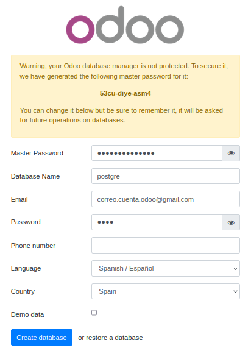

# **1. Guia d’estudi**
## Coneixements previs requerits
* Ús bàsic de sistemes operatius.
* Coneixement de comandaments de Linux.
* Utilització de comandaments de Docker i Docker Compose.

## Objectius
* Conéixer que tipus de desplegament poden fer-se en sistemes ERP.
* Desplegar Odoo en Linux manualment.
* Desplegar Odoo en Linux utilitzant Docker i Docker Compose.

## Continguts
Teoria i activitats no avaluables, a compartir al fòrum. A més, aquesta unitat té associada una activitat avaluable.

## Activitats
És molt important llegir els apunts i dur a terme les tasques no avaluables, a més de les avaluables.

## Bibliografia
Aquest document està basat en els apunts d’aquesta assignatura impartida pels professors:
    • García Barea, Sergi.
               

# **2. Introducció**
En aquesta unitat veurem quins factors generals hem de tenir en compte per a la instal·lació d'un sistema ERP després d'això veurem diferents formes de com instal·lar "Odoo", el programari que utilitzarem durant aquest curs.

## 2.1  Context històric dels ERP-CRM
Les possibilitats per a la instal·lació d'un sistema ERP-CRM s'han multiplicat en els últims anys. Les tendències, possibilitats tècniques i preus del maquinari, programari i l'electricitat han anat modificant la manera en què les empreses fan servir els ordinadors personals i els servidors.

Fent un breu i inexacte repàs històric podem reflexionar sobre els motius tècnics i econòmics d'aquesta evolució:
* En els primers anys de la informàtica empresarial el “Mainframe” era gairebé l'única opció: un únic ordinador molt gran i car amb diverses terminals. Aquest “Mainframe” era instal·lat a l'edifici de l'empresa. Aquesta solució només estava a l'abast de grans empreses.
* L'arribada dels computadors personals i miniordinadors va fer que moltes empreses més xicotetes utilitzassen aquesta solució. 
  * De vegades era un únic ordinador petit gestionat per l'empresa.
  * Mentrestant, els “Mainframes” seguien ocupant l'espai de les grans empreses. 
  * En els seus inicis, el PC i similars tenien mancances tant a escala de potència i com de sistemes operatius (orientats al mercat domèstic i no al mercat professional). Així i tot, el seu aterratge a la vida quotidiana va influenciar a la societat i la indústria, fent que fabricassen servidors amb l'arquitectura dels PC i similars però amb una major fiabilitat requerida en el context industrial.
    * Això és una gran millora que roman fins avui dia. Els servidors amb aquesta arquitectura van millorar considerablement el maquinari amb processadors i memòries més estables i sistemes operatius lliures i propietaris més robustos (Unix, Linux, Windows NT / Server ...). 
    * L'arribada d'Internet va suposar una altra alternativa. Ara les empreses podien utilitzar una xarxa comuna per interconnectar les seues seus, tant amb ordinadors centrals com amb servidors PC, es podia tenir un programa centralitzat. 
    * Al mateix temps, algunes empreses van poder oferir serveis per Internet a altres empreses. Aquest va ser l'inici d’allò que anomenem "serveis en el núvol". 

## 2.2  Sistemes ERP-CRM en la mateixa empresa
L'opció de tenir un servidor en la mateixa empresa té un seguit d'avantatges i inconvenients (relacionats entre si) i els principals problemes venen donats tant pels costos econòmics com per la seguretat de les dades.

Tenir un servidor a la mateixa empresa amb un sistema ERP-CRM (o amb qualsevol altre tipus de servei) suposa alguns reptes: 
* Posar en marxa un servei requereix una inversió inicial en maquinari.	
* L'escalat de maquinari per augmentar potència/disminuir potència és problemàtic:
  * Habitualment es té maquinari infrautilitzat.
  * L'augment de potència d'un servei requereix escalat vertical (augment de prestacions de servidor) o escalat horitzontal (comprar més equips).
    * El maquinari limita les possibilitats de còmput, així que és impossible escalar per augmentar potència en moments puntuals.
  * El manteniment de sistema informàtic, el subministrament d'energia i la seguretat de sistema són despeses i responsabilitats associades a l'empresa.
    * Un avantatge de la gestió de dades interna és que no estan en ordinadors fora de l'empresa, evitant riscos com ara l'espionatge industrial.

## 2.3  Sistemes ERP-CRM en el núvol
La despesa tant energètic com de potència de computació en una sola empresa sol ser desigual durant el dia, suposant això una ineficiència energètica. Per aquest motiu, algunes empreses, especialment aquelles que ofereixen serveis per Internet, es van plantejar vendre aquesta potència quan no la necessitaven o compartir-la entre molts clients. Això va propiciar el naixement de què avui anomenem "els serveis en el núvol".

Amb l'arribada dels "serveis en el núvol" (que realment són servidors d'una altra empresa) les empreses paguen una quota (fixa, per temps de còmput, per ús, etc.), però a canvi:
* No realitzen despeses relacionades amb el maquinari (instal·lació i escalat).
* No realitzen despeses relacionades amb el consum elèctric.
* Es redueixen de forma dràstica les despeses en manteniment i seguretat.
* Faciliten l'accés: per a operar amb aquests sistemes les empreses només necessiten un dispositiu (ordinador personal, telèfon intel·ligent, etc.) amb connexió a Internet.
* Si es necessita més potència, només cal contractar-la (escalat vertical/horitzontal). 

Tot i això, l'ús de "serveis en el núvol" posseeixen diversos inconvenients: 
* En alguns contextos, pot resultar més car que posar en marxa el teu la infraestructura.
* Les dades estan emmagatzemades físicament en un servidor d'una altra empresa, amb possibles problemes relacionats (per exemple, espionatge industrial).
* Per a l'ús de sistema depenen tant d'una bona connexió a Internet com del bon funcionament general de l'empresa que presta serveis.

## 2.4  Què triar? Sistema en la mateixa empresa o en el núvol?
No hi ha una resposta "contundent" a aquesta pregunta, ja que depén de context i és una cosa a estudiar a consciència abans d'implantar un sistema.

Avui dia en els entorns empresarials conviuen les dues opcions esmentades, i fins i tot opcions híbrides (servidor a l'empresa, però suport puntual o serveis en el núvol). 

Els principals factors a l'hora de prendre aquesta decisió són:
* El compliment de les lleis de protecció de dades. Aquest punt sobretot influeix en la decisió de contractar o no un "servei en el núvol", ja que guardant determinades dades en determinats serveis en el núvol podem estar incomplint la llei. 
  * A Europa hi ha el reglament RGPD i a Espanya la legislació vigent en matèria de protecció de dades ve definida per la LOPDGDD.
* El preu de l'electricitat i el consum del maquinari.
  * Existeixen dispositius maquinaris orientats a tenir un baix consum.
* El preu del maquinari. 
  * Existeixen dispositius orientats a tasques de servidor molt barats.

## 2.5  I el programari per al nostre sistema ERP?
Durant la introducció hem parlat de costos relacionats amb el sistema que allotjaria el nostre ERP. Però ... I el programari? Hi ha multitud d'opcions programari ERP, tan gratuïts, de pagament, lliures, mixtes (parts lliures, parts de pagament), etc.

Hi ha un programari ERP anomenat Odoo, que es presenta en dues versions: "Community Edition" (programari lliure i gratuït) i "Enterprise Edition" (de pagament).

En aquest curs utilitzarem  Odoo "Community Edition", ja que és lliure i gratuït. Per simplicitat, quan ens referim a Odoo, estarem referint-nos a aquesta versió.

Més informació a https://www.odoo.com/es_ES/ i https://github.com/odoo/odoo.

# **3. Tipus d'instal·lació d'un sistema ERP**
En aquest apartat tractarem les diferents maneres en què es pot instal·lar un sistema ERP i a  anomenar els pros i contres de cada tipus de solució. 

Començarem amb les solucions no recomanades ("d’estar per casa"), per passar aquelles simples però correctes i anar evolucionant cap a les més sofisticades:
* La carpeta compartida: es tracta d'una pràctica cada vegada menys usada, però que es manté en moltes petites empreses. 
  * Fa anys, alguns programes de gestió estaven pensats per a un sol usuari. L'única opció que donaven per poder ser accedits per diversos ordinadors en una xarxa local era compartir la carpeta de la base de dades i configurar diverses instal·lacions per a accedir al mateix arxiu. A més, aquesta "base de dades" era un fitxer de "Microsoft Access" o fitxers de text pla. 
  * Aquesta solució no és correcta ni recomanable: és una solució que proposa molts problemes, tant amb l'accés simultani, com problemes tant de seguretat com d'integritat.
* Instal·lació On-Premise: aquí entra en joc un servidor instal·lat a la mateixa empresa. 
  * Els ordinadors clients poden accedir a sistema ERP mitjançant un programari client del mateix ERP o fins i tot mitjançant un navegador web. 
* S'ha de configurar correctament la xarxa de sistema tant per evitar connexions externes no permeses, com per proporcionar accés segur (si es requereix) des de fora de la xarxa.
* Si cal accedir des de fora de la xarxa local, cal configurar correctament la xarxa i la seguretat de l'accés extern. Se sol pagar pel programari sencer o la instal·lació i el manteniment.
  * Si el servidor funciona d'una forma segura i aquesta opció és viable econòmicament per a l'empresa, és una solució correcta.
*  Instal·lació com a servei en el núvol: en aquesta solució prescindeix de servidor a l'empresa i se subcontracta la computació. Simplifica la instal·lació i l'accés extern. A més, es paga pel que es necessita i és fàcilment escalable. Els "serveis en el núvol" pot ser de molts tipus, però se sol distingir entre:
   * IaaS (Infraestructura com a servei): ens proporcionen accés a servidors, màquines virtuals o contenidors. Cal instal·lar i protegir el sistema operatiu, l'ERP i tota la resta. Potser l'empresa del núvol ja ens ho oferisca amb un sistema operatiu preinstal·lat, però hauríem de tenir control total d'aquest sistema operatiu. 
     * Exemple: els VPS entren dins d'aquest tipus de núvol.
   * PAAS (Plataforma com a servei): En aquest núvol ja hi ha el sistema operatiu i alguns programes configurats. Sobre aquest sistema es pot desplegar el sistema ERP. 
     * Exemple: el que considerem com a "hosting tradicional" (PHP, MySQL, etc.).
   * SAAS (Software com a servei): en aquest cas ja està l'ERP instal·lat i ens donen accés a determinades característiques segons contractem (quantitat d'usuaris, accés simultani, espai d'emmagatzematge, còpia de seguretat, etc.). No cal preocupar-se de res més, però estàs limitat al programa que el proveïdor ofereix.
     * Exemple: solucions tipus Gmail o Google Drive, on tenim tot posat en marxa i només consumim el servei. 
   * A part d'aquests tipus de "serveis en el núvol", podem tenir alguns serveis de forma individual en el núvol, com ara serveis de bases de dades (com Firebase) o serveis d'APIs REST o GRAPHQL, etc. En qualsevol cas, han de garantir una alta disponibilitat, seguretat i escalabilitat. 

# **4. Llicències de programari**
A l'hora de triar el programari d'un sistema ERP, un dels factors és la llicència i el seu preu. Distingirem entre llicències lliures i llicències propietàries.
Es considera llicència lliure aquella que permeta la modificació i redistribució del programari. Qualsevol llicència que no permeta la modificació i redistribució del programari es considera llicència propietària.

>❕ **Atenció**: una llicència lliure no implica que el programari siga gratuït. Una llicència propietària no implica que el programari siga de pagament.

El model de negoci del programari propietari és fàcil d'intuir a primera vista (crec un producte i el venc, cobrament serveis associats, etc.). El model de negoci del programari lliure és molt divers, des del pagament pel manteniment, cursos, instal·lació o personalització del sistema, donacions o venda de productes addicionals.

Hi ha una gran quantitat de llicències lliures. En el següent enllaç hi ha una comparativa de les principals  https://en.wikipedia.org/wiki/Comparison_of_free_and_open-source_software_licences

Una de les primeres llicències lliures i la més garantista és GPL i les seues diferents versions. Altres de les llicències lliures més conegudes són la MIT, BSD o Apache. 

# **5. Preparació del servei per configurar el sistema ERP**
Cada sistema ERP és diferent i posseeix necessitats de potència diferents. Aquestes necessitats solen dependre de factors com:
* Quantitat de dades que alberga el sistema.
* Nombre d'usuaris simultanis.
* Tecnologia utilitzada pel programari ERP.
* Sistema operatiu sobre el qual corre el programari ERP.

Per posar en marxa un sistema ERP és recomanable utilitzar maquinari dissenyat per a servidors. La qualitat dels components, la refrigeració o tecnologies com el sistema “ECC” en la memòria RAM, fan més estables aquests ordinadors davant de PC domèstics o altres alternatives per a l'usuari final (Raspberry Pi, Arduino, etc.). 

Els usuaris que interactuen amb el sistema ERP, sí que poden fer servir PC, tablets, smartphones o altres sistemes domèstics com a client del servei. 

Un altre aspecte a tenir en compte és la seguretat, tenint en compte tant mesures de seguretat passiva com activa. S'han de tenir en compte aspectes com:
* Protecció contra persones (atacs físics i remots).
* Protecció contra els elements: calor, humitat, sobretensions o incendis.
* Disponibilitat de sistema i còpia de seguretat. 
* Compliment de la legislació vigent.

No és tasca d'aquest mòdul explorar totes les proteccions disponibles, però s'han de tenir en compte i exigir-les en una instal·lació real. Algunes de les mesures de protecció bàsiques són:
* El servidor ha de tenir un SAI que el protegisca i el mantinga encés en cas de fallada de la xarxa elèctrica.
* És recomanable que el servidor en si dispose d'elements (processador, RAM, discs, etc.) per sobre de la potència mínima necessària perquè funcione el sistema ERP. 
  * No cal passar-se massa, ja que si ho fem incrementarem tan despeses de maquinari i el consum elèctric sense obtenir un gran benefici. Normalment, aquests programes tenen una documentació en la qual descriuen els requisits mínims. 
* Respecte a la seguretat de les dades, es recomana redundància en els discos, siga amb RAID o amb sistemes d'arxius redundants com ZFS o Btrfs. 
  * Aquesta redundància no exclou la necessitat d'establir una política de còpies de seguretat externes al sistema.

Un cop posat en marxa el servidor cal triar el sistema operatiu base i un possible sistema de virtualització. En el cas de sistema ERP Odoo, que tractem en aquests apunts, per a una posada en marxa en un sistema real es recomana Ubuntu Server. 
Aquest sistema operatiu pot ser el sistema instal·lat a la màquina o estar virtualitzat. 

La virtualització podem realitzar-la amb:
* Màquines virtuals amb hipervisor (tipus Virtualbox). Aquestes màquines realitzen una simulació completa del maquinari, influint això en una disminució de rendiment.
* Una alternativa a la virtualització amb hipervisor, però amb millor rendiment (proper al rendiment natiu) són els contenidors, siguen complets com LXD o contenidors d'aplicacions com Docker. 

Sistemes operatius base com Proxmox simplifiquen la gestió tant de màquines virtuals com de contenidors, còpies de seguretat dels mateixos i emmagatzematge en xarxa. 

En cas d'optar pel núvol, si contractem un IaaS també hem de tenir en compte la potència contractada. De fet, és més important afinar correctament, ja que podem incrementar els costos sense tenir un benefici pel que fa a rendiment.

# **6. Instal·lació d'un sistema ERP Odoo 17**

## 6.1. Requisits d’Odoo 17
A efectes pràctics, Odoo 17 no necessita molta potència per a funcionar. Pot funcionar sense problemes en qualsevol ordinador amb diversos nuclis i almenys 512 MB de RAM, encara que amb aquesta configuració, si rep molts accessos simultanis la màquina es pot quedar curta.
 
Com en totes les aplicacions que consulten bases de dades, l'accés al disc pot suposar un coll d'ampolla. Per això és recomanable utilitzar unitats SSD, RAIDs o sistemes d'arxius com ZFS o Btrfs amb diversos discos.
Odoo 17 funciona perfectament en màquines virtuals i contenidors. Algunes opcions de configuració poden ser: 
* Sistema operatiu: Ubuntu Server i instal·lació directa d'Odoo.
* Sistema operatiu: Ubuntu Server, Virtualització amb KVM o similar. Les màquines virtuals tindran instal·lat Ubuntu Server.
* Sistema operatiu: Ubuntu Server, contenidors Docker.
* Sistema operatiu: Proxmox, màquines virtuals o contenidors LXC gestionats per Proxmox.

Com es veu, en totes les ocasions es trien màquines reals i virtuals Ubuntu. Això és perquè Odoo està desenvolupat en aquest sistema i això ens ajuda a garantir que la implantació de sistema funcione correctament. 

## 6.2. Opció 1: Instal·lació manual d’Odoo 17
Si voleu fer una instalació manual d’Odoo 17, podeu seguir els pasos que estan explicats en  https://www.odoo.com/documentation/17.0/administration/on_premise.html

>❕ Atenció: no és l'opció recomanada per a cursar aquest ,mòdul. La opció recomanada es utilitzar “Docker Compose”.

## 6.3. Odoo 17 amb en Docker: - Part 1: Contenidor Odoo en producció
> 💬 Interessant:  si coneixes com usar "Docker", pots ser-te molt útil revisar aquest curs amb exemples pràctics https://sergarb1.github.io/CursoIntroduccionADocker
 

>💬 Interessant: si ja coneixes com usar "Docker", pots ser-te molt útil "CheatSheet" https://raw.githubusercontent.com/sergarb1/CursoIntroduccionADocker/main/FuentesCurso/Docker%20CheatSheet%20COMPLETA.pdf 

Per posar en marxa Odoo 17 en mode producció crearem dos contenidors:
* El primer contenidor contindrà la base de dades PostgreSQL en la seua versió 14.
* El segon contenidor contindrà el servidor Odoo.
Creem el contenidor de PostgreSQL amb:

> **docker run -d -v /home/usuario/OdooDesarrollo/dataPG:/var/lib/postgresql/data -e POSTGRES_USER=odoo -e POSTGRES_PASSWORD=odoo -e POSTGRES_DB=postgres --name db postgres:15**

On els paràmetres indiquen el següent:
* **"-d"**: executa el contenidor en segon pla.
* **“-v /home/usuario/OdooDesarrollo/dataPG:/var/lib/postgresql/data”: munta el directori del contenidor "/var/lib/postgresql/data"** (on es troba la informació emmagatzemada per PostgreSQL) al directori de l'amfitrió "/home/usuari/OdooDesarrollo/dataPG". 
  * La fi d'això és emmagatzemar la informació de la base de dades en la màquina amfitrió.
* **“-e POSTGRES_USER=odoo -e POSTGRES_PASSWORD=odoo -e POSTGRES_DB=postgres”**: estableix dins el contenidor aquestes variables d'entorn. A efectes pràctics, aquestes variables li indiquen que creuen en la base de dades un usuari "Odoo" i la contrasenya "Odoo" i que la base de dades a utilitzar es diu "postgres".
* **"--name db"**: nom que li donarem al nostre contenidor Docker.
* **"postgres:15"**: indiquem que farem servir la imatge de Docker Hub anomenada "postgres" i d'entre elles farem servir la versió 15.
  * Més informació d'aquesta imatge en https://hub.docker.com/_/postgres 
 
 >📖 Important:  si en lloc del paràmetre "-d", utilitzem el paràmetre "-t", executarem el contenidor en primer pla i veurem a la terminal informació de l'inici de PostgreSQL o Odoo. Això és interessant per detectar problemes. 

Amb el contenidor PostgreSQL ja en marxa, vam crear el contenidor amb Odoo amb:

> **docker run -d -v /home/usuario/odoo/addons:/mnt/extra-addons -p 8069:8069 --name odooprod --user root --link db:db odoo:17**

On els paràmetres indiquen el següent:
* **"-d"**: executa el contenidor en segon pla.
* **"-p 8069:8069"**: mapeamos el port 8069 del contenidor (on accedim a Odoo) al port 8069 de la màquina amfitrió, per poder accedir a Odoo amb http://localhost: 8069
* **"--name odooprod"**: donem el nom "odooprod" al nostre contenidor.
* **“--user=”root””**: força que el contenidor s'execute internament com "root" i no com l'usuari "Odoo" que va per defecte en la imatge.
* **“--link db:db”**: enllacem amb una xarxa virtual aquest contenidor amb el contenidor "db".

## 6.4. Odoo 17 en Docker: - Part 2: Contenidor Odoo per a desenvolupament
Per  llançar Odoo a un contenidor preparat per a desenvolupament, crearem també dos contenidors.
Crearem el contenidor de PostgreSQL de forma similar a com férem en l’apartat anterior amb:

> **docker run -d -v /home/usuario/OdooDesarrollo/dataPG:/var/lib/postgresql/data -e POSTGRES_USER=odoo -e POSTGRES_PASSWORD=odoo -e POSTGRES_DB=postgres --name db postgres:15**

Un servidor de producció està pensat per a posar-ho en funcionament, realitzar poques parades i mantenir el contingut del contenidor. Habitualment es fan còpies completes del contingut per a únicament restaurar el contenidor en cas d’urgència.

Malgrat d’això en entorns de desenvolupament, és més habitual “trencar coses”. A efectes pràctics, és habitual reiniciar contenidors o inclús esborrar-los i construir-los de nou.

Per a ell, modificarem la forma de crear els contenidors guardant alguna informació en volums per tal de realitzar “persistència” del servici Odoo.

Crearem el contenidor d’Odoo, amb algunes diferències respecte a l’anterior:

> **docker run -d -v /home/usuario/OdooDesarrollo/volumesOdoo/addons:/mnt/extra-addons -v /home/usuario/OdooDesarrollo/volumesOdoo/firestore:/var/lib/odoo/filestore -v /home/usuario/OdooDesarrollo/volumesOdoo/sessions:/var/lib/odoo/sessions -p 8069:8069 --name odoodev --user="root" --link db:db -t odoo:17 --dev=all**

A continuació, comentem les diferències:
* **“-v /home/usuario/OdooDesarrollo/addons:/mnt/extra-addons”**: la imatge d’Odoo 17 per defecte carrega els mòduls al directori del contenidor “/mnt/extra-addons”, per això  mapejem eixe directori al nostre directori de la màquina amfitrió “/home/usuario/OdooDesarrollo/addons”, on desenvoluparem utilitzant un IDE extern.
* **“-v /home/usuario/OdooDesarrollo/volumesOdoo/firestore:/var/lib/odoo/filestore**
* **” y “-v /home/usuario/OdooDesarrollo/volumesOdoo/sessions:/var/lib/odoo/sessions”**: com en desenvolupament és possible que parem i muntem moltes vegades els contenidors Docker, muntem aquests volums per tindre persistència dels directoris d’Odoo “firestore” i “sessions”. Per a ell, mapejarems eixos directoris del contenidor a la nostra màquina amfitrió dins del directori “/home/usuario/OdooDesarrollo/volumesOdoo/”.
* **“ --dev=all”**: li passa aquest paràmetre a Odoo per facilitar tasques de desenvolupament. 
  * El detall de què realitza aquesta opció es pot observar al següent enllaç https://www.odoo.com/documentation/17.0/es/developer/reference/cli.html
>❕ Atenció: per a poder desenvolupar sense problemes, és recomanable donar tots els permisos al directori **”/home/usuario/OdooDesarrollo/volumesOdoo/addons”, amb un comandament similar a “sudo chmod -R 777 /home/usuario/volumesOdoo/addons”**.

Amb això, tindrem llest el nostre entorn de desenvolupament “Dockeritzat”. Hem aconseguit que els contenidors corren de manera aïllada els serveis de base de dades i Odoo, mentre que nosaltres podrem desenvolupar utilitzant un IDE instal·lat en l’amfitrió treballant dins del directori “/home/usuario/OdooDesarrollo/addons”.

## 6.5. Odoo 17 en Docker: - Part 3: Docker Compose per a Odoo - OPCIÓ RECOMANADA
> 💬 Interessant:  si no coneixes com utilitzar “Docker Compose”, pot ser-te molt útil revisar aquest curs amb exemples pràctics https://sergarb1.github.io/CursoIntroduccionADocker/

> 💬 Interessant:  si ja coneixes com utilitzar “Docker Compose”, pots fer ús de https://raw.githubusercontent.com/sergarb1/CursoIntroduccionADocker/main/FuentesCurso/Docker%20CheatSheet%20COMPLETA.pdf 

Docker Compose és una ferramenta que ens facilita el desplegue de diversos contenidors utilitzant una configuració definida en un fitxer. Aquest fitxer per defecte hi ha de cridar-se “docker-compose.yml”.

Si ens situem al directori on està el nostre fitxer “docker-compose.yml”, podem iniciar el servici complet simplement escrivint:

> **docker compose up -d**

En llançar aquest comandament, es crearan en el directori actual:
* Carpeta “addons”: ací desenvoluparem els nostres mòduls mitjançant un IDE extern.
* Carpeta “pgData”: ací s’emmagatzemara la persistència de dades de la nostra base de dades.

>❕ Atenció: per a poder desenvolupar sense problemes, és recomanable donar permisos al directori “addons”, amb un comandament similar a **“sudo chmod -R 777 ./addons”**.

Podemos parar el servei complet simplement escrivint:

> **docker compose down**

Adjuntem a aquesta unitat un zip amb el fitxer “docker-compose.yml” per a entorn de producció i amb el fitxer “docker-compose.yml” per entorn de desenvolupament. A continuació, a més mostrem el contingut del fitxer “docker-compose.yml” per a entorn de desenvolupament.

### Fitxer “docker-compose.yml” (desenvolupament):
> version: '3.3'
services:
#Definimos el servicio Web, en este caso Odoo
  web:
	#Indicamos que imagen de Docker Hub utilizaremos
	image: odoo:17
	#Indicamos que depende de "db", por lo cual debe ser procesada primero "db"
	depends_on:
    	- db
	# Port Mapping: indicamos que el puerto 8069 del contenedor se mapeara con el mismo puerto en el anfritrion
	# Permitiendo acceder a Odoo mediante http://localhost:8069
	ports:
  	- 8069:8069
	# Mapeamos el directorio de los contenedores (como por ejemplo"/mnt/extra-addons" )
	# en un directorio local (como por ejemplo en un directorio "./volumesOdoo/addons")
	# situado en el lugar donde ejecutemos "Docker compose"
	volumes:
  	- ./volumesOdoo/addons:/mnt/extra-addons
  	- ./volumesOdoo/odoo/filestore:/var/lib/odoo/filestore
  	- ./volumesOdoo/odoo/sessions:/var/lib/odoo/sessions
	# Definimos variables de entorno de Odoo
	environment:
  	- HOST=db
  	- USER=odoo
  	- PASSWORD=odoo
	# Indica que pasa ese parametro al arrancar el servicio Odoo
	command: --dev=all
#Definimos el servicio de la base de datos
  db:
	image: postgres:15
	# Definimos variables de entorno de PostgreSQL
	environment:
  	- POSTGRES_PASSWORD=odoo
  	- POSTGRES_USER=odoo
  	- POSTGRES_DB=postgres
	# Mapeamos el directorio del contenedor "var/lib/postgresql/data" en un directorio "./volumesOdoo/dataPostgreSQL"
	# situado en el lugar donde ejecutemos "Docker compose"
	volumes:
  	- ./volumesOdoo/dataPostgreSQL:/var/lib/postgresql/data

# **7. Posada en marxa d’Odoo 17**
Una vegada realitzada la instal·lació amb qualsevol de les alternatives proposades anteriorment, accedirem mitjançant el nostre navegador a Odoo amb l’URL http://localhost:8069 i haurem de realitzar una configuració inicial. Ací un exemple d’aquesta configuració:

A primera vista, se’ns mostrarà un “Password mestre” que podem canviar si volem. Haurem d’emmagatzemar eixe “Password” a un lloc segur per poder recuperar el nostre sistema davant problemes amb el nostre usuari.

>❕ Atenció: si perdem el “Password mestre”, podem ficar-lo en blanc editant “/etc/odoo/odoo.conf” (o el fitxer “.odoorc” dins de l'“home”) i eliminat (o posar un comentari amb #) el camp “admin_password”. Si ho fem així i reiniciem el servei, Odoo ens dirà que no hi ha “Password mestre” i ens suggerirà que creem un nou password.

A més, se’ns demanara configurar Odoo segons els paràmetres de la nostra instal·lació. En aquesta configuració crearem un usuari administrador, e indicarem el nostre país (això realitzarà algunes adaptacions per a empreses locals) e idioma d’Odoo. Inclús ens permet carregar la instal·lació amb dades de demostració (útils per fer proves, conéixer com funciona Odoo, etc.).

Una vegada estiga tot llest, en polsar “Create database” s’inicialitzarà Odoo. Tingueu paciència (tarda uns minuts). Si tor ha anat bé, arribareu a una pantalla similar a la següent:

Aquesta pantalla indica que Odoo 17 s’ha instal·lat correctament i ja podem treballar amb ell.
