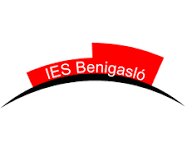

<div align="center">
    
</div>

# GUIA DOCENT
**IES Benigasló (La Vall d'Uixó)**  
*Família Professional d'Informàtica i Comunicacions*  
*Conselleria d'Educació, Universitats i Ocupació — Generalitat Valenciana*

---

## 1. Dades Generals del Cicle i del Mòdul

| Concepte | Detall |
| :--- | :--- |
| **Cicle Formatiu** | Desenvolupament d'Aplicacions Multiplataforma (DAM) |
| **Grau** | Grau Superior |
| **Mòdul Professional** | Sistemes de Gestió Empresarial |
| **Codi del Mòdul** | 0491 |
| **Curs Acadèmic** | 2026 / 2027 |
| **Curs** | 2n curs  |
| **Càrrega Horària** | 133 hores totals (4 hora / setmana) |
| **Aula** | Aula d'Informàtica 207 |

---

##  2. Equip Docent i Canals de Comunicació

* **Professor/a:** Ginés Asensio Sanagustín
* **Correu electrònic corporatiu:** `g.asensiosanagusti@edu.gva.es` *(Únic canal oficial per a consultes privades i incidències)*
* **Horari d'Atenció a l'Alumnat / Tutoria:** Dilluns de 9:50 a 10:45

> ⚠️ **Nota Important de Comunicació:**  
> Totes les notificacions i lliuraments es realitzaran exclusivament a través d'**Itaca**, d'**Aules** i del correu corporatiu oficial `@edu.gva.es`. No s'atendran comunicacions enviades des de comptes personals (Gmail, Hotmail, etc.).

---

##  3. Contextualització i Objectius del Mòdul

### 3.1. Introducció
Aquest mòdul professional té com a finalitat dotar l'alumnat de les competències tècniques i metodològiques necessàries per al disseny, implementació, depuració i desplegament de solucions informàtiques professionals, complint els estàndards de qualitat de la indústria tecnològica actual.

### 3.2. Objectius Generals
1. **Comprendre i aplicar** els fonaments de l'arquitectura del programari/sistemes.
2. **Desenvolupar autonomia** en la resolució d'incidències tècniques i la cerca de documentació oficial.
3. **Fomentar el treball cooperatiu** mitjançant eines de control de versions i metodologies àgils.
4. **Garantir la seguretat i bones pràctiques** en el tractament de la informació i l'escriptura de codi net (*Clean Code*).

---

## 4. Resultats d'Aprenentatge (RA) i Continguts

El currículum s'estructura al voltant dels **Resultats d'Aprenentatge (RA)** oficials establits per la normativa de la Comunitat Valenciana:  

```
├── RA1: Identifica sistemes de planificació de recursos empresarials i de gestió de relacions amb clients (ERP-*CRM) reconeixent les seves característiques i verificant la configuració del sistema informàtic.
├── RA2: Implanta sistemes ERP-*CRM interpretant la documentació tècnica i identificant les diferents opcions i mòduls.
├── RA3: Realitza operacions de gestió i consulta de la informació seguint les especificacions de disseny i utilitzant les eines proporcionades pels sistemes ERP-*CRM.
├── RA4: Adapta sistemes ERP-*CRM identificant els requeriments d'un supòsit empresarial i utilitzant les eines proporcionades per aquests.
├── RA5: Desenvolupa components per a un sistema ERP-*CRM analitzant i utilitzant el llenguatge de programació incorporat.
```

### 🗓️ Planificació Temporal

| Bloc / Unitat | Descripció del Contingut | RA Associats | Trimestre |  
| :--- | :--- | :--- | :--- | 
| **UD 1** | Sistemes ERP-CRM-BI | RA1 | 1r Trimestre |
| **UD 2** | Instalació i configuració d'un ERP | RA2 | 1r Trimestre |
| **UD 3** | Implantació de un ERP en empresa | RA2 | 1r Trimestre |
| **UD 4** | Entorn de desenvolupament y mòdul Odoo | RA2 | 1r Trimestre |
| **UD 5** | Desenvolupament de móduls: Model i Vista  | RA3 | 2n Trimestre |
| **UD 6** | Desenvolupament de mòduls: Controlador, Herència i Web Controllers | RA4 | 2n Trimestre |
| **UD 7** | Desenvolupament de components | RA5 | 2n Trimestre |
| **EXTRA** | Introducció a docker | NO AVALUABLE | 1r Trimestre |
| **EXTRA** | Introducció a python3 | NO AVALUABLE | 2n Trimestre |

> En el [annex 1](#annex-1) podem observar els continguts que es desenvoluparàn de cada Unitat

---

##  5. Metodologia Didàctica

L'aprenentatge en la família d'Informàtica és eminentment pràctic i vivencial (*Learning by Doing*):

1. **Classes Teoricopràctiques:** Breus exposicions conceptuals recolzades amb demostracions en viu de codi (*Live Coding*).
2. **Reptes i Tallers d'Aula:** Resolució immediata d'exercicis curts individuals o en parelles per a fixar conceptes.
3. **Aprenentatge Basat en Projectes (ABP):** Desenvolupament d'un projecte de programari/sistema transversal al llarg del curs.
4. **Metodologies Àgils:** Simulació de dinàmiques d'equip mitjançant taulers Kanban, revisió de codi (*Code Reviews*) i treball en branques de Git.

---

##  6. Criteris d'Avaluació i Qualificació

L'avaluació és contínua, formativa i integradora. Cada Resultat d'Aprenentatge (RA) té associats els seus respectius Criteris d'Avaluació (CA), que han de ser superats de manera independent.
> Atenció: Es poden revisar al [annex 2](#annex-2) del document la relació de resultats d'aprenentatge (RA) amb els seus respectius criteris d'Avaluació (CA)

### 6.1. Ponderació General per RA

```
┌────────────────────────────────────────────────────────────────────────┐
│                        DISTRIBUCIÓ DE LA NOTA                          │
├──────────────────────────┬─────────────────────────────────────────────┤
│ Activitats i Pràctiques  │ 20% (Tasques d'Aules, tallers i codi)       │
│ Proves Individuals       │ 80% (Exàmen o Projecte amb prova final)     │
└──────────────────────────┴─────────────────────────────────────────────┘
```
> **Atencio: Aquest percentatge podrie variar per decisió del professor per a algún RA especific, que es reflexarà en la programació didàctica del mòdul, a més a més, serà informat previament al començament del RA**

### 6.2. Ponderació Total del mòdul 
La nota global del curs serà una mitjana ponderada de les qualificacions de cada RA. La nota de cada RA ha de ser > = 5 per poder fer mitja amb la resta de RAs. Es donarà un percentatge a cada RA per a obtindré la mitjana ponderada del mòdul:
```
RA1 (20%) + RA2 (20%) + RA3 (25%) + RA4 (25%) + RA5 (10%) = 100%
```

### 6.3. Condicions de Superació del Mòdul
*  Hi ha **dues** convocatòries per curs escolar
* **Nota mínima en proves individuals:** Per a fer mitjana amb la resta d'apartats, cal obtenir una qualificació mínima de **5,0 sobre 10** en les proves escrites/pràctiques d'aula.
* **Lliurament de pràctiques:** És obligatori obtindre una qualificació mínima de **5,0 sobre 10** com haver lliurat almenys el **80% de les pràctiques obligatòries** proposades a *Aules* dins del termini establit.
* **Superació de RAs:** Cada Resultat d'Aprenentatge (RA) s'haurà d'assolir amb una nota mínima ponderada de **5,0**.
* **Còpia i Plagi:** L'ús no autoritzat de codi d'altres companys o la utilització indiscriminada d'intel·ligència artificial generativa sense citar i sense saber explicar el codi comportarà una qualificació de **0** en l'activitat i la pèrdua de l'avaluació contínua de la unitat corresponent.

### 6.4. Assistència, Justificació i Pèrdua d'Avaluació Contínua
La assistència és obligatòria. El còmput d'hores d'absència es calcula sobre el total d'hores assignades al mòdul durant el curs acadèmic:
* *Avís preventiu (5% d'inassistència):* Quan l'estudiant acumula un 5% d'hores d'absència en el mòdul, s'emetrà un avís oficial d'advertència (notificat a través d'ITACA / Web Famílies a l'alumnat / representants legals) alertant del risc imminent de pèrdua d'avaluació contínua.
* *Pèrdua de l'avaluació contínua (15% d'inassistència):* Superar el 15% d'hores d'inassistència sense justificar degudament comporta automàticament la *pèrdua del dret a l'avaluació contínua* en aquest mòdul professional.

> ⏱️ Exemple pràctic de càlcul segons les hores del mòdul:  
> * Mòdul de *220 hores: 10% = 22 hores (avís) | 15% = **33 hores* (pèrdua).

### 6.5. Recuperacions
* Al final curs o durant el periode de Formación en Empresa es realitzarà una sessió de recuperació dels RAs no assolits, es disoparà d'una **ÚNICA** convocatoria per aquells que **NO** hagen perdut l'avaluació continua.
* A final de curs es disposarà d'una **Convocatòria Ordinària Final** per a recuperar TODOS los RAs que conformen el mòdul, sols disposaràn d'aquesta convocatòria els alumnes que **SI** hagen perdut l'avaluació continua.
* En cas de continuar tenint RAs no assolits, per als dos casos anteriors es disposarà d'una **Convocatòria Extraordinària** per a recuperar-los.

---

##  7. Eines i Recursos de Treball

Totes les eines utilitzades a classe són preferentment de codi obert (*Open Source*) i multiplataforma:

* **Sistemes Operatius:** Distribució GNU/Linux (Ubuntu / Debian / LliureX)
* **Maquines Virtuals :** VirtualBox
* **Entorns de Desenvolupament (IDE):** Pycharm, Visual Studio Code o equivalent.
* **Control de Versions:** Git i client de GitHub / GitLab.
* **Bases de Dades / Servidors:** Docker, MySQL / MariaDB, PostgreSQL, Apache/Nginx.
* **Plataforma d'Aprenentatge Virtual:** [Aules](https://aules.edu.gva.es/)

---

##  8. Normes de Convivència

Per a garantir un entorn òptim de treball professional a l'aula d'informàtica:

1. 🚫 **Begudes i Menjar:** Prohibit terminantment introduir begudes (fins i tot aigua) o aliments a les taules dels equips informàtics.
2. 🔌 **Manteniment:** Respectar la configuració del maquinari i cablatge; deixar la cadira arreplegada i el lloc de treball net en finalitzar la sessió.
3. 💾 **Còpies de Seguretat:** L'alumnat és l'únic responsable de mantindre còpies de seguretat del seu treball al repositori remot de Git o al núvol corporatiu d'Aules.
4. ⏰ **Puntualitat:** L'entrada a l'aula s'efectuarà a l'hora en punt per respecte a la dinàmica de la classe.
5. 📱 **Mòbils:** Únicament permesos quan formen part explícita d'una dinàmica pedagògica (autenticació 2FA, proves d'apps, etc.).

---

##  9. Annexos

### Annex 1

Temari del mòdul que s'impartirà aquest curs

1. **Sistemes ERP-CRM-BI**
   - Conéixer que és un sistema de gestió empresarial (ERP)
   - Conéixer alguns conceptes del món de l’empresa
  
2. **Instalació i configuració d'un ERP**
   - Conéixer que tipus de desplegament poden fer-se en sistemes ERP
   - Desplegar Odoo en Linux manualment
   - Desplegar Odoo en Linux utilitzant Docker i Docker Compose  

3. **Implantació de un ERP en empresa**
   - Aprèn a implantar Odoo i a instal·lar i configurar mòduls d’Odoo mitjançant un cas pràctic
  
4. **Entorn de desenvolupament y mòdul Odoo**
   - Aprèn a preparar l’entorn per a desenvolupar mòduls en Odoo
   - Fer els primers passos en desenvolupament de mòduls en Odoo

5. **Desenvolupament de móduls: Model i Vista**
   - Crear models de dades per mòduls d’Odoo
   - Crear vistes per als models de dades en mòduls d’Odoo

6. **Desenvolupament de mòduls: Controlador, Herència i Web Controllers**
   - Utilitzar funcions avançades al servidor Odoo.
   - Fer servir l’herencia de models en Odoo.
   - Creació d’informes i wizards amb Odoo.
   - Creació de Web Controllers i API Rest amb Odoo

7. **Desenvolupament de components**
   - Aprendre conceptes bàsics d’aprenentatge automàtic (machine learning)
   - Aprendre conceptes relacionats amb aprenentatge supervisat i aprenentatge no supervisat.

8. **Introducció a docker (Extra)**
   - Ser capaç d’utilitzar el contenidor docker
   - Ser capaç d’utilitzar Docker Compose

9. **Introducció a python3 (Extra)**
   - Aprendre a programar en Python 3

--- 

### Annex 2

Resultados de aprendizaje y criterios de evaluación.
1. **<u>RA1:</u>** 1.Identifica sistemas de planificación de recursos empresariales y de gestión de relaciones con clientes (ERP-CRM) reconociendo sus características y verificando la configuración del sistema informático.
   Criterios de evaluación:
      - a. Se han reconocido los diferentes sistemas ERP-CRM que existen en el mercado.
      - b. Se han comparado sistemas ERP-CRM en función de sus características y
      requisitos.
      - c. Se ha identificado el sistema operativo adecuado a cada sistema ERP-CRM.
      - d. Se ha identificado el sistema gestor de datos adecuado a cada sistema ERP-CRM.
      - e. Se han verificado las configuraciones del sistema operativo y del gestor de datos para garantizar la funcionalidad del ERP-CRM.
      - f. Se han documentado las operaciones realizadas.
      - g. Se han documentado las incidencias producidas durante el proceso.
   
2. **<u>RA2:</u>** Implanta sistemas ERP-CRM interpretando la documentación técnica e identificando las diferentes opciones y módulos.
   Criterios de evaluación:
      - a. Se han identificado los diferentes tipos de licencia.
      - b. Se han identificado los módulos que componen el ERP-CRM.
      - c. Se han realizado instalaciones monopuesto.
      - d. Se han realizado instalaciones cliente/servidor.
      - e. Se han configurado los módulos instalados.
      - f. Se han realizado instalaciones adaptadas a las necesidades planteadas en diferentes supuestos.
      - g. Se ha verificado el funcionamiento del ERP-CRM.
      - h. Se han documentado las operaciones realizadas y las incidencias.

3. **<u>RA3:</u>** Realiza operaciones de gestión y consulta de la información siguiendo las especificaciones de diseño y utilizando las herramientas proporcionadas por los sistemas ERP-CRM.
   Criterios de evaluación:
      - a. Se han utilizado herramientas y lenguajes de consulta y manipulación de datos proporcionados por los sistemas ERP-CRM.
      - b. Se han generado formularios.
      - c. Se han generado informes.
      - d. Se han exportado datos e informes.
      - e. Se han automatizado las extracciones de datos mediante procesos.
      - f. Se han documentado las operaciones realizadas y las incidencias observadas.

4. **<u>RA4:</u>** Adapta sistemas ERP-CRM identificando los requerimientos de un supuesto empresarial y utilizando las herramientas proporcionadas por los mismos.
   Criterios de evaluación:
      - a. Se han identificado las posibilidades de adaptación del ERP-CRM.
      - b. Se han adaptado definiciones de campos, tablas y vistas de la base de datos del ERP-CRM.
      - c. Se han adaptado consultas.
      - d. Se han adaptado interfaces de entrada de datos y de procesos.
      - e. Se han personalizado informes.
      - f. Se han adaptado procedimientos almacenados de servidor.
      - g. Se han realizado pruebas.
      - h. Se han documentado las operaciones realizadas y las incidencias observadas.

5. **<u>RA5:</u>** Desarrolla componentes para un sistema ERP-CRM analizando y utilizando el lenguaje de programación incorporado.
   Criterios de evaluación:
      - a. Se han reconocido las sentencias del lenguaje propio del sistema ERP-CRM.
      - b. Se han utilizado los elementos de programación del lenguaje para crear componentes de manipulación de datos.
      - c. Se han modificado componentes software para añadir nuevas funcionalidades al sistema.
      - d. Se han integrado los nuevos componentes software en el sistema ERP-CRM.
      - e. Se ha verificado el correcto funcionamiento de los componentes creados.
      - f. Se han documentado todos los componentes creados o modificados.
