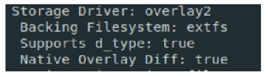
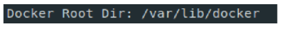
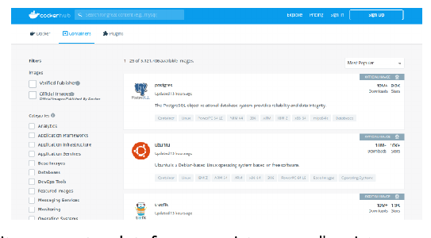
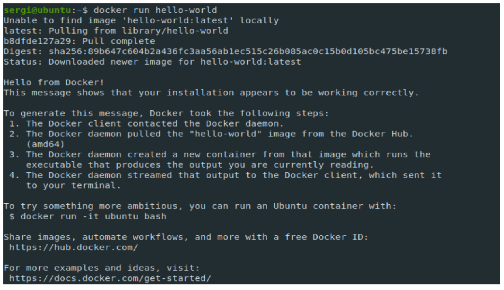
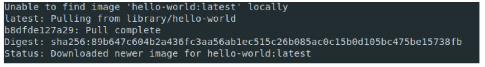
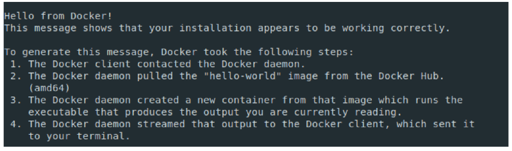
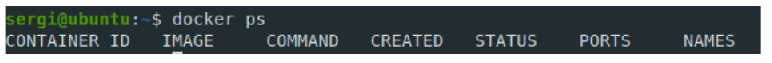
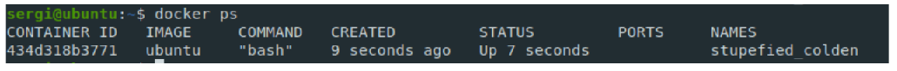

# 1. INTRODUCCIÓ
En aquesta unitat explicarem algunes de les principals accions bàsiques que podem realitzar amb Docker. En acabar la unitat ja estarem preparats per a utilitzar Docker amb certa facilitat.

# 2. ¿GESTIONAREM DOCKER MITJANÇANT INTERFÍCIE GRÀFICA?
Hi ha diferents eines per gestionar Docker des d'una interfície gràfica, fent la tasca més visual i intuïtiva. Tot i que aquestes eines poden ser molt útils, en el moment d'aprendre a treballar amb Docker, poden fer que se'ns escape la comprensió de determinats mecanismes de funcionament de Docker. Per aquest motiu en el curs no gestionarem Docker mitjançant interfície gràfica i farem totes les operacions mitjançant la línia d'ordres.

# 3. IMATGES I CONTENIDORS
## 3.1 Què és una imatge i un contenidor?
Abans de començar, és important aclarir alguns conceptes sobre què són imatges i contenidors i quines són les seues característiques Alguns conceptes a tenir en compte són:
- Imatges:
  - La imatge és una plantilla de només lectura que s'utilitza per crear contenidors. A partir d'una imatge poden crear-se múltiples contenidors.
  - Les imatges, a més de tenir el seu sistema de fitxers per defecte, tenen una sèrie de paràmetres predefinits (ordres, de variables d'entorn, etc.) amb valors per defecte i que es poden personalitzar en el moment de crear el contenidor.
  - Docker permet crear noves imatges basant-se en imatges anteriors. Es podria dir que una imatge pot estar formada per un conjunt de "capes" que han modificat una imatge base.
    - En crear una nova imatge, simplement estem afegint una capa a la imatge anterior, la qual actua com a base.
- Contenidors:
  - Són instàncies d'una imatge.
  - Poden ser arrencats, aturats i executats.
  - Cada contenidor Docker posseeix un identificador únic de 64 caràcters, però habitualment s'utilitza una versió curta amb els primers 12 caràcters.
    - Les comandes Docker habitualment suporten les dues versions.

Un símil per entendre aquests conceptes: una instal·lació d'una distribució de Linux mitjançant un DVD. Aquest DVD seria la nostra imatge i el sistema operatiu instal·lat seria el contenidor.
Detallarem conceptes relacionats sobre la creació d'imatges en futures unitats.

## 3.2 On s'emmagatzemen imatges, contenidors i dades?
El lloc on s'emmagatzemen contenidors i imatges pot variar segons distribució/sistema operatiu,
driver d'emmagatzematge i versió de Docker. Normalment mitjançant la següent comanda de
Docker, podem veure informació de sistema, incloent-hi el directori de Docker.

> docker info

Aquest comandament ens ofereix informació sobre l'estat de Docker. Per conéixer on s'emmagatzema la informació, dues dades són importants: directori de Docker i driver d'emmagatzematge.
Driver d'emmagatzematge utilitzat per Docker:



En l'exemple se'ns indica el controlador d'emmagatzematge utilitzat ("overlay2")i sobre quin sistema de fitxers està funcionant ("extfs", en concret "ext4").
Per saber més sobre els diferents drivers d'emmagatzematge de Docker, podeu consultar
[https://docs.docker.com/storage/storagedriver/select-storage-driver/]

Directori de Docker:


Directori on s'emmagatzema tot el relacionat amb Docker.
En utilitzar el driver"overlay2"sabem que
- La informació de les imatges es troba en "/var/lib/docker/overlay2".
  - Recordem que les imatges es basen en capes, una imatge pot estar creada per un conjunt de capes.
  - L'emmagatzematge temporal de contenidors (és a dir, petits canvis en els contenidors), es realitza com "versions de les imatges", és a dir, una capa més de la imatge base.
- La configuració dels contenidors s'emmagatzema en "/var/lib/docker/containers".
- Per accés a dades compartides, persistència, etc. existeix la figura dels volums, la qual detallarem en posteriors unitats.
  
# 4. REGISTRE: DOCKER HUB
Docker Hub és una "plataforma de registre" de Docker. Els serveis bàsics són gratuïts i ens permet registrar imatges Docker, fent-les públiques o privades.
Conté un gran ecosistema d'imatges ja creades, usualment amb instruccions d'instal·lació i ús, a més d'un cercador que ens permet trobar imatges segons diferents paràmetres. Enllaç al cercador
https://hub.docker.com/search?q=&type=image



Per defecte, Docker utilitza aquesta plataforma registre com "registre per defecte", encara que és possible si es requereix, triar un altre servei de registre, i fins i tot muntar un servei privat de registre.

Més informació sobre com crear un registre privat en
- [https://www.digitalocean.com/community/tutorials/how-to-set-up-a-private-docker-registry-on-ubuntu-18-04-es]

# 5. CREANT I ARRENCANT CONTENIDORS AMB "DOCKER RUN"
## 5.1 Què fa el comandament "docker run"?
És possiblement el comandament "docker run" més utilitzat. Podem dir que aquest comandament crea un contenidor a partir d'una imatge i l’arranca.
**<u>Important</u>**: un error comú és creure que "docker run" només arranca contenidors. Si fas diversos "docker run", estàs creant diversos contenidors, no arrancant diverses vegades un contenidor.

La descripció completa del comandament "docker run" la podeu trobar a [https://docs.docker.com/engine/reference/commandline/run/]

Comentarem al llarg d'aquesta unitat algunes de les seues opcions bàsiques més importants. A més a futures unitats, ampliarem els coneixements sobre aquest comandament.

## 5.2 Creant contenidors sense arrancar-los
Per crear un contenidor sense arrencar-(recordem, "docker run" crea i arrenca), hi ha l'ordre "docker create". La descripció completa de la comanda "docker create" la podeu trobar a [https://docs.docker.com/engine/reference/commandline/create/]

## 5.3 Repassant cas pràctic "Hello World"
En anteriors unitats vam proposar un senzill cas pràctic per comprovar que funcionava docker usant el següent comandament:

> docker run hello-world

### 5.3.1 Repàs part 1: obtenint la imatge
En executar aquest comandament per primera vegada, obtenim un resultat similar a aquest:



La documentació en Docker Hub del contenidor que estem llançant la tenim disponible a [https://hub.docker.com/_/hello-world] en primer lloc, ens fixem en el començament de la informació mostrada, concretament en:



Aquí se'ns indica que la imatge **"hello-word: latest"** no està localment en el nostre sistema. Com que no està al nostre sistema, és descàrrega del registre per defecte (normalment Docker Hub) i s'emmagatzema localment.

De fet, si tornem a fer la comanda "docker run hello-world", en tenir la imatge ja en el sistema, **<u>no ens apareixerà aquest text, ja que la imatge la tenim emmagatzemada localment</u>**.
Un altre aspecte a destacar, és que malgrat que només hem escrit **"hello-world"**, ens ha descarregat una imatge anomenada **"hello-world:latest"**. Això és perquè cada imatge creada té un nom de versió. Si no indiquem res o indicar **"latest"**, ens instal·la la darrera versió. Si volem instal·lar una versió concreta d'una imatge, s’indicaria de la manera **"imatge:nombreversion"**.

### 5.3.2 Repàs part 2: el contenidor es crea i executa una ordre
Un cop descarregada la imatge, es crea el contenidor, s'inicia i executa un procés. Aquest procés el podem proporcionar dins de l'ordre "docker run" o si com en el cas concret d'aquest exemple, no ho hem proporcionat, executarà una ordre predefinida per la mateixa imatge.

En aquest cas concret, com que no s’ha especificat cap comandament, en iniciar-se el contenidor llança un programa per defecte anomenat "Hello" i ens mostra per la sortida estàndard informació de com Docker ha generat aquest missatge:



Si teniu curiositat per veure el codi font del programa "hello", està disponible en [https://github.com/docker-library/hello-world/blob/master/hello.c]

Aquest programa genera un text que bàsicament ens explica que el client de Docker s'ha connectat amb el servei de Docker, aquest s'ha descarregat la imatge de Docker Hub (o localment si ja estava en el nostre sistema), s'ha creat un contenidor, que per defecte tenia una ordre que genera la sortida que estem llegint i finalment, el servei de Docker l'ha enviat a la terminal.

# 6. LLISTAR CONTENIDORS DISPONIBLES EN EL SISTEMA AMB "DOCKER PS"
Mitjançant la comanda "docker ps" podem llistar els contenidors en el sistema, tan aturats com en
execució. Si executem el següent:

> docker ps

Ens apareixerà un llistat com aquest si no tenim cap contenidor en execució:



O si tenim contenidors en execució, podem obtenir alguna cosa similar a això:



Si llancem el comandament

> docker ps -a

Obtindrem un llistat de tots els contenidors, tant aquells en funcionament com aquells que estan aturats.

La informació que obtenim dels contenidors és la següent:
- CONTAINER_ID: identificador únic del contenidor (versió 12 primers caràcters).
- IMAGE: imatge utilitzada per crear el contenidor.
- COMMAND: comanda que es llança en arrencar el contenidor.
- CREATED: quan es va crear el contenidor.
- STATUS: si el contenidor està en marxa o no (indicant quant temps porta en marxa o quant fa que es va parar).
- PORTS: redirecció de ports del contenidor (ho veurem més endavant en la unitat).
- NAMES: nom del contenidor. Es pot generar com a paràmetre al crear el contenidor, o si no s'indica res, el mateix Docker genera un nom aleatori.

La descripció completa de la comanda **"docker ps"** la podeu trobar a [https://docs.docker.com/engine/reference/commandline/ps/]

# 7. PARANT I ARRENCANT CONTENIDORS EXISTENTS AMB "DOCKER START/STOP/RESTART"
Per arrencar/parar un contenidor ja creat (recordem "docker run" crea i arrenca), hi ha les ordres **"docker start"**, **"docker stop"** i **"docker restart"**.
La forma més habitual d'utilitzar aquestes comandes, és usar el nom de la comanda, seguit de l'identificador únic o nom assignat al contenidor. Per exemple amb identificador:

> docker start 434d318b3771

o amb nom del contenidor

> docker start stupefied_colden

La descripció completa d'aquests comandaments la podeu trobar a
- [https://docs.docker.com/engine/reference/commandline/start/]
- [https://docs.docker.com/engine/reference/commandline/restart/]
- [https://docker.com/engine/reference/commandline/stop/]
  
# 8. INSPECCIONANT CONTENIDORS AMB "DOCKER INSPECT"
El comandament "docker Inspect" és una ordre que ens proporciona diversos detalls de la configuració d'un contenidor. Ofereix diferents dades, entre ells, identificador únic (versió 64 caràcters), emmagatzematge, xarxa, imatge en què es basa, etc. La seua sintaxi és:

> docker inspect IDENTIFICADOR/NOM

La descripció completa de la comanda "docker Inspect" la podeu trobar a [https://docs.docker.com/engine/reference/commandline/inspect/].

# 9. EXECUTANT COMANDAMENTS EN UN CONTENIDOR AMB "DOCKER EXEC"
La comanda "docker exec" ens permet executar una ordre dins d'un contenidor que estiga en aquest moment en execució. La forma sintaxi habitual per utilitzar aquesta comanda és la següent

> docker exec [OPCIONES] IDENTIFICADOR/NOMBRE COMANDO [ARGUMENTOS]

Alguns exemples d'ús, suposant un contenidor en marxa cridant "contenidor":

> docker exec -d contenedor touch /tmp/prueba

Exemple que s’executa en "background", gràcies al paràmetre "-d". Aquest exemple simplement crea mitjançant la comanda "touch" un fitxer "prova" a "/ tmp".

> docker exec -it contenidor bash

Ordre que executarà la "shell" bash en la nostra consola (gràcies al paràmetre "-it" s'enllaça l'entrada i sortida estàndard a la nostra terminal). A efectes pràctics, amb aquesta ordre accedirem a una "shell" bash dins el contenidor.

> docker exec -it -e VAR1=1 contenedor bash

Comando que estableix un variable d'entorn amb el paràmetre "-e". S'enllaça l'entrada i sortida de l'execució de la comanda amb "-it". A efectes pràctics, en aquesta "shell" estarà disponible la variable d'entorn "VAR1" amb valor 1. El podem provar amb "echo $VAR1".

La descripció completa de la comanda "docker exec" la podeu trobar a [https://docs.docker.com/engine/reference/commandline/exec/].

# 10.  COPIANT FITXERS ENTRE AMFITRIÓ I CONTENIDORS AMB "DOCKER CP"
El comandament **"docker cp"** és una ordre que ens permet copiar fitxers i directoris de l'amfitrió a un contenidor o viceversa. No es permet actualment la còpia de fitxer entre contenidors.
Alguns exemples d'ús:

> docker cp idcontainer:/tmp/prueba ./

Copia el fitxer **"/tmp/prova"** del contenidor amb identificador o nom "idcontainer" a directori actual de la màquina que exerceix com a amfitrió.

> docker cp ./miFichero idcontainer:/tmp

Copia el fitxer "miFichero" del directori actual al directori "/ tmp" del contenidor.
La descripció completa de la comanda **"docker cp"** la podeu trobar a [https://docs.docker.com/engine/reference/commandline/cp/].

# 11.  ACCEDINT A UN PROCÉS EN EXECUCIÓ AMB "DOCKER ATTACH"
En alguns casos, desitgem enllaçar l'entrada o sortida estàndard de la nostra terminal a un contenidor que està executant un procés en segon pla, de manera similar a la següent

> docker attach [OPCIONS] IDENTIFICADOR/NOM

per provar utilitzarem el següent exemple:
L'exemple consisteix a crear un contenidor que llança un procés que genera text (imprimint la data) per la sortida estàndard de forma indefinida. El comandament crida a "sh" amb el paràmetre -c (que indica que la següent cadena és una cosa a processar per la "shell" sh), seguit d'una cadena amb un "shell script". Aquí veiem la comanda, que podríem llançar en qualsevol terminal.

> sh -c "while true; do $(echo date); sleep 1; done"

Apliquem aquesta comanda al nostre exemple creant un contenidor:
```
docker run -d --name=muchotexto busybox sh -c "while true; do $(echo date); sleep 1; done"
```

> ❕Atenció: Els paràmetres d'aquest "docker run" són explicats més endavant en el document.

Amb aquest contenidor en marxa, ja podem provar "docker attach". Podrem enllaçar l'entrada i eixida del procés en execució a la nostra terminal i observar el text generat usant:

> docker attach muchotexto

La descripció completa del comandament **"docker attach"** la podeu trobar a [https://docs.docker.com/engine/reference/commandline/attach/].

# 12.  OBTENINT INFORMACIÓ DELS LOGS AMB "DOCKER LOGS"
Podem consultar la informació generada amb el comandament **"docker logs"**

> docker logs [OPCIONS] IDENTIFICADOR/NOM

Aquest ús és similar a "docker attach", solament que té opcions específiques per a tractar la informació obtinguda com registre. Partint del mateix exemple usat en "docker attach".

```
docker run -d --name=muchotexto busybox sh -c "while true; do $(echo date); sleep 1; done"
```

Un exemple d'ús per obtenir logs podria ser

> docker logs -f --until=2s muchotexto

Amb aquest exemple, et mostraria els logs generats (realment la sortida estàndard i d'error), incloent-hi aquells que s'anassen generant, parant dos segons després.

La descripció completa de la comanda "docker logs" la podeu trobar a [https://docs.docker.com/engine/reference/commandline/logs/].

# 13.  CANVIANT EL NOM CONTENIDORS AMB "DOCKER RENAME"
La comanda "docker rename" ens permet canviar el nom associat a un contenidor.

> docker rename contenedor1 contenedor2

Canvia el nom de"contenedor1" a "contenedor2".
La descripció completa de la comanda "docker rename" la podeu trobar a [https://docs.docker.com/engine/reference/commandline/rename/].

# 14.  PRINCIPALS PARÀMETRES DEL COMANDAMENT "DOCKER RUN"
Anteriorment hem indicat que la comanda "docker run" és de gran importància en l'ús de Docker i
que aquest ens permet crear contenidors a partir d'una imatge i arrencar-los.
L'estructura principal de la comanda és la següent

```
docker run [PARAMETROS] IMAGEN [COMANDO AL ARRANCAR] [ARGUMENTOS]
```

A continuació mostrem alguns exemples de "dockerrun".

## 14.1 Exemple 1: llançant Ubuntu i accedint a una terminal
Utilitzant la comanda

> docker run -it --name=nuestroUbuntu1 ubuntu /bin/bash

Estem creant un nou contenidor a partir de la imatge "ubuntu". En crear aquest contenidor hem
especificat els següents paràmetres:
- **Paràmetre "-i"**: indica que el procés llançat al contenidor Docker estarà en mode interactiu, és a dir, enllaça l'entrada estàndard quan s'assigna un procés a una terminal.
- **Paràmetre "-t"**: assigna al procés llançat en arrencar el contenidor una pseudo terminal, facilitant l'accés a la mateixa des de la nostra terminal.
- **Paràmetre "--name"**: ens permet establir un nom al nostre contenidor. Si no indiquem aquest paràmetre, ens crearà un nom aleatori.
  
Finalment, el comandament executat en llançar-se el contenidor és "/bin/bash". Això combinat amb els paràmetres "-it" (que entraven en mode interactiu i associaven 1 pseudo-terminal), ens fa que just després de llançar la comanda, estiguem en una "shell" dins del contenidor creat. En acabar aquesta "shell" (amb "exit", "control + c", etc.) el contenidor es pararà.

Els canvis que hàgem fet amb la "shell", com per exemple, crear un directori, s'emmagatzemaran com una imatge temporal (veurem en profunditat les imatges en una altra unitat) i a efectes pràctics, els canvis seran permanents en arrencar de nou aquest contenidor.

## 14.2 Exemple 1 EXTRA: accedint a terminal des del contenidor parat
L'anterior exemple ens permet accedir crear un contenidor i accedir de manera interactiva a aquesta "shell", però en eixir de l'intèrpret d'ordres, simplement es parava el contenidor.
Aleshores… Com podríem tornar a aquest contenidor? Farem servir **"docker start"**.

Aquest comandament ens permetrà arrancar el contenidor aturat. En arrancar no especificarem una ordre a llançar, ja que es llança la comanda que hàgem especificat (o per defecte de la imatge si no hem especificat res) al fer **"docker run"** o **"docker create"**.
La comanda "docker start" segueix la següent estructura:

```
docker start [PARAMETRES] IDENTIFICADOR/NOM
```

Podem obtenir identificador únic usant el comandament:

> docker ps -a

Després d'això, vam llançar el contenidor de la següent manera:

> docker start -ai IDENTIFICADOR

Els paràmetres especificats a "docker start" són els següents:
- **Paràmetre"-a"**: en arrencar el contenidor, enllaça la sortida estàndard i d'error del contenidor a la nostra terminal.
- **Paràmetre "-i"**: en arrencar el contenidor, ho fa en mode interactiu, és a dir enllaçant l'entrada estàndard del contenidor a la nostra terminal.
  
## 14.3 Exemple 2: executant una versió d'una imatge i autoeliminant el contenidor
Llançant la següent comanda

```
docker run -it --rm  ubuntu:14.04 /bin/bash
```

Estem creant un contenidor amb la versió de la imatge "ubuntu" etiquetada com a "14.04" en Docker Hub i arrencant de forma similar a l'exemple anterior.
Els paràmetres nous inclosos en aquesta ordre són:
- **Paràmetre "--rm"**: aquest paràmetre farà que res més el contenidor s'ature, s'esborre el
contenidor del sistema.

## 14.4 Exemple 3: llançant un servidor web en background i associant els seus ports
Llançant la següent comanda

> docker run -d -p 1200:80 nginx

Estem creant un contenidor amb la versió de la imatge "nginx:latest", la qual conté un servidor web Nginx en funcionament al port 80 del contenidor i a què podrem accedir a la nostra màquina com **"localhost:1200"**.
Els paràmetres nous inclosos en aquesta ordre són:
- **Paràmetre "-d"**: paràmetre "deatached", que indica que llança el contenidor en segon pla. En llançar-ho amb aquesta opció, no se'ns mostra cap informació de l'entrada/sortida del contenidor. L'única informació que se'ns mostra és la identificació del contenidor llançat.
- **Paràmetre "-p"**: seguint l'estil "pAnf:pCont" ens indica que al port de la màquina amfitrió "pAnf" està enllaçat amb el port intern del contenidor "pCont".
  - Si només s'indica un port, una mica de l'estil "-p 80", el sistema prendrà aquest port com el port intern del contenidor i s'associarà un port aleatori lliure de la màquina amfitrió. Podrem consultar els ports exposats d'un contenidor mitjançant la comanda "docker ps" o l'específic per a aquesta tasca "docker port".

> ❕Atenció: el mapeig de ports només pot realitzar-se en el moment de crear el contenidor. No es pot modificar el mapatge de ports amb el contenidor ja creat.

Per saber més sobre la imatge que hem utilitzat, en aquest cas "nginx" podem consultar la seua
pàgina en Docker Hub [https://hub.docker.com/_/nginx]

## 14.5 Exemple 3 EXTRA: canviant l’"index.html" i consultant logs
Observant la documentació que ens ofereix sobre la imatge
[https://hub.docker.com/_/nginx], observem que la ruta on es troba la pàgina que serveix "nginx" es troba en "/usr/share/nginx/html". Accedint a aquesta ruta, podríem modificar l’"index.html" que es veu quan ens connectem a port 1200 a la nostra màquina.

Amb les eines que tenim, tenim diverses accions per modificar:
- Accedeix amb una "shell" amb "docker exec", instal·lar un editor de text (per exemple amb "apt update; apt install nano") i editar el des de la consola.
- Copiar "index.html" des de la nostra màquina amfitrió amb "docker cp".

També podem accedir a registre que ens va generant durant la seua execució. Si per exemple volem accedir a les últimes 10 línies de logs generats, podem utilitzar

```
docker logs -n 10 NOMBRE_CONTENEDOR
```

## 14.6 Exemple 4: establint variables d'entorn
Veurem un senzill exemple on establirem una variable d'entorn i imprimir el seu valor a la pantalla.
Executem el següent comandament:

```
docker run  -it -e MENSAJE=HOLA ubuntu bash
```

Amb aquest exemple, al crear el contenidor hem establert la variable d'entorn "MISSATGE" i llançat
una terminal. Podem provar que la variable s'ha establert correctament usant:

> echo $MENSAJE

Els paràmetres nous inclosos en aquesta ordre són:
- **Paràmetre "-e"**: simplement ens permet establir una o diverses "variables d'entorn".

Aquest simple exemple ens indica com establir variables d'entorn al construir un contenidor.
També, en el moment de la creació d'imatges, es pot establir variables d'entorn amb valors per defecte de cada imatge. Aquests valors es mantindran, tret que siguen sobreescrits amb el paràmetre "-e".

# 15.  BIBLIOGRAFIA
[1] Docker Docs [https://docs.docker.com/]

