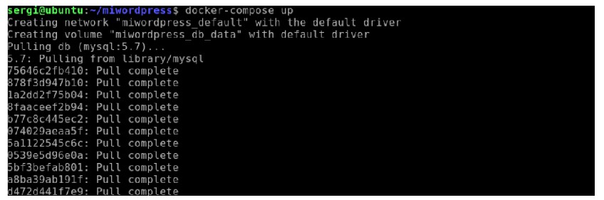
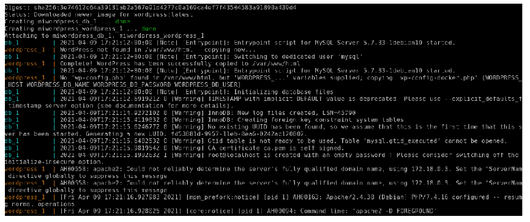

# 1. INTRODUCCIÓ
En aquesta unitat parlarem de **"Docker Compose"**, una utilitat per a definir i posar en marxa múltiples contenidors Docker, mitjançant un fitxer de configuració en format YAML.

# 2. DOCKER COMPOSE
## 2.1 QUÈ ÉS DOCKER COMPOSE?
Al llarg d'anteriors unitats hem vist aplicacions allotjades en contenidors Docker que per posar-se en marxa no utilitzaven un únic contenidor, sinó que requerien l'ús de diversos contenidors. El procés de posar en marxa aquestes aplicacions era tediós, ja que usualment havíem d’alçar "a mà" aquests contenidors, respectant l'ordre de llevat, etc.

**"Docker Compose"** és una aplicació per simplificar la tasca de llançar múltiples contenidors amb una configuració específica i enllaçar-se entre si. A més, "Docker Compose" actua com un orquestrador simple, permetent cert escalat local (encara que amb prou limitacions en comparació amb altres orquestradors, com Kubernetes).

Per definir el comportament que realitzarà Docker Compose, utilitzarem un fitxer de configuració escrit en format YAML.

Per a més informació [https://docs.docker.com/compose/]

## 2.2 instal·lant Docker Compose
Per instal·lar/actualitzar "Docker Compose", seguirem els passos indicats per al nostre sistema operatiu en https://docs.docker.com/compose/install/.
Bàsicament la instal·lació consisteix en obtenir el binari adequat per als nostres sistemes del compte GitHub de **"Docker Compose"** [https://github.com/docker/compose/releases] manualment o amb les ordres que proposem i després d'això donar-li permisos d'execució.
**Instal·lació Linux**: una forma d'obtenir-la és mitjançant el comandament "curl" és:
```
sudo curl -L
"https://github.com/docker/compose/releases/download/1.29.0/docker-compose-$(uname -s)-$(uname -m)" -o /usr/local/bin docker-compose
```

Un cop obtingut, li vam dotar de permisos d'execució:
```
sudo chmod +x /usr/local/bin/docker-compose
```
Si ho desitgem, podem crear també un enllaç simbòlic a altres llocs, com aquí:
```
sudo ln -s /usr/local/bin/docker-compose /usr/bin/docker-compose
```

**Instal·lació Windows**: en una PowerShell, habilita la versió de TSL que necessita GitHub per transferir paquets amb el comandament:
```
[Net.ServicePointManager]::SecurityProtocol =
[Net.SecurityProtocolType]::Tls12
```
i descarreguem el binari amb el comandament:
```
Invoke-WebRequest
"https://github.com/docker/compose/releases/download/1.29.0/docker-compose-Windows-x86_64.exe" -UseBasicParsing -OutFile
$Env:ProgramFiles\Docker\docker-compose.exe
```

Una vegada instal·lat **"Docker Compose"**, podem comprovar si la instal·lació és correcta amb:
```
docker-compose --version
```


En el moment de la redacció d'aquest document, l'última versió és la 1.29.0.

# 3. FORMAT YAML I FITXER "DOCKER-COMPOSE.YML"
## 3.1 Què és YAML?
YAML és l'acrònim recursiu de "YAML Is not Markup Language", que en valencià vol dir, "YAML no és un llenguatge de marques". Més informació a [https://es.wikipedia.org/wiki/YAML]
YAML és a efectes pràctics una forma de definir informació utilitzant format text. Funciona de manera similar a XML o JSON. Si teniu experiència amb XML o JSON, en aquest bloc plantegen i s'expliquen un exemple representant la mateixa informació en els 3 formats:
[https://journey2theccie.wordpress.com/2020/02/28/devnet-associate-1-1-compare-data-formats-xml-json-YAML/]

L'ús de YAML dins de **"Docker Compose"** és senzill i fàcilment comprensible amb cada un dels exemples. Podeu fer un repàs previ als principals elements de YAML utilitzats en fitxers **"Docker Compose"** revisant els exemples de YAML a la Viquipèdia, disponibles a:
https://es.wikipedia.org/wiki/YAML#Ejemplos.

> 💬Interessant: Utilitats com https://codeutility.org/yaml-to-json-xml/ ens permeten convertir YAML a XML o JSON.

## 3.2 Què és el fitxer "docker-compose.yml"?
El fitxer "docker-compose.yml" és un fitxer en format YAML que definirà el comportament de cada configuració de "Docker Compose". El més habitual, és tenir aquest fitxer a l'arrel del nostre projecte. En aquest el proper punt veurem què és el format YAML i posteriorment presentarem un exemple bàsic i comprensible d'un fitxer "docker-compose.yml".

## 3.3 Quina informació podem especificar en el nostre fitxer "docker-compose.yml"?
L'especificació completa per a la versió 3 del fitxer "docker-compose.yml" està definida en [https://docs.docker.com/compose/compose-file/compose-file-v3/]

A continuació, definirem els més importants:
- **version**: permet indicar la versió de l'especificació del fitxer **"docker-compose.yml"** no cal des de la versió 1.27.0 de **"Docker Compose"**.
- **services**: array associatiu amb les diferents plantilles de cada contenidor.
- **build**: usat en les plantilles de contenidors. Serveix per a indicar si hem de construir la imatge a partir d'un"Dockerfile". Encara que té diverses formes d'ús detallades en https://docs.docker.com/compose/compose-file/compose-file-v3/#build, la forma més habitual de fer-la servir és indicar en quin directori està el nostre nostre "Dockerfile" de la forma "build:./directorio".
- **command**: sobreescriu la comanda per defecte a la imatge. Es fa servir de la forma **"command:/bin/bash"**.
- **container_name**: especifica un nom de contenidor (si no, es generarà automàticament). Es fa servir de la forma"container_name:micontenedor"
- **depends_on**: indica que aquesta plantilla de contenidor, depén de què s'haja creat un contenidor previ amb les plantilles especificades. Els serveis també són detinguts en ordre invers a la dependència. Es poden veure exemples en [https://docs.docker.com/compose/compose-file/compose-file-v3/#depends_on]
- **env_file i environment**: permet definir variables d'entorn de la plantilla del contenidor.
  - env_file especifica un fitxer o llista de fitxers on estan definides les variables d'entorn, similar a "env_file:.env"
- **environment**: especifica una llista de variables d'entorn amb el seu valor. Exemples en [https://docs.docker.com/compose/compose-file/compose-file-v3/#environment]
- **Expose/ports**: permet definir un conjunt de ports que exporten al contenidor. Exemples en [https://docs.docker.com/compose/compose-file/compose-file-v3/#expose] i en [https://docs.docker.com/compose/compose-file/compose-file-v3/#ports].
- **image**: específica la imatge en què es basa el contenidor. No cal quan s'especifica a partir d'un "Dockerfile".
- **network_mode**: especifica la manera de xarxa, de manera similar al paràmetre --network de Docker. Les modalitats suportades es detallen en el següent enllaç [https://docs.docker.com/compose/compose-file/compose-file-v3/#network_mode]
- **networks**: defineix les xarxes a crear per posar en marxa els nostres contenidors. Exemples en https://docs.docker.com/compose/compose-file/compose-file-v3/#networks
- **restart**: indica quan ha de reiniciar-se el contenidor. El valor per defecte és "no" (no es reinicia). Altres valors suportats són "always" (es reinicia quan el contenidor és perd), **"on-failure"** (es reinicia si el contenidor s'atura i retorna un valor de sortida diferent de zero) i "unless-stoped" (es reinicia sempre, excepte si el contenidor és aturat manualment amb "docker stop").
  - Exemples [https://docs.docker.com/compose/compose-file/compose-file-v3/#restart]
- **tmpfs**: estableix una llista de directoris a muntar en format "tmpfs" al contenidor. Exemples en [https://docs.docker.com/compose/compose-file/compose-file-v3/#tmpfs]
- **volumes**: estableix una llista de volums, ja siga en format "bind mount" o volum Docker. Si vols reutilitzar un volum entre diferents plantilles, a més has de definir la variable "volumes" fora de les plantilles de contenidors. Exemples [https://docs.docker.com/compose/compose-file/compose-file-v3/#volumes]

##  3.4 Entenent un fitxer "docker-compose.yml" amb exemple Wordpress
En aquest apartat veurem un exemple de "docker-compose.yml" per posar en marxa Wordpress. En primer lloc, crearem un directori "miwordpress" o similar, ens situarem dins de directori i allà crearem el fitxer"docker-compose.yml".

El contingut complet del fitxer seria el següent:
```
version: "3.9"
services:
  db:
    image: mysql:5.7
    volumes:
    - db_data:/var/lib/mysql
    restart: always
    environment:
      MYSQL_ROOT_PASSWORD: somewordpress
      MYSQL_DATABASE: wordpress
      MYSQL_USER: wordpress
      MYSQL_PASSWORD: wordpress

  wordpress:
    depends_on:
      - db
    image: wordpress:latest
    ports:
      - "8000:80"
    restart: always
    environment:
      WORDPRESS_DB_HOST: db:3306
      WORDPRESS_DB_USER: wordpress
      WORDPRESS_DB_PASSWORD: wordpress
      WORDPRESS_DB_NAME: wordpress
volumes:
  db_data:
```
Procedim a analitzar el contingut de l'arxiu:

### 3.4.1 Paraula clau "version"
```
version: "3.9"
```
Aquí tenim definit en format YAML un parell variable/valor (la variable és "version" i el valor és "3.9"). "Docker Compose"ha anat ampliant-se amb el temps, així que aquí indiquem indicant la versió del format de fitxer. Aquesta dada és opcional des de la versió "1.27.0" de "Docker Compose", ja que és capaç d'auto detectar-lo.

### 3.4.2 Paraula clau "services" i contenidor "db"
```
services:
  db:
    image: mysql:5.7
    volumes:
    - db_data:/var/lib/mysql
    restart: always
    environment:
      MYSQL_ROOT_PASSWORD: somewordpress
      MYSQL_DATABASE: wordpress
      MYSQL_USER: wordpress
      MYSQL_PASSWORD: wordpress
```
En primer lloc, estableix la variable "services". Seguint el format YAML, el que emmagatzema "services" és un array associatiu amb les variables "db" i posteriorment "wordpress" (no es veu en aquest fragment). Per saber que un element està contingut en un altre, ho detecta mitjançant el nivell dels espais (de manera similar a llenguatges com Python).

Cadascuna d'aquestes variables, defineix un contenidor. En aquest cas, la plantilla de contenidor "db", és també un array associatiu en format YAML i defineix les següents propietats:
```
image: mysql:5.7
```
Defineix la imatge que utilitzarà el contenidor.
```
volumes:
- db_data:/var/lib/mysql
```
Defineix que volums contindrà aquesta imatge. En aquest cas, els volums en si, es defineixen com una llista, d'un sol element. Sabem que és una llista perquè en YAML comencen amb"-".
En aquest cas, es defineix el volum "db_data" que és mapeja amb el directori del contenidor "/var/lib/mysql". Si volguérem tenir diversos volums, podríem fer alguna cosa similar a:
```
volumes:
- db_data:/var/lib/mysql
- otrovolumen:/directori/otrovolumen
```
Amb això ja hem vist els 3 principals tipus elements de YAML (parell variable/valor, array associatiu, llista).
```
restart: always
```
Aquest fragment, utilitzant la sintaxi YAML de bat variable / valor, indica que si el servidor s'atura, **"Docker Compose"** el re-llance automàticament (útil per a contenidors que puguen caure per una fallada, però siguen necessaris perquè l'aplicació funcione).
```
environment:
  MYSQL_ROOT_PASSWORD: somewordpress
  MYSQL_DATABASE: wordpress
  MYSQL_USER: wordpress
  MYSQL_PASSWORD: wordpress
```

En aquest últim fragment, es defineix la variable "environment" del contenidor. Aquestes contindran mitjançant un vector associatiu, el parell variable/valor de cada variable d'entorn definida en el contenidor. A efectes pràctics, està definint el password de root de MySQL, el nom d'una base de dades "wordpress", un usuari amb permisos de root per a MySQL anomenat "wordpress" (necessari per a connexions remotes) i el seu password com "wordpress".

### 3.4.3 Paraula clau "services" i contenidor "wordpress"
```
wordpress:
  depends_on:
    - db
  image: wordpress:latest
  ports:
    - "8000:80"
  restart: always
  environment:
    WORDPRESS_DB_HOST: db:3306
    WORDPRESS_DB_USER: wordpress
    WORDPRESS_DB_PASSWORD: wordpress
    WORDPRESS_DB_NAME: wordpress
```
En aquest cas, s'està definint dins “services”, la plantilla del contenidor "wordpress". 

Passem a veure els teus fragments:
```
depends_on:
- db
```
Indica que aquest contenidor depén del contenidor "db", per la qual el contenidor "db" s'ha de posar en marxa abans d'iniciar el nostre contenidor "wordpress".
```
image: wordpress:latest
```
Com s'ha comentat anteriorment, indica la imatge en què es basa el contenidor.
```
ports:
- "8000:80"
```
Indica que el port "80" d'aquest contenidor és mapeja amb el port "8000" de l'amfitrió.
```
restart: always
```
Com s'ha comentat anteriorment, indica que si el contenidor s'atura, es torna a arrencar automàticament.
```
environment:
  WORDPRESS_DB_HOST: db:3306
  WORDPRESS_DB_USER: wordpress
  WORDPRESS_DB_PASSWORD: wordpress
  WORDPRESS_DB_NAME: wordpress
```
De manera similar a l'anterior punt, definim el valor de diferents "variables d'entorn" del contenidor "wordpress".

### 3.4.4 Paraula clau "volumes" fora de les plantilles de contenidors
```
volumes:
  db_data:
```
Simplement indica que el volum "db_data" està disponible per a altres contenidors posats en marxa amb **"Docker Compose"**.

## 3.5 Llançant el nostre exemple Wordpress "docker-compose.yml"
Un cop creat i entés el nostre fitxer "docker-compose.yml", podem posar en marxa el nostre servei  situant-nos en el directori on està aquest fitxer i escrivint:
```
docker-compose up -d
```
Amb l'opció "up" vam indicar que s'interprete la plantilla definida a "docker-compose.yml" i amb "-d" vam indicar l'execució en segon pla. Observarem alguna cosa similar a:



I continua amb text com el següent



Observem, que tal com hem definit, primer es descarrega i posa en marxa el contenidor basat en la plantilla "db", al qual se li dona nom **"miwordpress_db_1"**, ja que estableix el nom de directori com a base **"miwordpress"**, després el de la plantilla, i després un nombre segons el nombre de contenidor creat.
Posteriorment, es crea de la mateixa manera el contenidor basat en la plantilla "wordpress".

Si accedim a [http://localhost:8000] observarem que tot funciona correctament.
Podem aturar tots els contenidors amb el comandament:
```
docker-compose down
```

# 4. ORDRES DE "DOCKER COMPOSE"
En aquest apartat definirem els principals comandaments de "Docker Compose".
## 4.1 Comandament "up"
Amb la comanda "up" s'interpretarà la plantilla "docker-compose.yml" i es llançaran els contenidors necessaris. El detall del seu funcionament i paràmetres està definit en la següent adreça https://docs.docker.com/compose/reference/up/

**<u>Alguns dels usos més típics són</u>**:
```
docker-compose up -d
```
Interpreta la plantilla i crea l'aplicació, però amb el paràmetre "-d" actua en segon pla.
```
docker-compose up -d -f mifichero.yml
```
El paràmetre "-f" permet indicar un nom de fitxer YAML per "Docker Compose".
```
docker-compose up -d --force-recreate
```
El paràmetre "--force-recreate" força a reconstruir contenidors fins i tot si ja existeixen a la teua màquina.
```
docker-compose up -d --scale db=3
```
El paràmetre "--scale" indica que del servei "db" es creuen tres contenidors, realitzant un escalat local. El mateix **"Docker Compose"** s'encarregarà mitjançant algoritme "round robin" de distribuir les peticions als hosts "db" (com el nom del servei) a cadascun dels contenidors escalats. Això es veurà més clarament en un dels casos pràctics proposats.

## 4.2 Comandament "down"
Amb la comanda **"down"** s'interpretarà la plantilla i es paren els contenidors necessaris.
El detall del seu funcionament i paràmetres està definit en la següent adreça [https://docs.docker.com/compose/reference/down/]
**<u>Alguns dels usos més típics són</u>**:
```
docker-compose down
```
Atura tots els contenidors.
```
docker-compose down -v
```
Elimina els volums creats a la plantilla
```
docker-compose down -t 5
```
Estableix un "timeout" per a la parada de contenidors de 5 segons. El valor per defecte si no s'indica res és de 10 segons.

# 4.3 Comandament "build"
Comandament que simplement crea les imatges definides en la plantilla "docker-compose.yml". El seu funcionament es detalla en [https://docs.docker.com/compose/reference/build/]

## 4.4 Comandament "pull"
Comandament descàrrega les imatges de contenidors necessàries per "docker-compose.yml". El seu funcionament es detalla en [https://docs.docker.com/compose/reference/pull/]

## 4.5 Comandament "run"
Comandament que permet llançar una ordre contra un servei concret definit a la plantilla **"docker-compose.yml"**. El detall del seu funcionament està disponible en [https://docs.docker.com/compose/reference/run/]

## 4.6 Comandament "pause"/"unpause"
Amb e comandament" pause"/"unpause" és pausan/reprenen els contenidors de la plantilla. El detall del seu funcionament i paràmetres està definit en la següent adreça [https://docs.docker.com/compose/reference/pause/]

## 4.7 Comandament "start"/"stop"
Amb el comandament "start"/"stop" podem iniciar/parar sense paràmetres tots els serveis de la plantilla o amb paràmetres, el servei que desitgem d'aquesta plantilla. També inicia per les seues dependències, si les té.
El detall del seu funcionament i paràmetres està definit en:
- https://docs.docker.com/compose/reference/stop/
- https://docs.docker.com/compose/reference/start/
Exemple:
```
docker-compose start db
```
Inicia el servei "db" de la plantilla.
```
docker-compose stop db
```
Atura el servei "db" de la plantilla.

## 4.8 Comandament "ps"
Similar al comandament "docker ps", només que aplicat als contenidors de la plantilla. El detall del seu funcionament i paràmetres està definit en la següent adreça [https://docs.docker.com/compose/reference/ps/]

## 4.9 Comandament "exec"
El comandament "exec" és similar a"docker exec". Ens permet executar una ordre els contenidors amb una plantilla determinada. El detall del seu funcionament està definit en [https://docs.docker.com/compose/reference/exec/]
Exemple:
```
docker-compose exec db mysql --version
```

## 4.10 Comandament "rm"
El comandament "rm" elimina tots els contenidors aturats segons la plantilla determinada en **"docker-compose.yml"**. El detall del seu funcionament està definit en https://docs.docker.com/compose/reference/rm/

# 5. BIBLIOGRAFIA
[1] Docker Docs [https://docs.docker.com/]
[2] Docker Compose [https://docs.docker.com/compose/]