# 1. INTRODUCCIÓ
Fins ara, hem vist com descarregar i treballar amb imatges de tercers en Docker. En aquesta unitat explicarem com gestionar les imatges de contenidors Docker (llistat, eliminació, història, etc.) així com la seua creació tant de forma manual com utilitzant el comandament "docker build" amb els anomenats "Dockerfiles".

# 2. LLISTANT IMATGES LOCALS I PER A BAIXAR
## 2.1 Llistant imatges locals
Podem obtenir informació de quines imatges tenim emmagatzemades localment utilitzant 

> docker images 

Obtenint un resultat similar a el següent, on veiem informació sobre les imatges

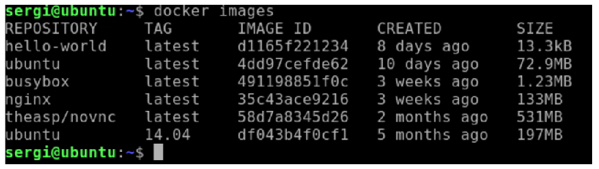

Podem utilitzar filtres senzills usant la nomenclatura  **“docker images [REPOSITORIO[:TAG]]”**.

> docker images ubuntu:14.04

Ens mostrarà la imatge del repositori "ubuntu" en la seua versió "14.04".

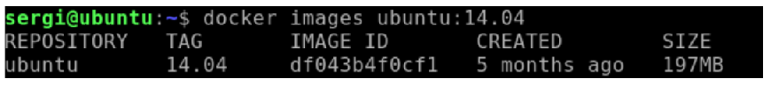

Si volem utilitzar algun filtre avançat, podem usar l'opció "-f". Aquí un exemple, filtrant les imatges que comencen per "o" i acabe la seua etiqueta a "04".

```
docker images -f=reference="u*:*04"
```

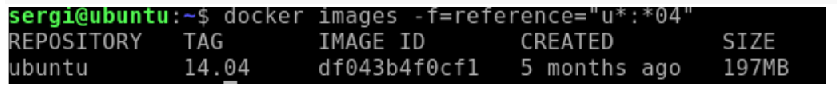

>❕ Atenció: no confondre aquest comandament amb "docker image" (sense la s final).

Més informació a [https://docs.docker.com/engine/reference/commandline/images/]

## 2.2 Llistant imatges per a baixar
Podem obtenir informació d'imatges que podem descarregar en el registre (per defecte, Docker Hub) utilitzant el comandament "docker search". Per exemple amb la següent comanda:

```
docker search Ubuntu
```

Ens apareixen aquelles imatges disponibles en el registre (Docker Hub) amb aquesta paraula.

# 3. DESCARREGANT I ELIMINANT IMATGES (I CONTENIDORS) LOCALS
## 3.1 descarregant imatges amb "docker pull"
Podem emmagatzemar imatges localment des del registre sense necessitat de crear un contenidor mitjançant la comanda "docker pull", clarament inspirat en sistemes de control de versions com "git". Per conéixer els seus noms i versions, podem usar la comanda "docker search" explicat
anteriorment o visitar https://hub.docker.com/.

```
docker pull alpine:3.10
```

Aquesta comanda ens descarrega la imatge "alpine" amb el tag "3.10", com veiem aquí:

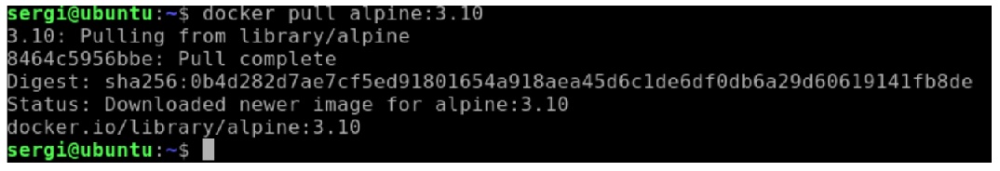

## 3.2 Observar l'historial d'una imatge descarregada
Podeu observar l'historial d'una imatge descarregada, és a dir, en quines versions es basa, utilitzant la comanda "docker history". Per exemple amb:

```
docker history nginx
```

Obtenim el següent:

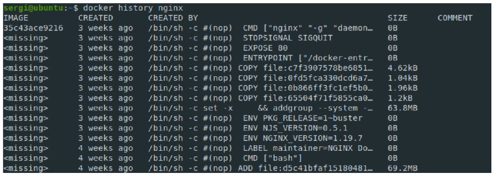

## 3.3 Eliminant imatges amb "docker rmi"
Amb la comanda "docker rmi" podem eliminar imatges emmagatzemades localment.

```
docker rmi ubuntu:14.04
```

Elimina la imatge “ubuntu” amb l'etiqueta “14.04”.
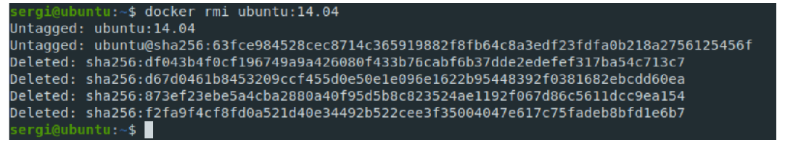

Una manera d'eliminar totes les imatges locals, que no estiguin sent usades per un contenidor, combinant "docker images -q" per obtenir la llista i "docker rmi" és la següent :

```
docker rmi $(docker images -q)
```

Aquí s'observa l'esborrat, excepte d'aquelles usades per un contenidor:

## 3.4 Eliminant contenidors amb "docker rm"
Aprofitant que tractem l'esborrat d'imatges, comentem com esborrar contenidors aturats (si un contenidor està en marxa, ha de ser aturat abans de l'esborrat).
Amb la següent ordre es pot esborrar un contenidor per identificador o nom

```
docker rm IDENTIFICADOR/NOM
```

Així mateix, una forma d'esborrar tots els contenidors (que estiguen aturats), de manera similar a com vam veure en l'anterior punt, és la següent:
**Pas 1 (opcional)**: parem tots els contenidors:
```
docker stop $(docker ps -a -q)
```
**Pas 2**: esborrem tots els contenidors:
```
docker rm $(docker ps -a -q)
```

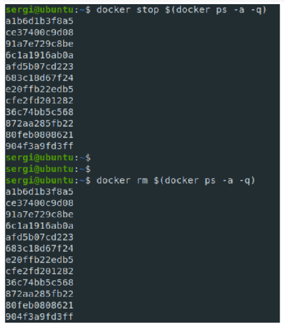

## 3.5 Eliminant totes les imatges i contenidors amb "docker system prune -a
Una manera de fer les operacions anteriors de cop, és usant "docker system prune -a", que elimina tota imatge i contenidor aturat.
**Pas 1 (opcional)**: parem tots els contenidors:
```
docker stop $(docker ps -a -q)
```
**Pas 2**: esborrem tots els contenidors:
```
docker system prune -a
```
Obtenint una cosa similar a això:

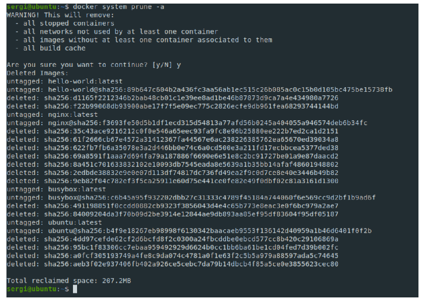

# 4. CREANT LES NOSTRES PRÒPIES IMATGES A PARTIR D'UN CONTENIDOR EXISTENT
El sistema d'imatges de Docker funciona com un control de versions per capes, de manera similar a l'eina "git" per a control de versions. Podem entendre que un contenidor és com una "capa temporal" d'una imatge, per la qual cosa, podem fer un "commit" i convertir aquesta "capa
temporal" en una imatge. La sintaxi més habitual és la següent
```
docker commit -a "autor" -m "comentario" ID/NOMBRE-CONTENEDOR
usuario/imagen:[version]
```

Per exemple, si tenim un contenidor amb nom"ubuntumod" que simplement és un contenidor basat en la imatge "ubuntu" en què s'ha instal·lat un programa i fem:
```
docker commit -a "Sergi" -m "Ubuntu modificado" IDCONTENEDOR
sergi/ubuntumod:2021
```

i després d'això, vam comprovar les imatges amb
```
docker images
```
observem el següent:

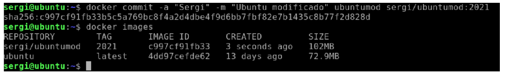

Hem obtingut el següent: una nova imatge, amb nom"sergi/ubuntumod"amb tag"2021",on "sergi" actua com a nom d'usuari per usar-lo en un repositori remot (recordem novament, que per defecte és "Docker Hub").
Ara ja podríem crear nous contenidors amb aquesta imatge, usant per exemple:
```
docker run -it sergi/ubuntumod:2021
```
Si volguérem afegir una nova etiqueta a la imatge, com "latest", podem usar el comandament "docker tag", tenint en compte que una mateixa imatge pot tenir diverses etiquetes:
```
docker tag sergi/ubuntumod:2021 sergi/ubuntumod:latest
```
Obtindrem alguna cosa similar a:

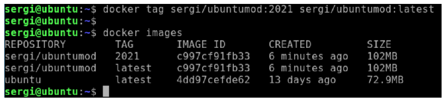

Per eliminar una etiqueta, simplement haurem d’esborrar la imatge amb “docker rmi”. La imatge es mantindrà mentre almenys tinga una etiqueta. Per exemple amb:
```
docker rmi sergi/ubuntumod:2021 
```
quedaria així:

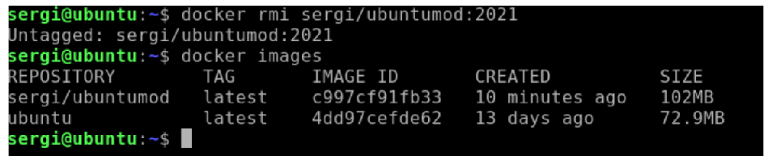

Més informació dels comandaments en:
- Docker commit [https://docs.docker.com/engine/reference/commandline/commit/]
- Docker tag [https://docs.docker.com/engine/reference/commandline/tag/]

# 5. EXPORTANT/IMPORTANT IMATGES LOCALS A/DES DE FITXERS
Un cop tinguem una imatge local en el nostre sistema, podem fer una còpia d’aquesta, sigui com a còpia de seguretat o com a forma de transportar-la a altres sistemes mitjançant el comandament "docker save". Per exemple es pot fer d'aquestes dues formes:
```
docker save -o copiaSeguridad.tar sergi/ubuntumod
```
o de forma alternativa
```
docker save sergi/ubuntumod > copiaSeguridad.tar
```
Si volem importar el fitxer per crear una imatge a la nostra màquina, podem usar "docker import". Per exemple es pot fer d'aquestes dues formes:
```
docker load -i copiaSeguridad.tar
```
o de forma alternativa
```
docker load < copiaSeguridad.tar
```
Més informació sobre els comandaments:
- Docker save: [https://docs.docker.com/engine/reference/commandline/save/]
- Docker load: [https://docs.docker.com/engine/reference/commandline/load/]

# 6. PUJANT LES NOSTRES PRÒPIES IMATGES A UN REPOSITORI (DOCKER HUB)
Podem pujar una imatge a un repositori (per defecte Docker Hub). Per a això, hem de realitzar els
següents passos:
## 6.1 Pas 1: creant repositori per emmagatzemar la imatge en Docker Hub
En primer lloc, heu de crear-vos un compte a [https://hub.docker.com] i logear-vos. Una vegada loguejats, heu d'accedir a "Repositories" i ací a "Create repository" de manera similar a com es veu en la imatge següent:

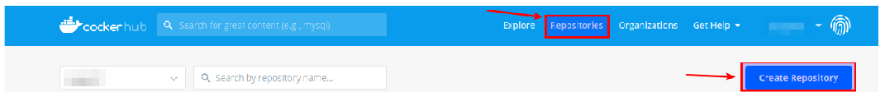

Després d'això, podreu quedar un repositori amb el vostre compte i triar si aquest repositori és públic (qualsevol pot accedir ) o privat (només pot accedir amo o autoritzats).
La pantalla de creació del repositori té un aspecte similar a aquest:

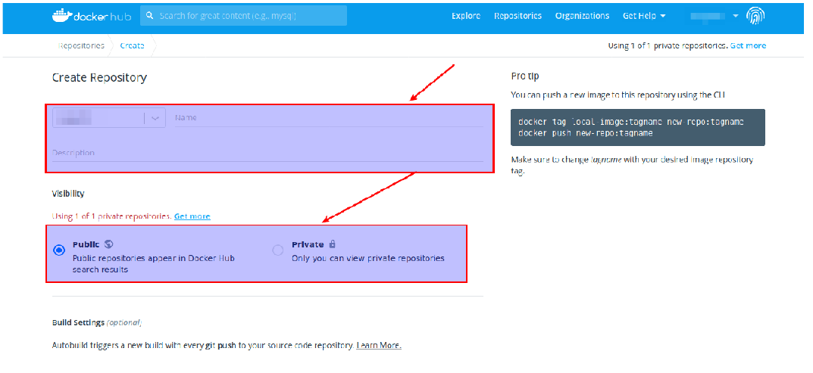

Un cop creat, si el teu usuari és "sergi" i la imatge es diu "prova", podrem referenciar en diferents contextos com "sergi/prova"

## 6.2 Pas 2: emmagatzemant imatge local en repositori Docker Hub
En primer lloc, haurem de loguearnos mitjançant consola al repositori mitjançant la comanda
```
docker login
```
Un cop loguejat, hem de fer un "commit" local de la imatge, seguint l'estructura vista en punts anteriors. Un exemple podria ser:
```
docker commit -a "Sergi" -m "Ubuntu modificado" IDCONTENEDOR
sergi/prueba
```
Fet aquest commit local, hem de pujar-lo usant "docker push"
```
docker push sergi/prueba
```
Un cop fet això, si la imatge és pública (o privada amb permisos), qualsevol podrà descarregar-la i crear contenidors usant "docker pull" o "docker run".
Més informació de les ordres:
- Docker login [https://docs.docker.com/engine/reference/commandline/login/]
- Docker push [https://docs.docker.com/engine/reference/commandline/push/]

# 7. GENERAR AUTOMÀTICAMENT LES NOSTRES PRÒPIES IMATGES MITJANÇANT DOCKERFILE
Docker ens permet generar de forma automàtica les nostres pròpies imatges usant "docker build" i els anomenats "Dockerfile".
## 7.1 Editor Visual Studio Code i connectors associats a Docker
Els fitxers "Dockerfile" poden crear-se amb qualsevol editor de text, però des d'aquí recomanem l'editor multiplataforma "Visual Studio Code" [https://code.visualstudio.com/]
Per saber més sobre com utilitzar aquest editor podeu fer servir [https://code.visualstudio.com/learn]
En instal·lar-lo, si detecta Docker instal·lat en el sistema, el mateix editor ens suggerirà una sèrie de connectors. Val la pena instal·lar-los. Si no, sempre podeu buscar a connectors manualment. Jo personalment, us recomane aquests dos que podeu veure a la imatge:

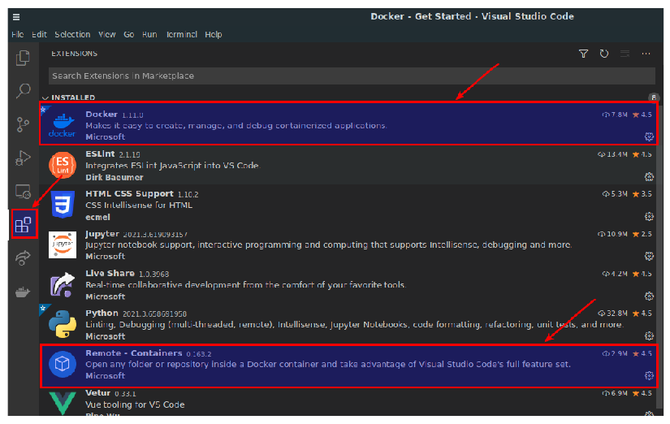

## 7.2 Creant el nostre primer Dockerfile
Començarem creant un senzill "Dockerfile" on crearem una imatge d'Ubuntu amb l'editor de text
"nano" instal·lat. Per a això indicarem:
- De quina imatge base partirem.
- Que ordres llançarem sobre la imatge base, per crear la nova imatge
- Què comanda s'associarà per defecte en llançar un contenidor amb la nova imatge

Creem el fitxer"Dockerfile"(Visual Studio Code li posarà una icona de la balena) i afegim:
```
FROM ubuntu:latest
RUN apt update && apt install -y nano
# Aquí un comentario
CMD /bin/bash
```
a l'editor quedarà d'una manera similar a:

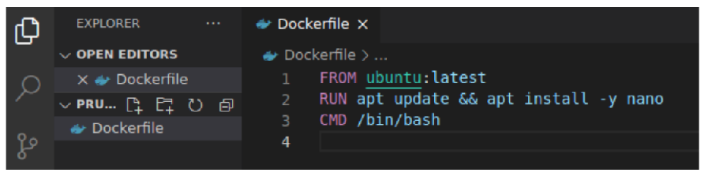

Si ara fem servir la comanda "docker build" de la següent manera:
```
docker build -t ubuntunano ./
```
Obtindrem alguna cosa similar a

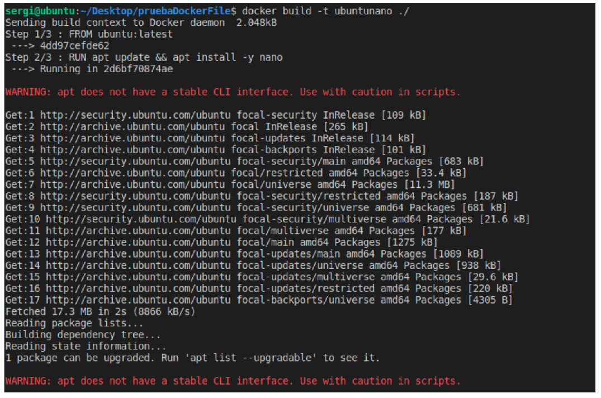

el que hem fet és "executar" el que marca el "Dockerfile". El resultat s’ha guardat en una nova imatge local amb el nom que hem especificat amb l'opció "-t". El lloc on es trobava el **"Dockerfile"** s'ha indicat mitjançant "./" (directori actual).

>❕ Atenció: el fitxer ha de cridar exactament "Dockerfile", respectant majúscules i minúscules.

Si voleu especificar un nom de fitxer diferent a buscar en el directori, pot usar-se l'opció "-f", com en aquest exemple:
```
docker build -t ubuntunano -f Dockerfile2 ./
```
Podem observar la història de la imatge que hem creat amb **"docker history"**:

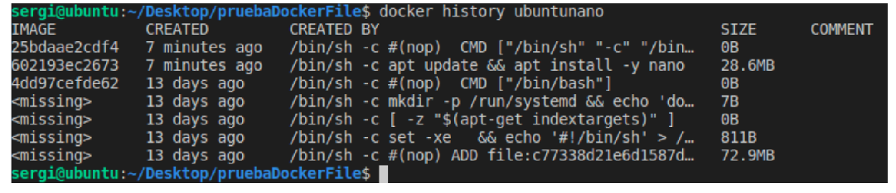

On observem, que la nostra imatge ha crescut en "28.6MB" al fer **"apt update && apt install -i nano"**. Encara que en l'anterior "Dockerfile" hem fet servir un sol RUN, podríem haver utilitzat diversos RUN en lloc d'un, escrit d'una manera seqüencial com veiem en:
```
FROM ubuntu:latest
RUN apt update
RUN apt install -y nano
CMD /bin/bash
```
aquí simplement, hi hauria més capes intermèdies, com s'observa en "docker history" si generem la imatge amb la seqüència anterior

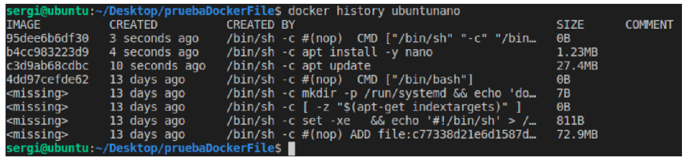

Els comandaments vistos (FROM, RUN i CMD) admeten diferents formats. Per saber-ne més podem visitar la seua ajuda: [https://docs.docker.com/engine/reference/builder/]

## 7.3 Altres ordres importants de Dockerfile
En crear un "Dockerfile" hi ha multitud d'ordres. A continuació expliquem les ordres més importants a utilitzar:

### 7.3.1 Comandament EXPOSE
En primer lloc, repassem la diferència entre exposar i publicar ports en Docker:
- Si no s'exposa ni publica un port, aquest Només des de l'interior del contenidor.
- Exposar un port, indica que aquest port és accessible tant dins el mateix contenidor com per altres contenidors, però no des de fora (inclòs l'amfitrió).
- Publica un port, indica que el port accessible des de fora del contenidor, per la qual cosa s'ha d'associar a un port de l'amfitrió.
  
L'opció Expose ens permet indicar els ports per defecte exposats que tindrà un contenidor basat en aquesta imatge. És similar a l'opció **"--expose"** de **"docker run"** (i de pas, recordem que "docker run" amb "-p" els publica). Per exemple, per a exposar 80, 443 i 8080 indicarem:
```
EXPOSE 80 443 8080
```
## 7.3.2 Comandament ADD/COPY
ADD i COPY són ordres per copiar fitxers de la màquina amfitrió al nou contenidor. Es recomana usar COPY, excepte que vulguem descomprimir un "zip", que ADD permet la seua descompressió.

Més informació sobre la diferència entre ADD i COPY:
[https://nickjanetakis.com/blog/docker-tip-2-the-difference-between-copy-and-add-in-a-dockerile]

Exemple d'ús de ADD:
```
ADD ./mifichero.zip /var/www/html
```
Descomprimirà el contingut de"mifichero.zip" al directori destí de la nova imatge.

Exemple d'ús de COPY:
```
COPY ./mifichero.zip /var/www/html
```
o fins i tot accedint des del web.
```
COPY http://miservidor.commifichero.zip /var/www/html
```
En aquest cas, copiarà el fitxer **"mifichero.zip"** al directori destí de la nova imatge.

### 7.3.3 Comando ENTRYPOINT
Per defecte, els contenidors Docker estan configurats perquè executen les ordres que es llancen mitjançant "/bin/sh -c". Dit d'una altra manera, les ordres que llançàvem, eren paràmetres per **"/bin/sh -c"**. Podem canviar que comandament s'usa per això amb ENTRYPOINT. Per exemple:
```
ENTRYPOINT ["cat"]
CMD ["/etc/passwd"]
```
Indicarem que les ordres siguen llançats amb **"cat"**. En llançar el comandament **"/etc/passwd"**, realment el que farem és que es llançarà "cat /etc/passwd".

### 7.3.4 Comando USER
Per defecte, tots els comandaments llançats en la creació de la imatge s'executen amb l'usuari root (usuari amb UID=0). Per poder canviar això, podem usar la comanda USER, indicant el nom d'usuari o UID amb el qual volem que s'execute el comandament. Per exemple:
```
USER sergi
CMD id
```
Mostrarà amb la comanda "id" el uid i altra informació de l'usuari "sergi".

### 7.3.5 Comando WORKDIR
Cada vegada que expressem la comanda WORKDIR,estem canviant el directori de la imatge on
executem les ordres. Si aquest directori no existeix, es crea. Per exemple:
```
WORKDIR /root
CMD mkdir tmp
WORKDIR /var/www/html
CMD mkdir tmp
```
Crearà la carpeta **"tmp"** tant en **"/root"** com a **"/var/www/html"**. Si els directoris **"/root"** o **"/var/www/html"** no haguessen existit, els haguera creat.

### 7.3.6 Comando ENV
La comanda ENV ens permet definir variables d'entorn per defecte en la imatge.
```
ENV v1=”valor1” v2=”valor2”
```
Això definirà les variables d'entorn "v1" i "v2" amb els valors "valor1" i "valor2".

### 7.3.7 Altres ordres útils: ARG, VOLUME, LABEL, HEALTHCHECK
Aquí comentem ordres útils:
- **ARG**: permet enviar paràmetres al propi "Dockerfile" amb l'opció "--build-arg" del comandament "docker build".
- **VOLUME**: permet establir volums per defecte en la imatge. Parlarem dels volums més endavant en el curs.
- **LABEL**: permet establir metadades dins de la imatge mitjançant etiquetes. Un dels casos més típics, substituint a el comandament Maintainer, que aquesta "deprecated" és:
  - LABEL: maintainer="sergi.profesor@gmail.com"
- **HEALTHCHECK**: permet definir com es comprovarà si aquest contenidor està funcionant correctament o no. Útil per sistemes orquestradors com"Dockerswarn", encara que altres
com "Kubernetes" incorporen el seu propi sistema

# 8. TRUCS PER FER LES NOSTRES IMATGES MÉS LLEUGERES
En crear imatges, és habitual augmentar la mida de les imatges base. Alguns consells per la mesura del possible, augmentar la mida el menys possible:
-  Utilitza imatges base lleugeres, tipus "Alpine".
- No instal·lar programes innecessaris, fins i tot evitant eines tipus Vim, Nano, etc.
- Minimitzar capes en "Dockerfile"
  - Millor usar "RUN apt-get install -i `<packageA>` `<packageB>`" que fer servir "RUN apt-get install -i `<packageA>`" i després d'això "RUN apt-get install -i `<packageB>`"
- Utilitza ordres de neteja després instal·lacions amb **"apt"**, com ara: **"rm -rf /var/lib/apt/lists/*"** després de crear una imatge per esborrar les llistes generades a realitzar "apt update".
  - **"apt-get purge --auto-remove && apt-get clean"** per eliminar temporals d'apt.
- En utilitzar "apt install" usar l’opció "no-install-recommend", perquè no instal·le paquets recomanats associats al paquet instal·lat.
- Analitza els teus "Dockerfile" amb [https://www.fromlatest.io/#/] i segueix els seus consells.
Més informació a:
- [https://medium.com/sciforce/strategies-of-docker-images-optimization-2ca9cc5719b6]
- [https://hackernoon.com/tips-to-reduce-docker-image-sizes-876095da3b34]
  
# 9. BIBLIOGRAFIA
[1] Docker Docs [https://docs.docker.com/]
[2] Visual Studio Code Learn [https://code.visualstudio.com/learn]
[3] FROM: latest [https://www.fromlatest.io/#/]