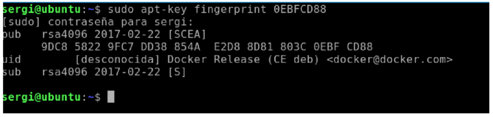
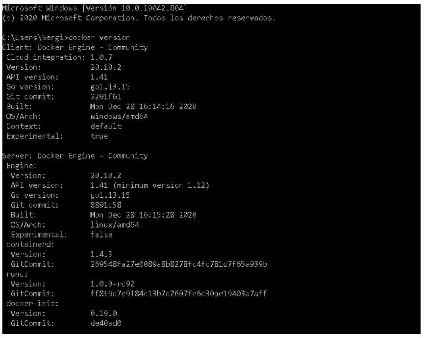

# 1. INTRODUCCIÓ
En aquesta unitat explicarem diversos itineraris per a la instal·lació de Docker, realitzant les nostres recomanacions. Després d'això, descriurem opcions de post instal·lació i comprovarem que tot funciona correctament. Tot i que la unitat hauria de poder realitzar-se en sistemes Windows i MacOS, recomanem sempre que siga possible realitzar aquesta unitat (i en general, utilitzar
Docker) en sistemes Linux, ja que la seua implementació avui dia és més robusta i pot evitar-nos molts maldecaps.

# 2. INSTAL·LACIÓ DE DOCKER EN SISTEMES LINUX (UBUNTU)
En aquest apartat parlarem de la instal·lació de Docker engine CE (Community Edition) en sistemes Linux en distribucions basades en Ubuntu (Ubuntu, Kubuntu, Linux Mint, etc.).
El procediment per instal·lar Docker engine CE en altres distribucions és similar i aquí deixe alguns enllaços amb instruccions per instal·lar-ho en algunes de les més populars:

- CentOS: https://docs.docker.com/engine/install/centos/
- Debian: https://docs.docker.com/engine/install/debian/
- Fedora: https://docs.docker.com/engine/install/fedora/

Així mateix, també és possible la realització d'una instal·lació des dels binaris, seguint les instruccions de https://docs.docker.com/engine/install/binaries/

## 2.1 Instal·lació des del repositori oficial d'Ubuntu (no recomanat)
És possible instal·lar Docker Engine des del repositori oficial d'Ubuntu, però no està recomanat, ja que instal·la versions antigues. En aquesta unitat, donarem per descomptat que no utilitzaren aquestes versions.

## 2.2 Instal·lació des del repositori de Docker-CE (Recomanat)
A continuació detallarem els passos per a instal·lar Docker Engine CE en Ubuntu des del repositori oficial de Docker CE. Les versions d'Ubuntu suportades (totes de 64 bits) són:
- Ubuntu Groovy 20.10.
- Ubuntu Focal 20.04 (LTS).
- Ubuntu Bionic 18.04 (LTS).
- Ubuntu Xenial 16.04 (LTS).

### 2.2.1 Pas 1: Eliminant versions antigues de Docker Engine
En primer lloc, haurem d’eliminar altres versions de Docker, per si estigueren instal·lades (per exemple, una versió del repositori oficial d'Ubuntu) i poguessen provocar conflictes.
Per eliminar les versions antigues pot bastar-amb l'ordre:

> sudo apt-get remove docker docker-engine docker.io containerd runc

### 2.2.2 Pas 2: Incloent el repositori de Docker CE
Per posar en marxa el repositori, el primer que farem serà actualitzar el nostre índex de paquets i després d'això, instal·lar els paquets necessaris (si no ho estaven ja) perquè es puguen utilitzar repositoris amb HTTPS.

```
sudo apt-get update
sudo apt-get install apt-transport-https ca-certificates curl
gnupg-agent software-properties-common
```

Un cop fet aquest pas, descarreguem la clau GPG del repositori de Docker CE i la inclourem. Podem
fer tot amb la següent línia:
> curl -fsSL https://download.docker.com/linux/ubuntu/gpg | sudo apt-key
add -

Opcionalment, podem verificar que la clau està en el nostre sistema amb la següent ordre, buscant
la "petjada" 0EBFCD88.

> sudo apt-key fingerprint 0EBFCD88

Si és correcte, veuràs una cosa similar a la següent captura:


Ara, només ens queda afegir el repositori de Docker CE com a font per a instal·lació de paquets.
MOLT OJO en aquest pas en distribucions derivades, com Linux Mint. El motiu és el següent. En
configurar la font de paquets indiquem la versió d'Ubuntu. La comanda que utilitzem per obtenir la
versió d'Ubuntu és el següent:

> lsb_release -cs

Aquesta comanda ens dirà quina distribució tenim. Per exemple, si tenim "Ubuntu Bionic 18.04
(LTS)", aquesta comanda imprimirà per pantalla "bionic".

En algunes versions derivades d'Ubuntu, com Linux Mint, encara que la distribució estiga basada
en Ubuntu Bionic, no retornarà el text "bionic", sinó un altre diferent. Si esteu en aquest cas,
haureu d'introduir a mà la versió d'Ubuntu en què es basa la vostra distribució.

Aclarit això, amb el següent comandament podeu afegir el repositori:

> sudo add-apt-repository "deb [arch=amd64]
https://download.docker.com/linux/ubuntu $(lsb_release -cs) stable"

En el cas que tingueu una distribució basada en Ubuntu amb el problema comentat anteriorment,
substituir" $(lsb_release -cs)"a mà pel nom, d'una forma similar a:
> sudo add-apt-repository "deb [arch=amd64]
https://download.docker.com/linux/ubuntu bionic stable"

### 2.2.3 Pas 3: Instal·lació Docker Engine CE
Finalment, ja amb el repositori oficial de Docker en el nostre sistema, només ens queda actualitzar
l'índex de paquets i instal·lar l'última versió de Docker Engine CE de la següent manera:
```
sudo apt-get update
sudo apt-get install docker-ce docker-ce-cli containerd.io
```

Finalment, comprovarem que Docker Engine CE s'ha instal·lat correctament executant:

> sudo docker version i obtenint un resultat similar al següent:

Per a més informació sobre aquesta comanda podeu visitar
https://docs.docker.com/engine/reference/commandline/version/

## 2.3 Post instal·lació
En la documentació de Docker, ens proposen alguns passos de post instal·lació. Els podeu consultar
al https://docs.docker.com/engine/install/linux-postinstall/

En aquesta secció comentarem dos d'ells: administrar Docker amb usuaris sense privilegis (no root ni sudoers) i arrencar Docker des de l'inici.

### 2.3.1 Permetre administrar Docker amb usuaris sense privilegis
Docker utilitza sockets Unix. Per a la creació i reserva d'un socket Unix, cal tenir permisos de root, per la qual cosa Docker Engine necessita permisos de root per executar-se.

A vegades, en alguns contextos pot ser-nos útil que Docker s'execute per usuaris sense permisos de root. Posem un context d'una aula d'ordinadors, que serà utilitzada per alumnes amb els quals
volem dur a terme activitats que utilitzen Docker.
Podem configurar l'aula perquè aquests alumnes puguen utilitzar Docker sense necessitat de proporcionar-los un compte amb permisos de root.

Per això, en primer lloc crearem un grup anomenat "docker".

> sudo groupadd docker

Després d'això afegirem als usuaris que volem que facin servir Docker sense permisos de root a el grup amb una ordre semblant a el següent, on $USER és el nom d'usuari:

> sudo usermod -aG docker $USER

Per provar que això funcione, serà necessari que els usuaris afectats tanquen sessió completament (si la tenen oberta) i la tornen a obrir, perquè es reavalue la seua pertinença a grup "docker". Amb això podran utilitzar ordres Docker sense necessitat de permisos de root.

**<u>MOLT ULL</u>**: si vas llançar comandaments de Docker usant sudo amb un d'aquests usuaris abans d'aquesta operació, és possible que en llançar Docker aparega un missatge similar a aquest:
```
WARNING: Error loading config file: /home/user/.docker/config.json -
stat /home/user/.docker/config.json: permission denied
```

Per arreglar aquest error, les opcions són eliminar el directori ".docker" amb
```
sudo rm -rf ~/.docker/
```

o canviar el propietari i permisos del' directori, usant
```
sudo chown "$USER":"$USER" /home/"$USER"/.docker -R
sudo chmod g+rwx "$HOME/.docker" -R
```

### 2.3.2 Activa / desactivar arrencada a l'inici
Per a indicar que el servei de Docker s'inicia al arrancar la màquina, podem indicar-ho mitjançant
els següents comandaments:
```
sudo systemctl enable docker.service
sudo systemctl enable containerd.service
```

Si el que volem és desactivar aquesta arrencada automàtic, podem usar:
```
sudo systemctl disable docker.service
sudo systemctl disable containerd.service
```

Per iniciar/aturar/ einiciar els serveis manualment, podem usar:
```
sudo systemctl start/stop/restart docker.service
sudo systemctl start/stop/restart containerd.service
```

## 2.4 Desinstal·lant Docker en Ubuntu
Si en algun moment volem desinstal·lar Docker en Ubuntu, podem utilitzar la comanda
> sudo apt-get purge docker-ce docker-ce-cli containerd.io

Aquest comandament elimina Docker Engine, però no elimina contenidors i imatges presents al sistema. Si volem eliminar aquestes dades, tenim dues opcions.
La primera consisteix a, prèviament a l'eliminació de Docker Engine, executar el comandament:
> sudo docker system prune -a

La segona opció, s'ha de realitzar després d'eliminar Docker i consisteix en l'esborrat manual d’aquestes, amb el comandament:
> sudo rm -rf /var/lib/docker

# 3. INSTAL·LACIÓ DE DOCKER EN SISTEMES WINDOWS
En aquest apartat veurem com instal·lar Docker Desktop en sistemes Windows.
Docker posseeix dues guies diferenciades d'instal·lació en sistemes Windows:
- Guia per a Windows 10 Pro i Windows Server
  - https://docs.docker.com/docker-for-windows/install/
- Guia per Windows 10 Home
  - https://docs.docker. com/docker-for-windows/install-windows-home/

La principal diferència entre elles, és que el primer grup requereix que s'activen les característiques de Windows per Hyper-V, mentre que la segona guia requereix l'activació de WSL2 (Windows
Subsystem for Linux 2).

## 3.1 Passos previs Windows 10 Pro i Windows Server: activant Hyper-v
En aquest enllaç s'explica com habilitar Hyper-V a:
- Windows 10 Pro
  - https://docs.microsoft.com/es-es/virtualization/hyper-v-on-windows/quick-start/enable-hyper-v
- Windows Server
- https://docs.microsoft.com/es-es/windows-server/virtualization/hyper-v/get-started/install-the-hyper-v-role -on-windows-server

## 3.2 Passos previs Windows 10 Home: Instal·lant WSL2
Abans de començar, el nostre sistema ha de tenir instal·lat WSL2. La guia per instal·lar-es troba
aquí [https://docs.microsoft.com/en-us/windows/wsl/install-win10]

A continuació un resum dels passos a realitzar.
En primer lloc, utilitzant una consola PowerShell amb permisos d'administrador,hem d'habilitar WSL. Ho podem fer amb el comandament.
```
dism.exe /online /enable-feature
/featurename:Microsoft-Windows-Subsystem-Linux /all /norestart
```

Un cop habilitat, hem d'assegurar que tenim el nostre Windows 10 Home actualitzat, almenys fins
a la versió "Versió 1903, Build 18362". Pots comprovar la vostra versió executant la comanda
"winver".

Un cop actualitzat i reiniciat el sistema, hem d'habilitar la característica de "Virtual Machine", la qual cosa podem fer-ho amb una consola PowerShell amb permisos d'administrador:
```
dism.exe /online /enable-feature /featurename:VirtualMachinePlatform
/all /norestart
```

Després d'això , hauràs de reiniciar la teua màquina abans del proper pas.
Un cop completat el reinici, hauràs instal·lat l'última versió del nucli de Linux per WSL2 aquí
[https://wslstorestorage.blob.core.windows.net/wslblob/wsl_update_x64.msi]
Finalitzada la instal·lació, amb una PowerShell amb permisos d'administrador, hauràs de establir
WSL2 com la versió per defecte en instal·lar una distribució de Linux.

> wsl --set-default-version 2

Amb això ja tens llest WSL2 i una versió d'Ubuntu instal·lada en el teu sistema Windows.
**OPCIONAL**: una vegada instal·lat WSL2, pots instal·lar distribucions de Linux mitjançant la botiga Microsoft Store https://aka.ms/wslstore (per exemple Ubuntu 20). Una vegada instal·lada, és obligatori que siga iniciada almenys una vegada perquè descomprimiu part de sistema i després et demane establir un usuari administrador de la distribució Linux virtualitzada.

## 3.3 Instal·lació de Docker Desktop
La instal·lació de Docker Desktop, que és la versió de Docker CE per a sistemes Windows, és senzilla. Bàsicament consisteix a descarregar l'instal·lador des de Docker Hub, en el següent enllaç https://hub.docker.com/editions/community/docker-ce-desktop-windows/ i seguir les instruccions d'instal·lació en pantalla.

En aquest enllaç es pot veure un vídeo en el qual es realitza la instal·lació
[https://www.youtube.com/watch?v=9AWYlt86B8]
Finalment, amb Docker Desktop instal·lat i llançat, comprovarem que Docker Engine CE s'ha instal·lat correctament executant:

> docker version

obtenint un resultat similar al següent:


Per a més informació sobre aquesta comanda podeu visitar
[https://docs.docker.com/engine/reference/commandline/version/]

## 3.4 Resolent problemes en la instal·lació de Docker Desktop
En la meua experiència amb Docker Desktop, he tingut problemes, fins i tot simplement instal·lant
actualitzacions. Hi ha quantitat de bugs típics com els que us enllace ací:
- https://forums.docker.com/t/docker-starts-but-trying-to
- https://github.com/docker/for-win/issues/7629-do-anything-results-in-error-during-connect/49007/4

**<u>Aquest és el motiu que, si us és possible, us recomane utilitzar Docker en un sistema Linux, on la seua implementació és més robusta.</u>**

En qualsevol cas, en aquests problemes d'instal·lació en sistemes Windows, una solució que
sempre m'ha funcionat és fer un "esborrat complet" de Docker Desktop. Les instruccions són les
següents:
- Desinstal·la Docker Desktop.
- Ves al teu directori d'usuari (alguna cosa com C:\Users\tuUsuario) i elimina tot el contingut de la carpeta ".docker", si és que hi és.
- Elimina totes les "variables d'entorn" del sistema relacionades amb Docker. Solen començar amb "DOCKER_". Algunes d'elles poden ser DOCKER_TLS_VERIFY, DOCKER_CERT_PATH o
DOCKER_HOST.
  - Aquí pots veure com eliminar les variables d'entorn de Windows 10: https://answers.microsoft.com/es-es/windows/forum/windows_10-other_settings/windows-10-variables-de-entorno-windows-10-version/703ea5fa-1db4-46da-8ff7-6261140bf58b
- En aquest punt, reinicia el sistema.
- Una vegada reiniciat, instal·la de nou "Docker Desktop".

# 4. INSTAL·LACIÓ DE DOCKER EN SISTEMES MACOS
Les instruccions per a la instal·lació de Docker Desktop en MacOS estan descrites en [https://docs.docker.com/docker-for-mac/install/].
Per realitzar aquesta instal·lació, bàsicament ha de descarregar-se el paquet ".dmg" de [https://hub.docker.com/editions/community/docker-ce-desktop-mac/] i seguir les instruccions d'instal·lació en pantalla.

# 5. PLAYGROUNDS DE DOCKER
A Internet hi ha diversos llocs que ens permeten utilitzar un "playground" de diferents eines,
perquè juguem amb elles línia, sense necessitat d'instal·lar ni configurar res (i sense el risc de
trencar coses).
El lloc web Katacoda [https://katacoda.com/] posseeix un "playground" de Docker disponible aquí:
[https://www.katacoda.com/courses/docker/playground]

Us anime a utilitzar-lo si voleu fer alguna prova, trastejar en un lloc on no teniu Docker instal·lat o per ensenyar Docker en contextos on no es puga instal·lar de forma nativa.

# 6. CONCLUSIÓ
En aquesta unitat hem vist els passos bàsics per instal·lar Docker en diferents sistemes operatius.
No obstant això, continuem amb la nostra recomanació que si és possible, per minimitzar problemes utilitzem Docker en sistemes Linux.

# 7. BIBLIOGRAFIA
[1] Docker Docs: [https://docs.docker.com/]