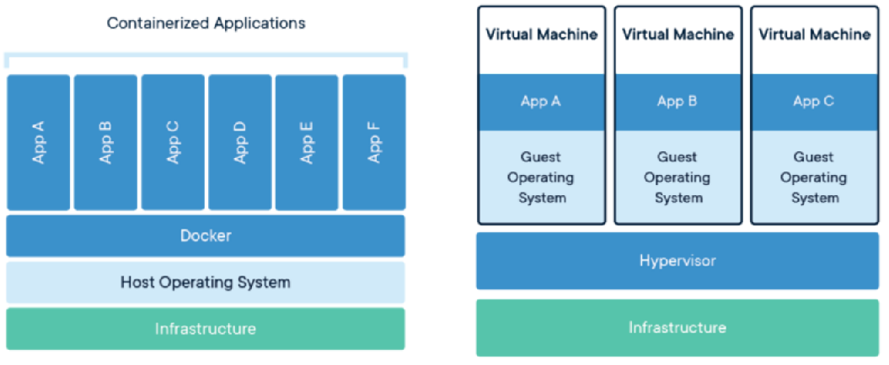
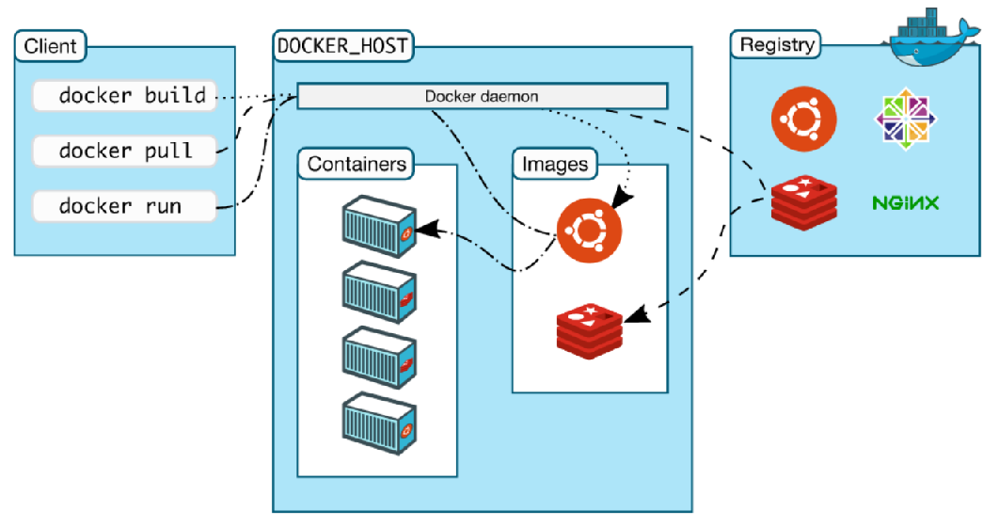

# **1. INTRODUCCIÓ**
En aquesta unitat farem una introducció al concepte de contenidors. Ens centrarem en contenidors Linux i en concret en la tecnologia de Docker.

# **2. CONCEPTES PREVIS**
## 2.1 Virtualització
La virtualització és un conjunt de tecnologies de maquinari i programari que permeten l'abstracció de maquinari, creant així la "il·lusió" d'administrar recursos virtuals com si foren recursos reals, de manera transparent per als usuaris.

La virtualització és molt utilitzada per al desplegament de sistemes, desenvolupament de programari, anàlisi de malware, escalat horitzontal, etc. Ja que és relativament senzilla d'implementar i pot estalviar significativament costo (consum d'energia, manteniment, etc.)

## 2.2 Què és una màquina virtual?
De vegades, necessitem provar un nou sistema operatiu, una determinada configuració, provar de desplegar un programari, etc. però no està disponible per a això una màquina real. La creació d'una màquina virtual utilitzant tècniques de virtualització és la solució a aquest problema.

D'aquesta manera, una màquina virtual permet simular una màquina (amb el seu sistema operatiu) i executar programes com si estigueren utilitzant una màquina real i independent.

Per a la creació de màquines virtuals generalment hi ha diversos tipus de tecnologies:
- Màquina virtual de procés.
- Hipervisor.
- Contenidors. Docker s'engloba en aquesta categoria.

## 2.3 Què és una màquina virtual de procés?
Les màquines virtuals de procés, són un tipus de màquines virtuals que permeten executar un programa dissenyat per a un sistema operatiu/arquitectures particulars (diferent de la màquina actual), com un procés més de la nostra màquina actual.

Això s'aconsegueix implementant una màquina virtual de procés que emula l'arquitectura necessària. Teòricament, podem llançar el nostre programa en qualsevol sistema que tinga la màquina virtual de procés implementada.

Alguns dels principals exemples d'aquest tipus de virtualització són:
- Màquina virtual de Java (JVM): executa els bytecodes de Java en qualsevol sistema i arquitectura que la tinga implementada.
- Wine: executar aplicacions Windows en altres sistemes operatius.

## 2.4 Què és un hipervisor?
Un hipervisor, és una màquina virtual que simula totalment o parcialment un maquinari d'una màquina, permetent la instal·lació de diferents sistemes operatius (per exemple, virtualitzar un sistema Windows 10 Home en una màquina real Linux).

Alguns programaris coneguts que implementen un hipervisor són: Virtualbox, VMWare, emuladors de vídeo-consoles, etc.

Per saber-ne més: [https://es.wikipedia.org/wiki/Hipervisor](https://es.wikipedia.org/wiki/Hipervisor)

# **3. CONTENIDORS**

## 3.1 Què són els contenidors?
Els contenidors són una tecnologia de virtualització, que al contrari que un hipervisor (que tracta d'emular un sistema complet), utilitza el sistema base de la màquina amfitrió i actua realment com un "entorn privat" que comparteix recursos amb el sistema amfitrió, sense virtualitzar el maquinari complet. En concret, els contenidors solen tenir entorns privats aïllats en l’àmbit de processos, memòria, sistema de fitxers i xarxa.

Tècnicament, els contenidors són un tipus de virtualització englobada en el que es diu "US Level virtualization". Per saber-ne més: [https://en.wikipedia.org/wiki/OS-level_virtualization](https://en.wikipedia.org/wiki/OS-level_virtualization)

> ❕ Atenció: això implica, que de forma nativa, no pots executar un contenidor en un sistema operatiu diferent de què utilitza la tecnologia de contenidors.

La següent imatge pot ajudar-nos a entendre el concepte de contenidor.

*Font imatge: [https://commons.wikimedia.org/wiki/File:Docker-containerized-and-vm-transparent-bg.png](https://commons.wikimedia.org/wiki/File:Docker-containerized-and-vm-transparent-bg.png)*

A la dreta observem el funcionament d'un hipervisor, encarregat de virtualitzar el maquinari i on cada màquina virtual té el seu propi sistema operatiu. A l'esquerra, observem un sistema de contenidors, on no existeix aquesta virtualització de maquinari i cada contenidor és un entorn
privat.

## 3.2 Analogia amb contenidors de transport marítim

*Font imatge: [https://www.flickr.com/photos/68359921@N08/50125348052/](https://www.flickr.com/photos/68359921@N08/50125348052/)*

Per facilitar la comprensió del funcionament dels contenidors, farem una analogia amb els contenidors de transport marítim:
- Els contenidors de transport marítim, han de complir uns estàndards (mida, pes i forma) per ser transportats.
  - El mateix passa amb els contenidors en virtualització. Mentre Complan un estàndard, poden ser virtualitzats en qualsevol màquina que ho suporti (local, servidor, etc.).
- Un cop complert l'estàndard, el tipus de càrrega del contenidor marítim és independent.
  - El mateix passa amb els contenidors en virtualització. Si es compleix l'estàndard, el programari que contingui podrà ser executat sense problemes
  
## 3.3 Contenidors per a desenvolupament i desplegament d'aplicacions
Un dels principals usos dels contenidors (encara que no l'únic) és facilitar el desenvolupament, distribució i el desplegament d'aplicacions.
- Compilació programari és tediós. Utilitzant un contenidor, tenim l'entorn de compilació/depuració muntat amb les versions que necessitem.
- Utilitza contenidors facilita el testatge, permetent la creació de diferents entorns de prova amb diferents configuracions, etc.
- Els contenidors ens eviten problemes de compatibilitat en desplegar les nostres aplicacions, tenint sempre les versions adequades per executar el nostre programari.

> 💬 Interessant: Molts sistemes de CI/CD (Continuous Integration/Continuous Delivery) es basen en l'ús de contenidors.

## 3.4 Contenidors per desplegament de serveis
Un altre dels principals usos dels contenidors és el desplegament de servidors de diferent tipus (web, correu, bases de dades, DNS, etc.).
A més dels avantatges anteriorment citats de mantenir versions de programari, els contenidors ens permeten unificar configuracions de servidors en local, fins i tot involucrant diferents serveis en diferents contenidors, de manera que en desplegar en el núvol, funcionen exactament igual que en les proves realitzades localment.

>❕ Atenció: "En la meua màquina funcionava ... falla només en pujar-lo al servidor...". L'ús de contenidors contribueix a fer que aquesta situació desaparega

A més, els contenidors faciliten l’"escalat horitzontal" de serveis, especialment si es donen suport d'eines trucades orquestadors.
Per saber-ne més [https://es.wikipedia.org/wiki/Escalabilidad#Escalabilidad_horizontal](https://es.wikipedia.org/wiki/Escalabilidad#Escalabilidad_horizontal)

## 3.5 Avantatges i inconvenients de l'ús de contenidors
Alguns dels avantatges de l'ús de contenidors són:
- Els contenidors ocupen menys espai, perquè no ha de replicar en cadascun el sistema operatiu que estan Virtualitzant, ja que utilitzen el sistema de la màquina amfitrió.
- Com que no hem de fer una virtualització de maquinari, l'execució del programari dels contenidors és molt més ràpida, amb velocitats properes a les natives.
- Multitud d'empreses de programari (Microsoft, Apache, Nginx, MySQL, Oracle, Wordpress, Moodle, i un llarg etc.) donen suport a aquestes tecnologies tan incorporants sistemes de contenidors als seus sistemes operatius, com oferint imatges oficials dels seus productes per què amb una senzilla ordre, es puga posar en marxa algun dels seus serveis o aplicacions.
  
Alguns dels principals desavantatges dels contenidors són:
- Malgrat que milloren enormement la velocitat respecte a una virtualització per hipervisor, segueixen tenint un rendiment pitjor que una execució "barem metall" (sobre un sistema real), ja que l'aïllament consumeix recursos.
- La persistència i l'accés/modificació de dades persistents entre contenidors és més tediós que realitzat sobre una màquina real.
- Els contenidors estan pensats generalment per a l'ús via línia d’ordres. Encara que tècnicament és possible configurar els contenidors per tenir el seu propi entorn gràfic, aquest procés és tediós.

## 3.6 En resum Quan és adequat utilitzar contenidors?
L'ús de contenidors, sol ser adequat en els contextos:
- Com a usuaris: volem provar alguna cosa ràpida i sense complicar-nos molt en la configuració (per exemple, muntar un servei en local per aprendre).
  - Per a això, podem utilitzar serveis de distribució d'imatges de contenidors públiques com Docker Hub [https://hub.docker.com/](https://hub.docker.com/)
- Com a desenvolupadors: volem desenvolupar una aplicació que es puga distribuir en local o desplegar al núvol sense problemes de configuració
  - Podem usar contenidors, tant per a tenir l'entorn de desenvolupament llest, com per distribuir l'aplicació en si.
- Volem testejar la nostra aplicació amb diferents configuracions, límits de recursos, jocs de
prova, etc.
  - Útil per generar entorns de prova i desplegament utilitzant CI/CD (Continuous Integration/Continuous Delivery) [https://es.wikipedia.org/wiki/CI/CD](https://es.wikipedia.org/wiki/CI/CD)
- Volem fer "escalat horitzontal" de serveis, és a dir executar múltiples còpies d'una mateixa aplicació/conjunt d'aplicacions que funcionen com un clúster.
  - [https://es.wikipedia.org/wiki/Escalabilidad#Escalabilidad_horizontal](https://es.wikipedia.org/wiki/Escalabilidad#Escalabilidad_horizontal)

# **4. CONTENIDORS EN SISTEMES LINUX**
## 4.1 És nou el concepte d'entorns privats en sistemes Unix?
El concepte d'entorns privats, utilitzat en els controladors, no és una cosa nova dels sistemes Unix moderns. Des de fa molts anys hi havia algunes solucions com ara:
- chroot (Sistemes Unix): [https://es.wikipedia.org/wiki/Chroot](https://es.wikipedia.org/wiki/Chroot) (1982)
- Jail (FreeBSD): [https://es.wikipedia.org/wiki/FreeBSD_jail](https://es.wikipedia.org/wiki/FreeBSD_jail) (1999)
Aquestes utilitats són els "avis" del concepte actual de contenidor en els sistemes Unix.

## 4.2 Sistemes privats moderns en Linux: contenidors
L'any 2008, apareixen els contenidors moderns de sistemes Linux, amb el sistema lxc (Linux Container). Per al seu desenvolupament, es van introduir noves capacitats en el nucli de Linux, que han estat aprofitades per altres sistemes de contenidors.

Encara que en aquest curs ens centrarem en contenidors Docker, sempre podeu obtenir més informació de contenidors Linux com lxc, LXD i LXCFS en [https://linuxcontainers.org/](https://linuxcontainers.org/).
A més, aquí us presento un exemple pràctic desenvolupat per José Castell on fa servir LXD en les seves classes: [https://www.youtube.com/watch?v=ynglk64Hecg](https://www.youtube.com/watch?v=ynglk64Hecg)

## 4.3 Com funcionen els contenidors moderns en Linux?
Els sistemes més populars de contenidors sobre Linux, s'han utilitzat (entre altres) dues característiques del nucli aparegudes en versions relativament recents:
- Linux namespaces: permet aïllar processos de manera que vegen uns recursos concrets. Els processos que tenen un "namespace" comú poden veure recursos comuns.
  - Això entre altres coses, ens permet tenir processos "diferents" de la màquina real als contenidors, fins i tot amb privilegis diferents (un procés pot ser "root" al contenidor, però no té aquests privilegis en la màquina real).
  - Per saber-ne més:
    - [https://www.linux.com/news/understanding-and-securing-linux-namespaces/](https://www.linux.com/news/understanding-and-securing-linux-namespaces/)
    - [https://en.wikipedia.org/wiki/Linux_namespaces](https://en.wikipedia.org/wiki/Linux_namespaces)
- Cgroups: permet aïllar, configurar i limitar l'ús de recursos (memòria, processos, E/S, etc.). Per saber-ne més [https://en.wikipedia.org/wiki/Cgroups](https://en.wikipedia.org/wiki/Cgroups)

En resum, Linux namespaces ens facilita aïllar el sistema i cgroups facilita la limitació/configuració
de la disponibilitat de recursos de cada contenidor.

## 4.4 Puc posar en marxa un contenidor Linux "A mà"?
Sí, és possible. Tal com ens mostra la coneguda autora de materials en format comic Julia Evans aquí un exemple de script on es mostra com crear un contenidor de Linux "a mà".
[https://gist.github.com/jvns/ea2e4d572b4e2285148b8e87f70eed73](https://gist.github.com/jvns/ea2e4d572b4e2285148b8e87f70eed73).
Aprofite per a recomanar la seua web https://wizardzines.com/,on part del seu treball és Creative Commons, i en concret el seu "WizardZine" sobre contenidors [https://wizardzines.com/zines/contenidors/](https://wizardzines.com/zines/contenidors/)

## 4.5 Els contenidors Linux Poden funcionar en sistemes com Windows o MacOS?
En principi, és possible executar contenidors Linux en sistemes diferents de Linux, encara que és possible que el rendiment no siga el mateix. Alguns sistemes, per poder utilitzar contenidors Linux, necessiten que un hipervisor virtualitze un sistema Linux complet i que des d'aquí es llancen els contenidors Linux.

En sistemes Windows i MacOS l'estratègia era la següent: mitjançant un hipervisor, per exemple VirtualBox, és virtualizaba un sistema Linux i aquí es posava en marxa el sistema de contenidors.

En el cas concret de Docker, per fer aquest procés de manera transparent, s’utilitzava l'avui "discontinuada" eina "Docker Toolbox" [https://github.com/docker/toolbox](https://github.com/docker/toolbox).

Actualment, donat el creixement de Docker, hi ha altres optimitzacions que comentarem més endavant. Tot i això aquesta estratègia segueix sent possible utilitzar-la per virtualitzar contenidors Linux (lxc, LXD, Docker, etc.) en altres sistemes.

> 📖 Important: Aquests casos poden ser útils en algun context (proves, aprenentatge, desenvolupament per a una altra plataforma), però es perden avantatges relatives a l'rendiment.

# **5. CONTENIDORS DOCKER**
## 5.1 Què és Docker?
Docker és un sistema de contenidors Linux que utilitza les característiques del nucli de Linux per permetre el desenvolupament i desplegament d'aplicacions.

La seua web oficial [https://www.docker.com/](https://www.docker.com/) i la seua entrada en la wikipedia on es dona informació detallada del projecte [https://es.wikipedia.org/wiki/Docker_(software)](https://es.wikipedia.org/wiki/Docker_(software))

Docker és un projecte de codi obert. Generalment disposa de diverses versions:
- Docker CE (Community Edition): el motor de Docker, de codi obert.
- Docker EE (Enterprise Edition): el mateix que la versió CE, només que a més inclou certificació de funcionament en alguns sistemes concrets i suport amb l'empresa Docker Inc.

El sistema de contenidors de Docker és integrable amb altres serveis populars en el núvol, com ara Google Cloud, Amazon AWS, Microsoft Azure, Digital Ocean i OVH, entre d'altres.
- AWS: [https://aws.amazon.com/es/getting-started/hands-on/deploy-docker-containers/](https://aws.amazon.com/es/getting-started/hands-on/deploy-docker-containers/)
- Azure:[https://docs.microsoft.com/es-es/learn/modules/run-docker-with-azure-contenidors-instances/](https://docs.microsoft.com/es-es/learn/modules/run-docker-with-azure-contenidors-instances/)
- Google Cloud: [https://cloud.google.com/container-optimized-os?hl=es-419](https://cloud.google.com/container-optimized-os?hl=es-419)

## 5.2 L'arquitectura Docker
En aquesta imatge podem veure com funciona l'arquitectura bàsica de Docker.

*Font imatge: [https://github.com/docker/docker.github.io/blob/master/engine/images/architecture.svg](https://github.com/docker/docker.github.io/blob/master/engine/images/architecture.svg)*

Aquesta arquitectura, la podem resumir en 3 parts:
- Client:és el programari encarregat de comunicar-se amb el servidor Docker.
- Servidor (Docker Host):servei docker, on s'atenen les peticions dels clients i es gestionen els contenidors i imatges.
- Registre(Registry):lloc on s'emmagatzemen imatges Docker (públiques o privades). Fins i tot, d'una mateixa imatge, s'emmagatzemen les diferents versions. El registre més popular i configurat per defecte en Docker és "Docker Hub" [https://hub.docker.com/](https://hub.docker.com/)
  
## 5.3 Docker en Sistemes Windows i MacOs
En apartats anteriors, vam comentar que una de les estratègies per a llançar Docker (i altres contenidors Linux) en sistemes Windows i MacOS, era virtualitzar un sistema Linux i aquí llançar el sistema de contenidors.

Actualment, en sistemes Windows i MacOS es planteja com a alternativa l'ús de programari "Docker Desktop" per utilitzar contenidors en aquests sistemes. Docker Desktop ens instal·la totes les aplicacions necessàries per a córrer contenidors en aquests sistemes, de la forma més òptima
possible.

A continuació, vam realitzar una xicoteta comparativa en l’àmbit de rendiment entre l'execució de Docker en diferents sistemes:
- Execució de Docker en Linux:
  - Estan implementats pel nucli, amb velocitat propera a la nativa.
- Execució de Docker a Windows:
  - Els contenidors Linux de Docker, funcionen usant Hyper-V en sistemes Windows Server i WSL2 (Windows Subsystem for Linux 2) en Windows Home [https://www.docker.com/blog/docker-hearts-wsl-2/](https://www.docker.com/blog/docker-hearts-wsl-2/)
  - Els contenidors "Windows Server Core", estan implementats pel nucli de Windows.
- Execució de Docker a Mac OS:
  - Els contenidors Linux funcionen usant Hyperkit.
    - [https://github.com/moby/hyperkit](https://github.com/moby/hyperkit)

Més informació a:
- [https://docs.docker.com/docker-for-windows/release-notes/](https://docs.docker.com/docker-for-windows/release-notes/)
- [https://docs.docker.com/desktop/](https://docs.docker.com/desktop/)
- [https://docs.docker.com/docker-for-mac/release-notes/](ttps://docs.docker.com/docker-for-mac/release-notes/)

## 5.4 Docker corrent contenidors Windows Server Core i contenidor MacOs
Encara que l'ús habitual de Docker és llançar contenidors amb sistemes Linux, noves millores han permés que es puguen utilitzar contenidors que llancen altres sistemes operatius.

Docker en sistemes Windows pot llançar contenidors que corren el sistema operatiu "Windows Server Core". Ha de virtualitzar amb un sistema amfitrió Windows. Més informació a:
- [https://blog.ipswitch.com/creating-your-first-windows-container-with-docker-for-windows](https://blog.ipswitch.com/creating-your-first-windows-container-with-docker-for-windows)
- [https://hub.docker.com/_/microsoft-windows-servercore](https://hub.docker.com/_/microsoft-windows-servercore)

Així mateix, és possible llançar un contenidor que execute Mac OS en un sistema Linux que tinga instal·lat KVM, utilitzant el projecte disponible a [https://github.com/sickcodes/Docker-OSX](https://github.com/sickcodes/Docker-OSX)

# **6. CONCLUSIÓ**
En aquesta part de la unitat hem repassat conceptes bàsics sobre virtualització. Després d'això, hem procedit a introduir el concepte de contenidor i les seues característiques, centrant-nos en contenidors Linux. Compresos els conceptes de contenidors, hem introduït la solució Docker, la qual instal·larem i utilitzarem més endavant.

# **7. BIBLIOGRAFIA**
[1] WizardZines "How contenidors work" [https://wizardzines.com/zines/containers/](https://wizardzines.com/zines/containers/)
[2] Docker Docs [https://docs.docker.com/](https://docs.docker.com/)
[3] Linux contenidors [https://linuxcontainers.org/](https://linuxcontainers.org/)
[4] US Level virtualization [https://en.wikipedia.org/wiki/OS-level_virtualization](https://en.wikipedia.org/wiki/OS-level_virtualization)

# **8. LLICÈNCIES D'ELEMENTS EXTERNS UTILITZATS**
Figura 1: Imatge amb llicència Apache 2.0. Font:
[https://github.com/docker/docker.github.io/blob/master/engine/images/architecture.svg](https://github.com/docker/docker.github.io/blob/master/engine/images/architecture.svg)
Figura 2: Imatge amb llicència CC BY SA. Font:
[https://commons.wikimedia.org/wiki/File:Docker-containerized-and-vm-transparent-bg.png](https://commons.wikimedia.org/wiki/File:Docker-containerized-and-vm-transparent-bg.png)
Figura 3: Imatge amb llicència CC BY SA. Font: [https://www.flickr.com/photos/68359921@N08/50125348052/](https://www.flickr.com/photos/68359921@N08/50125348052/)