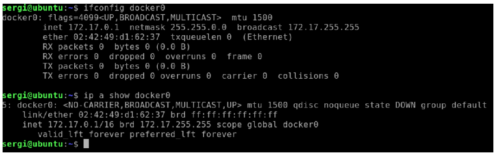
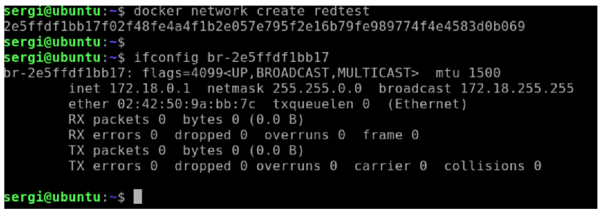
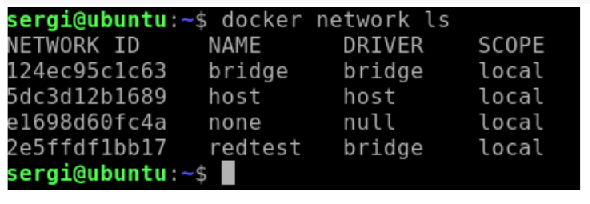
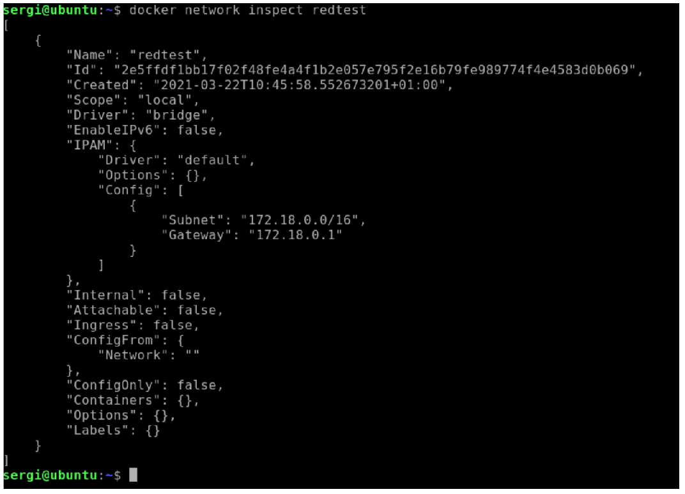
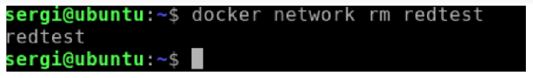
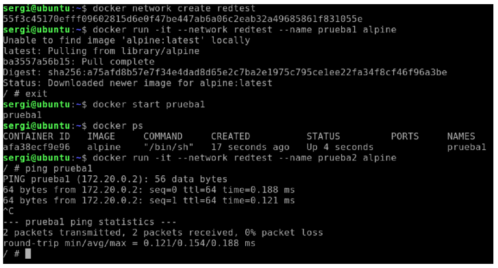

# 1. INTRODUCCIÓ
Fins al moment hem tractat amb contenidors relativament aïllats i amb poc contacte amb la màquina amfitrió i amb altres contenidors. En aquesta unitat parlarem de com configurar xarxes entre contenidors i de com compartir dades i dotar-los de persistència mitjançant volums.

# 2. GESTIONANT XARXES
En aquest apartat veurem les xarxes predefinides que posseeix Docker i com podem crear i eliminar les nostres pròpies xarxes.
## 2.1 Xarxes predefinides en instal·lar Docker
En instal·lar Docker s'estableixen per omissió 3 xarxes internes amb les quals podem treballar. Aquestes xarxes no es poden eliminar i estan sempre presents:
- Xarxa "bridge": és la xarxa per defecte de qualsevol contenidor, donant una IP pròpia. Per funcionar utilitza una interfície de xarxa virtual a la màquina amfitrió anomenada "docker0".
- Xarxa "host": si un contenidor utilitza aquesta xarxa, estar utilitzant la mateixa configuració de xarxa de la màquina amfitrió.
- Xarxa "none": aquesta xarxa no permet l'entrada a altres xarxes. Només permet l'accés a la interfície de loopback.
Podrem observar a la màquina amfitrió la interfície "docker0" usant:
```
ifconfig  docker0
o
ip a show docker0
```



## 2.2 Crear xarxes internes en Docker
Si ho desitgem, podem crear diferents xarxes independents, ampliant les 3 xarxes per defecte.
¿Quan ens pot ser útil crear xarxes? En general, en contextos en què vulguem aïllar les comunicacions entre un conjunt de contenidors (per exemple, una xarxa per a proves de test i una altra per a desenvolupament, o simular una xarxa aïllada amb determinats serveis).

Per crear una xarxa, simplement fent servir la comanda
```
docker network create redtest
```
En crear la xarxa, en la màquina amfitrió es crearà una xarxa virtual amb format pels 12 primers nombres de l'identificador. Ho veiem amb un exemple:



En crear-se la xarxa "redtest" se'ns torna un identificador. Usant els 12 primers dígits de l'identificador, podem observar la xarxa virtual a la màquina amfitrió anomenada **"br-2e5ffdf1bb17"**.

En aquest cas, hem creat una xarxa simple amb els paràmetres per defecte. Alguns dels paràmetres configurables més interessants són:
- **"--internal"**: per xarxa interna. Restringeix l'accés des de l'exterior.
- **"--Gateway"**: per indicar la porta d'enllaç de la xarxa.
- **"--Ip-range"**: delimita el rang d'IP assignables al contenidor.
- **"--Ipv6"**: habilita l'ús de IPV6.
- **"--Subnet"**: defineix la subxarxa en format CIDR.
  - https://es.wikipedia.org/wiki/Classless_Inter-Domain_Routing

Per a més informació relacionada amb el comandament **"docker network create"** podeu consultar
el següent enllaç: [https://docs.docker.com/engine/reference/commandline/network_create/]

## 2.3 Inspeccionar i eliminar xarxes
Podem observar les xarxes Docker del nostre sistema amb el comandament:
```
docker network ls
```




També podem obtenir informació de cada xarxa usant
```
docker network Inspect ID/NOM-XARXA
```



També podem eliminar xarxes mitjançant el comandament "docker network rm". Si tot va bé, aquest comandament ens mostrarà el nom de la xarxa eliminada.
```
docker network rm ID/NOM-XARXA
```



> ❕ Atenció: per poder suprimir una xarxa, és imprescindible que cap contenidor en execució estiga connectat a la xarxa.

# 3. ASSIGNANT XARXES A CONTENIDORS
## 3.1 Assignar la xarxa en crear un contenidor
Quan vam crear un contenidor mitjançant les ordres **"docker run"** o **"docker create"**, podem especificar que xarxa va formar part (per defecte, si no s'indica, forma part de "bridge").
Per exemple per llançar un contenidor connectat a la xarxa "redtest" fem servir la comanda:
```
docker run -it --network redtest ubuntu /bin/bash
```
En connectar un contenidor a una xarxa, mitjançant un DNS intern implementat per Docker se'ns permet referenciar a un contenidor amb el vostre nom de contenidor com un "hostname".
Si a un contenidor amb nom "miserver" és part d'una xarxa, si algú intenta resoldre el nom amb "dig","ping", etc. "Miserver" es correspondrà a la IP d'aquest contenidor.

Anem a veure un exemple concret, on crearem dos contenidors i farem ping sobre ells.
Creem un contenidor "prueba1" a la xarxa "redtest" amb:
```
docker run -it --network redtest --name prueba1 alpine
```
Després d'això, eixirem amb "exit". En eixir, es pararà el contenidor, així que per a la nostra prova, l'iniciem de nou amb el comandament:
```
docker start prueba1
```
després d'això llancem el segon contenidor "prova2" amb el comandament:
```
docker run -it --network redtest --name prueba2 alpine
```
Ja dins del contenidor "prueba2", vam llançar l'ordre "ping" per comprovar que el contenidor "prueba1" accessible des de la màquina "prova2":
```
ping prueba1
```
Podem observar l'exemple complet en aquesta captura:



Un altre paràmetre interessant relacionat amb les xarxes que aplica a "docker run" és el paràmetre **"--network-alias"**. Aquest paràmetre permet assignar un àlies al contenidor a la xarxa, de manera que en resoldre aquest àlies assignat, és resolga la IP.
Un exemple d'ús:
```
docker run -it --network redtest --network-alias miservidor --name
prueba3 alpine
```
En aquest exemple, veiem com s'assigna l'àlies **"miservidor"**, per la qual cosa, si s'intenta resoldre
el host **"miservidor"**, obtindrem la IP d'aquest contenidor.

## 3.2 Connectar i desconnectar un contenidor d'una xarxa
Mitjançant el comandament "docker network connect/disconnect" podem connectar o desconnectar un contenidor d'una xarxa. Un contenidor pot estar connectat a més d'una xarxa.

Per exemple amb el comandament:
```
docker network connect IDRED IDCONTENEDOR
```
Connectarem el contenidor a una xarxa existent. A continuació comentem algunes opcions
interessants de"docker network connect":
- De forma semblant a la comentada en el punt anterior, podem establir un àlies a la xarxa d'aquest contenidor amb el paràmetre"--alias". Això permetrà que en resoldre el nom DNS de l'àlies, indique la IP del contenidor.
- En l'exemple plantejat, al contenidor se li assignarà una IP entre les disponibles en el rang de la xarxa. Si es vol intentar que se li assigne una IP fixa, es pot usar l'opció "--ip" per a una IPv4 o "--ip6" per a una IPV6.
Per desconnectar, podem usar simplement l'opció "disconnect", com veiem ací:
```
docker network disconnect IDRED IDCONTENEDOR
```
Per a més informació relacionada amb el comandament **"docker network connect"** podeu consultar el següent enllaç:
https://docs.docker.com/engine/reference/commandline/network_connect/

# 4. PERSISTÈNCIA DE DADES EN DOCKER
En aquest apartat veurem com gestionar la persistència de dades en Docker usant diferents tipus d'eines, coneixent els seus casos d'ús més típics. També parlarem d'estratègies no orientades a la persistència com "tmpfs".
# 4.1 ¿Quines són les principals eines de persistència en Docker?
Els principals mètodes de persistència en Docker són "bind mount", volums i "tmpfs".
- "Binding Mount": bàsicament aquest tipus de persistència consisteix a "muntar" un fitxer o directori de la màquina amfitrió en un fitxer o directori del contenidor. Aquest muntatge es fa en el moment de crear el contenidor.
  - El fitxer o directori s'indica en els dos casos amb una ruta absoluta no té per què existir en el contenidor (si no existeix, es crearà).
  - El rendiment d'aquest tipus de persistència, a efectes pràctics, depén del sistema de fitxers i característiques del maquinari de la màquina real. Una bona configuració segons les necessitats del contenidor influirà en el rendiment.
  - Aquests volums poden ser usats per diversos contenidors simultàniament.
  - En sistemes Linux no sol haver-hi diferències de rendiment respecte a volums, però en sistemes Windows i Mac el rendiment és pitjor.
- Volums Docker: similar al "binding mount", solament que no especifiquem en quin lloc hi ha el directori a muntar a la màquina amfitrió, sinó que només donem un nom del volum per identificar-lo. Això ens proporciona alguns avantatges respecte a l'anterior:
  - Ens permet abstreure’ns d’"on" està realment el volum. Aquesta abstracció no és únicament en l’àmbit del directori de la màquina amfitrió, sinó fins i tot pot estar el volum en servidors remots.
  - Obtenen millor rendiment que "binding mount" en sistemes Windows i Mac.
- “Tmpfs": aquest tipus de volum utilitza el sistema de fitxers [https://es.wikipedia.org/wiki/Tmpfs] el qual s'allotja en memòria i no en el disc, per la qual cosa no té persistència. En canvi, augmentarem el rendiment d'entrada i sortida.
  - Té algunes limitacions:
    - Només funciona en sistemes Linux.
    - No permet compartir el volum entre contenidors.

Per entendre millor aquestes definicions, observarem i comentarem aquesta imatge que il·lustra el seu funcionament:


- Observem que "Binding Mount" i volum, apunten al sistema de fitxers. La principal diferència és que "Binding Mount" pot anar a qualsevol part de sistema i volum apunta a una àrea concreta de Docker (on s'emmagatzemen els volums).
- En el cas de"tmpfs", veiem que va directament a la memòria de sistema.

> 💬 Interessant: igual que amb el comandament "mount" de sistemes Linux, si vam muntar un volum en un directori existent, el que farà és "superposar" el contingut d'aquest directori amb el volum muntat. Això pot ser útil, per ara, provar una nova versió d'una aplicació en un contenidor sense haver de refer la imatge.

## 4.2 Utilitzant "Binding mount"
Aquest tipus de persistència (igual que la resta) és muntada en el moment de crear el contenidor. Com veurem a l'hora de muntar tot tipus de contenidors, podem usar dos paràmetres diferents: **"-v"** que és més simple i **"--mount"** que és més explícit. En utilitzar aquests comandaments, hem de fer servir rutes absolutes.
```
docker run -d -it --name appcontainer -v /home/sergi/target:/app nginx:latest
o
docker run -d -it --name appcontainer --mount type=bind,source=/home/sergi/target,target=/app nginx:latest
```
En ambdós casos, aquesta comanda crea un contenidor anomenat **"appcontainer"** on la ruta de l'amfitrió "/home/sergi/target" es muntarà al contenidor a **"/app"**.
Més informació a: [https://docs.docker.com/storage/bind-mounts/]


## 4.3 Creant volums Docker
En aquests apartats comentem les principals accions amb volums Docker. No obstant això, si vols saber més pots consultar [https://docs.docker.com/storage/volumes/].

### 4.3.1 Creant volum al crear contenidor
De manera similar a"binding mount", és possible crear volums Docker usant "-v" o "--mount". Ací veiem un exemple:
```
docker run -d -it --name appcontainer -v mivolumen:/app nginx:latest
o
docker run -d -it --name appcontainer --mount source=mivolumen,target=/app nginx:latest
```

En aquest exemple, s'ha muntat el volum gestionat per Docker "mivolumen" al directori "/app" del contenidor. Si el volum "mivolumen" no existia prèviament, el crea.

### 4.3.2 Gestionant volums
Aquest tipus de volums, poden crear-se de forma separada, sense crear un contenidor associat a aquest. Això ho podem fer amb el comandament "docker volume":
-  Amb "docker volume create mivolumen" podem crear el volum buit.
- Amb "docker volume ls" podem observar els volums existents.
- Amb "docker volume rm mivolumen" pots esborrar un volum, sempre que tot contenidor que l'utilitza estiga aturat.

### 4.3.3 Poblant volums
Si vam crear un volum directament en llançar un contenidor (no aplicable al cas d'un contenidor buit, però creat prèviament) i ho associem a un directori que no està buit, el contingut d'aquest directori es copia al volum. Per exemple si llancem
```
docker run -d -it --name appcontainer --mount
source=mivolumen,target=/app nginx:latest
```
Si el directori **"/app"** tenia informació, aquesta és còpia al volum "mivolumen".

## 4.4 Creant volums "tmpfs"
Com hem comentat abans, els volums "tmpfs" no té persistència (s'allotgen en memòria) i tenen algunes limitacions (només poden ser usats en sistemes Linux i no poden ser compartits entre contenidors). Per crear un volum d'aquest tipus podem usar dos paràmetres diferents: "--tmpfs" que és més simple i "--mount" que és més explícit.
En utilitzar aquestes comandes, hem de fer servir rutes absolutes.
```
docker run -d -it --tmpfs /app nginx
o
docker run -d -it --mount type=tmpfs,destination=/app nginx
```
Aquest tipus de contenidors són útils per:
- Emmagatzemar fitxers que per algun motiu no vols que es guarden ni al contenidor ni en altres volums (per exemple, dades sensibles).
- En operar en memòria, pot ser útil utilitzar aquest tipus de fitxers per accelerar operacions de lectura/escriptura. Per exemple, podem emmagatzemar uns jocs de prova que havien de ser llegits moltes vegades, copiar contingut d'una pàgina a servir, etc.
  - Això també pot fer-se usant “Binding mounts” i una correcta configuració de sistema de fitxers en l'amfitrió, usant el mateix "tmpfs" o "ramfs". Més informació [https://www.jamescoyle.net/how-to/943-create-a-ram-disk-in-linux]
  
Per a més informació sobre "tmpfs" [https://docs.docker.com/storage/tmpfs/]

## 4.5 Còpia de seguretat d'un Volum
Realitzar una còpia de seguretat de volums Docker, és tan senzill com fer una còpia de seguretat en el sistema amfitrió en els directoris pertinents (o implementar en el sistema de fitxers elements com ara “discos mirall”, etc.).
Tot i això, si es vol fer una còpia de seguretat, per exemple, en un fitxer ".tar" és possible realitzar-ho mitjançant ordres. Suposem tenim un "contenedor1", que utilitza el volum "misdatos" muntats en "/datos". Per realitzar la còpia de seguretat, seguirem aquests passos:
En primer lloc, pararem el contenidor.
```
docker stop contenedor1
```
i després d'això, llançant la següent ordre:
```
docker run --rm --volumes-from contenedor1 -v
/home/sergi/backup:/backup ubuntu bash -c "cd /datos && tar cvf /backup/copiaseguridad.tar ."
```
Aquesta comanda, llança un contenidor temporal (s'esborra en acabar amb "--rm"), que munta els contenidors existents en **"contenedor1"** (usant **"--volumes-from"**) i realitza un "binding mount" de directori de l'amfitrió ***"/home/sergi/backup"*** amb el directori "/backup" del contenidor. Després
d'això, entra a la carpeta "/datos" (on es munta el volum) i guarda tot el contingut empaquetat en un fitxer ".tar" en "/backup". En acabar l'execució, veiem com "/backup" està muntada en ***"/home/sergi/backup"***, ací tindrem disponible la còpia de seguretat.

## 4.6 Plugins per volums en Docker
La funcionalitat de Docker pot estendre mitjançant l'ús de connectors. Entre ells hi ha una gran multitud de plugins per ampliar els tipus de volums suportats. Com a curiositat, cal dir que els connectors són distribuïts com imatges en Docker Hub. Una manera de cercar connectors allotjats en Docker Hub és mitjançant [https://hub.docker.com/search?q=&type=plugin]

Ací [https://docs.docker.com/engine/extend/] es mostra com a exemple d'ús, la instal·lació i configuració del connector "sshfs", allotjat en [https://hub.docker.com/r/vieux/sshfs].

# 5. BIBLIOGRAFIA
[1] Docker Docs [https://docs.docker.com/]
[2] Understanding Docker Volumes
[https://medium.com/bb-tutorials-and-thoughts/understanding-docker-volumes-with-an-example-d898cb5e40d7]
[3] Docker Volumes: how to understand and get started
[https://phoenixnap.com/kb/docker-volumes]

# 6. LLICÈNCIES D'ELEMENTS EXTERNS UTILITZATS
Figura 1: Imatge amb llicència Apache 2.0. Font:
[https://github.com/docker/docker.github.io/blob/master/storage/images/types-of-mounts-bind.png]