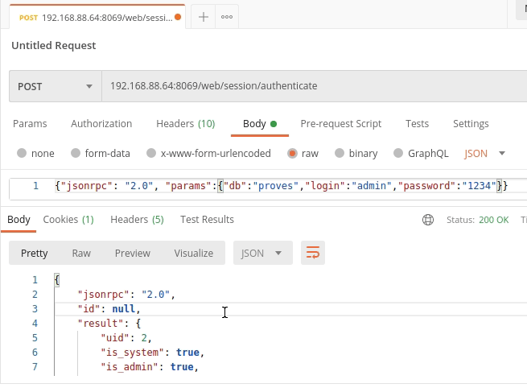

# **1. Guia d'estudi**
## Coneixements previs requerits
- Ús bàsic de sistemes operatius.
- Coneixement de comandaments de Linux.
- Coneixements avançats de programació.
- Coneixements de Python.
- Desplegament d’Odoo.
- Treball bàsic amb mòduls d’Odoo.
- Desenvolupament bàsic d’Odoo.
    
## Objectius
- Utilitzar funcions avançades al servidor Odoo.
- Fer servir l’herencia de models en Odoo.
- Creació d’informes i wizards amb Odoo.
- Creació de Web Controllers i API Rest amb Odoo.

## Continguts
Desenvolupament de mòduls: Controlador, Herència i Web Controllers.

## Activitats
És molt important llegir els apunts i dur a terme les tasques requerides per el docent.

## Bibliografia
A continuació oferim en ordre alfabètic el llistat d’autors que han fet aportacions a aquest document:
	• García Barea, Sergi


# **2.CONTROLADOR**
Odoo té una arquitectura MVC (Model-Vista-Controlador) que ens permet desenvolupar cadascuna d'aquestes parts per separat. No obstant això, és habitual que el controlador es desenvolupe en els mateixos fitxers Python en els quals es fa el model.
Per a aclarir, podríem dir que el controlador són els mètodes que hi ha en els models.
En la unitat anterior hem vist els “fields” computats i com funcionen les funcions en Python i Odoo. En aquest apartat veurem les facilitats que proporciona el framework d'Odoo per a manipular l'ORM (Object Relational Mapping).

>❕ Atenció: llegats a aquest punt, se suposa que hi ha un nivell mínim de coneixements de programació i del llenguatge de programació Python. 
La capa ORM té uns mètodes per a manipular les dades sense necessitat de fer sentències SQL contra la base de dades.

> 💬 Interessant: Odoo té una eina per a accedir per terminal en comptes de per la web. Per a això hem d'escriure en la terminal quan reiniciem el servidor: “odoo shell”.
L'accés a la terminal ens permet provar les instruccions de l'ORM sense haver d'editar arxius i reiniciar el servidor. 
Indica que s'han fet en la terminal d'Odoo i que seria interessant fer-ho per a provar el seu funcionament.
Quan en aquest capítol vegem exemples de codi de l'estil:
```>>> print(self)```

Per a Odoo, un conjunt de registres d'un model es diu “Recordset” i un conjunt amb un sol registre d'un model és un “Singleton”. La interacció amb l'ORM es basa a manipular “recordsets” o recórrer-los per a anar manipulant els “singletons”. 
```python
def do_operation(self):
    print self # => a.model(1, 2, 3, 4, 5) (Recordset)
    for record in self:
        print record # => a.model(1), a.model(2), a.model(3), ... (Singletons)
```

Recordem que per a accedir a les dades, cal anar als “singletons” i no als “recordsets”.
```python
>>> a
school.course(1, 2)
>>> for i in a:
...  i.name
...
'2DAM'
'1DAM'
>>> a.name
ValueError: too many values to unpack
```

Si s'intenta accedir a les dades en un “recordset” dona error. Les dades dels “fields” relacionals donen un “recordset”, fins i tot encara que només tinguen un element:
```python
>>> a[0].students
res.partner(14, 26, 33, 27, 10)
```

Els “recordsets” són iterables com una llista/array i tenen, a més, operacions de conjunts que permeten facilitar el treball amb ells:
- record in set:  retorna True si “rècord” està en el conjunt (set).
- set1 | set2: unió de conjunts (sets). També funciona el signe +.
- set1 & set2: intersecció de conjunts (sets).
- set1 - set2:  diferència de conjunts (sets).
A més, compta amb funcions pròpies de la programació funcional:
**filtered()**
Retorna un “recordset” amb els elements del “recordset” que passen el filtre. Per a passar el filtre, es necessita que retorne un True, siga una funció Lambda o un “field” Booleà. Similar a “filter”.
```python
records.filtered(lambda r: r.company_id == user.company_id)
records.filtered("partner_id.is_company")
```

**sorted()**
Retorna un “recordset” ordenat segons el resultat d'una funció Lambda aplicat a la seua “key function” https://docs.python.org/3/howto/sorting.html#key-functions. Similar a “sort”.
```python
# sort records by name
records.sorted(key=lambda r: r.name)
records.sorted(key=lambda r: r.name, reverse=True)
```

**mapped()**
Li aplica una funció a cada element del recordset i retorna un recordset amb els canvis demanats. Similar a “map”.
```python
# returns a list of summing two fields for each record in the set
records.mapped(lambda r: r.field1 + r.field2)
# returns a list of names
records.mapped('name')
# returns a recordset of partners
record.mapped('partner_id')
# returns the union of all partner banks, with duplicates removed
record.mapped('partner_id.bank_ids')
```

## **1.1  Enviroment**
L'anomenat “enviroment” o “env” guarda algunes dades contextuals interessants per a treballar amb l'ORM, com el cursor en la base de dades, l'usuari actual o el context (que guarda algunes metadades).

Tots els “recordset” tenen un “enviroment” accessible mitjançant l'atribut “env”. Quan volem accedir a un “recordset” dins d'un altre, podem usar “env”:
```python
>>> self.env['res.partner']
res.partner
>>> self.env['res.partner'].search([['is_company', '=', True], ['customer', '=', True]])
res.partner(7, 18, 12, 14, 17, 19, 8, 31, 26, 16, 13, 20, 30, 22, 29, 15, 23, 28, 74)
```

Dins del “enviroment” trobem a “context”. L'atribut “context” es tracta d'un diccionari de Python que conté dades útils per a les vistes i els mètodes. Les funcions en Odoo reben el “context” i ho consulten o actualitzen si ho necessiten. Pot tenir quasi de tot, però almenys sempre conté el “user ID”, l'idioma i la zona horària.  
``` python
>>> env.context
{'lang': 'es_ES', 'tz': 'Europe/Brussels'}
```

El “context” ja ho hem usat anteriorment i ho usarem en aquesta unitat didàctica. És convenient repassar els usos comuns que Odoo té per defecte per a veure la seua importància:
- active_id: quan en una vista volem que els “fields One2many” òbriguen un formulari amb el “field Many2one” per defecte li passem el “active_id” d'aquesta manera: context="{'default_<field many2one>':active_id}".  
  - Com es pot veure, el que fa aquest atribut és ampliar el “context” i afegir una clau amb un valor. Els formularis en Odoo arrepleguen aquest “context” i cerquen les claus que siguen “default_<field>”. Si les troben, posen un valor per defecte.
  - Això també funciona en els “action” si volem un “field” per defecte. El “active_id” també està en el “context” i es pot accedir des d'una funció amb la instrucció self.env.context.get('active_id').
- En la vista “search” també guardem el criteri d'agrupació amb el “group_by” en l'atribut “context”.
         
## **1.2  Mètodes de l’ORM**
Vegem ara d'un en un els mètodes que proporciona l'ORM d'Odoo per a facilitar la gestió dels “recordset”:
search():
A partir de la definició d'un domini extrau un “recordset” amb els registres que coincideixen
```python
>>> # searches the current model
>>> self.search([('is_company', '=', True), ('customer', '=', True)])
res.partner(7, 18, 12, 14, 17, 19, 8, 31, 26, 16, 13, 20, 30, 22, 29, 15, 23, 28, 74)
>>> self.search([('is_company', '=', True)], limit=1).name
'Agrolait'
```

Una funció associada és “search_count()” que funciona de manera similar, però retornant únicament la quantitat de registres trobats.
Aquests són els paràmetres que accepta “search”:
- args: un domini de cerca. Si es deixa com “[]” ens mostrarà tots els registres.
- offset (int): nombre de resultats a ignorar. Es pot combinar amb “limit” si volem paginar la nostra cridada a “search”.
- limit (int): nombre màxim de resultats a extraure.
- order (str): string d'ordenació amb el mateix format que en SQL (per exemple: order=’date DESC’).
- count (bool): perquè es comporte com search_count().

**create():**
Crea i retorna un nou “singleton” a partir de la definició de diversos dels seus “fields”.
```python
>>> self.create({'name': "New Name"})
res.partner(78)
```

**write():**
Escriu informació en el “recordset” des del qual s'invoca:
```python
self.write({'name': "Newer Name"})
```

Hi ha un cas especial de “write()” quan s'intenta escriure en un “Many2many”. El normal és passar una llista de “ids”. Però si s'escriurà en un “Many2many” que ja té elements s'han d'usar uns codis especials:
```python
self.write({'sessions':[(4,s.id)]})
self.write({'sessions':[(6,0,
                       [ref('vehicle_tag_leasing'),
                        ref('fleet.vehicle_tag_compact'),
                        ref('fleet.vehicle_tag_senior')] )]})
```

Com s'observa, se li proporciona una tupla de 2 o 3 elements. El primer és un codi numèric indicant què es vol fer. El segon i el tercer element depenen del primer. 
Aquests són els significats dels números:
- (0,_ ,{'field': value}): crea un nou registre i el vincula.
- (1,id,{'field': value}): actualitza els valors d'un registre ja vinculat.
- (2,id,_): desvincula i elimina el registre.
- (3,id,_): desvincula, però no elimina el registre de la relació.
- (4,id,_): vincula un registre que ja existeix.
- (5,_,_): desvincula, però no elimina tots els registres.
- (6,_,[ids]): reemplaça la llista de registres. 
browse():

A partir d'una llista de “ids”, extrau un “recordset”. No s'usa molt actualment, encara que a vegades és més fàcil treballar només amb les “ids” i després tornar a cercar els “recordsets”.
```python
>>> self.browse([7, 18, 12])
res.partner(7, 18, 12)
```

**exists():**
Retorna si un registre existeix encara en la base de dades.

**ref():**
A partir d'un “External ID”, retorna el “recordset” corresponent.
```python
>>> env.ref('base.group_public')
res.groups(2)
```

> 💬 Interessant: tots els registres de tots els models que té Odoo poden tenir una “External ID”. Aquesta és una cadena de caràcters que ho identifica independentment del model al qual pertanga. Odoo té una taula en la base de dades que relaciona els “External ID” amb els “ids” reals de cada registre. D'aquesta manera, podem cridar a un registre amb un nom fàcil de recordar i no preocupar-nos que canvie el “id” autonumèric. Veurem més del “External ID” en l'apartat de fitxers de dades.

**ensure_one():**
S'assegura que un “recordset” és en realitat un “singleton”.
unlink():
Esborra de la base de dades un registre.
```python
   @api.multi
    def unlink(self):
        for x in self:
            x.catid.unlink()
        return super(product_uom_class, self).unlink()
```

En l'exemple anterior, sobreescrivim el mètode “unlink” per a esborrar en cascada.

**ids:**
Es tracta d'un atribut dels “recordsets” que té una llista de les “ids” dels registres del “recordset”.

**copy():**
Retorna una còpia del “recordset” actual.

## 1.3  Onchange
En els formularis existeix la possibilitat que s'execute un mètode quan es canvia el valor d'un “field”. El seu ús habitual sol ser per a canviar el valor d'altres “fields” o avisar a l'usuari que s'ha equivocat en alguna cosa. Per a utilitzar-ho usarem el decorador “@api.onchange”. 

> 💬 Interessant: “onchange” té implicacions en la vista i el controlador. Tot el codi s'escriu en Python quan es defineix el model, però Odoo fa que el framework de Javascript associe un “action” al fet de modificar un “field” que demana al servidor executar el “onchange” i s'espera al resultat de la funció per a modificar “fields” o avisar a l'usuari. 
D'altra banda, els “fields computed” que tenen el “@api depends” tenen un comportament similar al “onchange” quan canvia el “field” del qual depén.

Vegem primer alguns exemples:
```python
@api.onchange('amount', 'unit_price')
def _onchange_price(self):
    # set auto-changing field
    self.price = self.amount * self.unit_price
    # Can optionally return a warning and domains
    return {
        'warning': {
            'title': "Something bad happened",
            'message': "It was very bad indeed",
            'type': 'notification',
        }
    }
```

En el primer exemple es canvia el valor del “field” preu i es retorna un “warning”. És només un exemple, no obstant això, observa com té el ‘type’:’notification’ perquè es mostre en aqueixa mena de notificació. Si no s'indica això, es mostraria com un diàleg.
```python
@api.onchange('seats', 'attendee_ids')
def _verify_valid_seats(self):
     if self.seats < 0:
         return {
             'warning': {
                 'title': "Incorrect 'seats' value",
                 'message': "The number of available seats may not be negative",
             },          }
     if self.seats < len(self.attendee_ids):
          return {
             'warning': {
                 'title': "Too many attendees",
                 'message': "Increase seats or remove excess attendees",
             },
         }
```

En aquest segon exemple comprova la quantitat de seients i retorna un error si no hi ha suficients o si l'usuari s'ha equivocat amb el nombre.
```python
@api.onchange('pais')
def _filter_empleado(self):                                        	 
  	return { 'domain': {'empleado': [('country','=',self.pais.id)]} }
```

En aquest tercer exemple el que retorna és un“domain”. Això provoca que el “field Many2one” al qual afecta tinga un filtre “definit en temps d'edició” del formulari.
> 💬 Interessant: si l'usuari s'equivoca hi ha tres maneres de tractar amb aqueix error: “constraints”, “onchange” i sobreescriure el mètode “write” i “create” per a comprovar que no hi ha errors (només recomanable si no es pot fer amb constraints). Les “contraints” i “onchange” es complementen bé: amb la “constraint”: prevens l'error de l'usuari i amb el “onchange” prevens realment abans de guardar-lo en la base de dades.

# 2. Fitxers de dades
Ja hem utilitzat fitxers de dades creant les vistes. Si ens fixem, observarem que és un XML amb una etiqueta “<odoo>”, altra “<data>” i dins els “<record>” de cada vista. Així és com li diem a Odoo el que s'ha de guardar en la base de dades.
```xml
<odoo>
	<data>
        <record model="{model name}" id="{record identifier}">
            <field name="{a field name}">{a value}</field>
        </record>
	</data>
<odoo>
```

En aquest exemple, en el model posem el nom del model en el qual guardarà i en “id” el “External ID”. Després d'això, indiquem cadascun dels “fields” als quals volem donar-li valor.

En aquest punt, és necessari detenir-se per a investigar els “External ID” en Odoo.

La primera consideració a tenir en compte és que estem utilitzant un ORM que transforma les declaracions de classes que hereten de “models.Model” en taules de PostgreSQL i els “records” declarats en XML en registres d'aqueixes taules. Tots els registres de l'ORM tenen una columna “id” que els identifica de manera unívoca en la seua taula. Això permet que, durant l'execució del programa, funcionen les claus alienes entre models. Això no té cap diferència respecte al model tradicional sense ORM.

**El problema al qual s'enfronten els programadors d'Odoo és que cal crear fitxers de dades XML en els quals es defineixen relacions entre models abans d'instal·lar el mòdul**. Aquestes relacions no es poden referir al “id” perquè és un codi autonumeric que no és predictible en el moment de programar.
Per a solucionar-ho es va inventar el “External ID”. Aquest identificador està escrit en llenguatge humà i ha de ser diferent de qualsevol identificador del programa. Per a garantir això **es recomana posar el nom del mòdul, un punt i un nom que identifique la utilitat i significat del registre**.
Cal tenir en compte que tots els elements d'Odoo poden tenir un identificador extern: mòduls, models, vistes, accions, menús, registres, fields, etc. Per això cal establir unes regles. Per exemple: “school.teacher_view_form” serviria per al formulari que mostra als professors del mòdul “school”.

> 💬 Interessant: podem buscar els identificadors externs directament en el mode desenvolupador d’Odoo en l’apartat “Ajustes > Técnico > Identificadores externos”.
 
Quan es fan els fitxers de dades, els “fields” simples són molt senzills d'emplenar. Els “Binary” i “Image” han d'estar en format Base64, però això es pot aconseguir fàcilment amb el comando “base64” de GNU/Linux o llocs web com [https://www.base64decode.org/](https://www.base64decode.org/).
El més complicat són els “field” relacionals. Per a aconseguir-ho cal utilitzar els identificadors externs, ja que no és recomanat en cap cas usar el camp “id”. En realitat es guardarà el “id” en la base de dades, però es fa després d'avaluar el **“External ID”**.

Per a emplenar un “Many2one” cal usar “ref()”:
```xml
<field name="product_id" ref="product.product1"/>
```

A vegades volem que el valor siga calculat amb Python durant el moment de la instal·lació del mòdul. Per a això usem “eval()”:
```xml
<field name="date" eval="(datetime.now()+timedelta(-1)).strftime('%Y-%m-%d')"/>
<field name="product_id" eval="ref('product.product1')"/> # Equivalente al ejemplo anterior
<field name="price" eval="ref('product.product1').price"/>
```

Per als “x2many” s’ha d’utilitzar “eval()” amb “ref()” i una tripleta que indica el que hi ha que fer:
```xml
<field name="tag_ids" eval="[(6,0,[ref('fleet.vehicle_tag_leasing'),ref('fleet.vehicle_tag_compact'),
ref('fleet.vehicle_tag_senior')] )]" />
```

Aquestes tripletes tenen els següents significats:
- 0,_ ,{'field': value}): crea un nou registre i el vincula.
- (1,id,{'field': value}): actualitza els valors d'un registre ja vinculat.
- (2,id,_): desvincula i elimina el registre.
- (3,id,_): desvincula, però no elimina el registre de la relació.
- (4,id,_): vincula un registre que ja existeix.
- (5,_,_): desvincula, però no elimina tots els registres.
- (6,_,[ids]): reemplaça la llista de registres. 

També es pot usar per a esborrar registres:
```xml
<delete model="cine.session" id="session_cine1_1"></delete>
```

# 3. Reports (Informes)
És molt probable necessitar imprimir alguns documents a partir d'Odoo o simplement enviar-los en PDF per correu. Per a això estan els “reports” (informes). Tots els ERP tenen un sistema d'extracció de documents i generalment tots el fan mínim en PDF, com és el cas d'Odoo.

El format PDF té les seues peculiaritats i és complicat manejar-lo directament com es fa amb HTML. Per això Odoo confia en un renderizador d'HTML a PDF que utilitza el motor de WebKit (que és un dels motors de renderitzat lliures més populars). Per a això fa una anomenada al sistema perquè execute “wkhtmltopdf” que és un programa que transforma per terminal un HTML en PDF. És necessari, per tant, haver-ho instal·lat en el sistema. 

Generalment, un “report” és cridat amb una acció des del client web. Aquesta acció és de tipus “ir.actions.report”. Aquesta acció de tipus “report” necessita una plantilla feta amb QWeb per a interpretar-la, transformar-la en HTML i després invocar a “wkhtmltopdf” per a transformar-ho en PDF.

> 💬 Interessant: tant el “action” com la plantilla es guarden en la base de dades en “records”, però els dos tenen dreceres per a no escriure l'etiqueta ```<record>```, així que els usarem.  Aquestos són ```<report>``` per al “action” i ```<template>``` per a la plantilla.

Vegem un exemple senzill:
```xml
<report
       id="report_session"
       model="openacademy.session"
       string="Session Report"
       name="openacademy.report_session_view"
       file="openacademy.report_session"
       report_type="qweb-pdf" />
<template id="report_session_view">
       <t t-call="report.html_container">
           <t t-foreach="docs" t-as="doc">
               <t t-call="report.external_layout">
                   <div class="page">
                       <h2 t-field="doc.name"/>
                       <p>From <span t-field="doc.start_date"/> to <span t-field="doc.end_date"/></p>
                       <h3>Attendees:</h3>
                       <ul>
                           <t t-foreach="doc.attendee_ids" t-as="attendee">
                               <li><span t-field="attendee.name"/></li>
                           </t>
                       </ul>
                   </div>
               </t>
           </t>
       </t>
</template>
```

Com es pot veure, QWeb té una variable anomenada “docs”, que és la llista de registres a mostrar en l'informe.

# 4. Herència
Odoo proporciona mecanismes d’herència per a less tres parts del MVC.  En el cas de l’herència en el model, el ORM permet 3 tipus: De classe, per prototip i per delegació:

| Tipus d'Herència | Descripció | Implementació Python/Odoo |
| :--- | :--- | :--- |
| **Per Classe** | Herència simple. La classe original queda **ampliada** per la nova classe (afegeix nous atributs i/o mètodes). Les vistes originals continuen funcionant. Permet sobreescriure mètodes. En PostgreSQL, continua mapejada a la **mateixa taula**, ampliada amb els nous atributs. | S'utilitza l'atribut `_inherit`: `_inherit = obj`<br>El nom de la nova classe ha de ser el mateix que l'original: `_name = obj` |
| **Per Prototip** | Herència simple. Aprofita la definició de la classe original com a "prototip". La classe original continua existint. Les vistes definides sobre la classe original **no existeixen** (cal dissenyar-les de nou). Permet sobreescriure mètodes. En PostgreSQL, queda mapejada en una **nova taula**. | S'utilitza l'atribut `_inherit`: `_inherit = obj`<br>Cal indicar el nom de la nova classe: `_name = nuevo_nombre` |
| **Per Delegació** | Herència simple o múltiple. La nova classe "delega" certs funcionaments a altres classes que incorpora. Els recursos de la nova classe contenen un recurs de cada classe de la qual deriven. Les vistes definides sobre les classes bases **no existeixen** en la nova classe. En PostgreSQL, queda mapejada en **diferents taules** (una per als atributs propis i les altres per a les classes delegades). | S'utilitza l'atribut `_inherits`: `_inherits = ...`<br>Cal indicar el nom de la nova classe: `_name = nuevo_nombre` |

Vegem quan cal usar cada tipus d'herència:
- Odoo és un programa que ja existeix, per tant, a l'hora de programar és diferent de quan ho fem des de 0 encara que usem un framework. En general, no necessitem crear coses totalment noves, tan sols ampliar algunes funcionalitats d'Odoo. Per tant, l'herència més utilitzada és l'herència de classe. Aquesta amplia una classe existent, però aquesta classe continua funcionant com abans i totes les vista i relacions romanen.
- Usarem l'herència per prototip quan volem fer una cosa més semblant a l'herència dels llenguatges de programació. Aquesta no modifica l'original, però obliga a crear les vistes i les relacions des de zero.
- L'herència per delegació serveix per a aprofitar els “fields” i funcions d'altres models en els nostres. Quan creguem un registre d'un model heretat d'aquesta manera, es crega també en el model pare un registre al qual està relacionat amb un “Many2one”. 
  - El funcionament és semblant a posar manualment aqueix “Many2one” i tots els “fields” com “related”.
  - Un exemple fàcil d'entendre és el cas entre “product.template” i “product.product”, que hereta d'aquest. Amb aquesta estructura, es pot fer un producte base i després amb “product.product” es pot fer un producte per a cada talla i color, per exemple.

Vegem un exemple de cada tipus d'herència:
```python
class res_partner(Models.model):  # De clase
  _name = 'res.partner'
  _inherit = 'res.partner'
  debit_limit = fields.float('Payable limit')
...
class res_alarm(Model.model):  # Clase padre
    _name = 'res.alarm'
...  
class calendar_alarm(Model.model):  # Por prototipo
    _name = 'calendar.alarm'
    _inherit = 'res.alarm'
... 
class calendar_alarm(Model.model):  # Por delegación
   _name = 'calendar.alarm'
   _inherits = {'res.alarm':'alarm_id'}
	...
```

Si es fa herència de classe i s'afigen “fields” que volem veure, cal ampliar la vista existent. Per a això usarem un “rècord” en XML amb una sintaxi especial. El primer és afegir aquesta etiqueta:
```xml
<field name="inherit_id" ref="modulo.id_xml_vista_padre"/>
```

Després, en el “<arch>” no cal declarar una vista completa, sinó una etiqueta que ja existisca en la vista pare i què fer amb aqueixa etiqueta.
El que es pot fer és:
- inside (per defecte): els valors s'afigen dins de l'etiqueta.
- after: afig el contingut després de l'etiqueta.
- before: afig el contingut abans de l'etiqueta.
- replace: reemplaça el contingut de l'etiqueta.
- attributes: modifica els atributs.

Vegem alguns exemples:
```xml
<field name="arch"type="xml">
   <data>
     <field name="campo1" position="after">
       <field name="nuevo_campo1"/>
     </field>
     <field name="campo2" position="replace"/>
     <field name="camp03" position="before">
        <field name="nuevo_campo3"/>
     </field>
   </data>
 </field>
<xpath expr="//field[@name='order_line']/tree/field[@name='price_unit']" position="before">
 <xpath expr="//form/*" position="before">
  <header>
    <field name="status" widget="statusbar"/>
  </header>
 </xpath>
 ```

Com es pot veure en l'exemple, es pot usar l'etiqueta “<xpath>” per a trobar etiquetes més difícils de referenciar o que estiguen repetides.
És possible que tinguem una herència de classe en el model, però no vulguem usar res de la vista original en un altre menú. Per a això podem especificar per a cada “action” les vistes a les quals està associat.
Odoo quan mostrarà alguna cosa que li indica un “action”, cerca la vista que li correspon. En cas de no trobar-la, cerca la vista d'aqueix model amb més prioritat. Per tant, dins del “action”:
``` xml
<field name="view_ids" eval="[(5, 0, 0),(0, 0, {'view_mode': 'tree', 'view_id': ref('tree_external_id')}),(0, 0, {'view_mode': 'form', 'view_id': ref('form_external_id')}),]" />
```

Això generarà en la taula intermèdia del “Many2many” amb les vistes les relacions que consultarà Odoo abans de triar una vista per prioritat.

# 5. Wizards (Asistents)
Un “wizard” és un assistent que ens ajuda pas a pas a realitzar alguna gestió en Odoo. Els formularis són suficients per a introduir dades, però a vegades poden ser poc intuïtius o confusos.
En realitat, un “wizard” no utilitza cap tecnologia específica que no utilitzen altres parts d'Odoo. Es tracta d'un formulari mostrat generalment en una finestra modal per damunt de la finestra principal. Les dades d'aqueix formulari no són permanents en la base de dades, ja que aquest només és una ajuda per a, finalment, modificar la base de dades quan acabem amb assistent.
Per a fer aqueixes dades no persistents s'usa un tipus de model anomenat “TransientModel”. Aquest es guarda temporalment en la base de dades i és accessible solo durant l'execució del “wizard”.   

> 💬 Interessant: dels “wizard”, el més nou són els “TransientModel”. Però aquest apartat ens servirà per a fer un recopilatori de les tècniques vistes en aquestes unitats com són els “actions”, “onchange”, “buttons”, “context”, etc. A més, els estudiarem des d'un altre punt de vista i de formes més avançades en alguns casos. 

“TransientModel” té les següents característiques i limitacions:
- No és permanent en la base de dades i no hem de preocupar-nos d'esborrar els registres temporals.
- No necessitem permisos explícits per a poder accedir a aquests models.
- Poden tenir “Many2one” amb models permanents, però no al contrari (“One2Many”).

Vegem un exemple complet:
```python
class course_wizard(models.TransientModel):
	_name = 'school.course_wizard'
	state = fields.Selection([('1','Course'),    ('2','Classrooms'),('3','Students'),('4','Enrollment')],default='1')
	name = fields.Char()
	c_name = fields.Char(string='Classroom Name')
	c_level = fields.Selection([('1', '1'), ('2', '2')],string='Classroom Level')
	classrooms = fields.Many2many('school.classroom_aux')
	s_name = fields.Char(string='Student Name')
	s_birth_year = fields.Integer(string='Student Birth Year')
	s_dni = fields.Char(string='DNI')
	students = fields.Many2many('school.student_aux')

	@api.model
	def action_course_wizard(self):
    	   action = self.env.ref('school.action_course_wizard').read()[0]
    	   return action

	def next(self):
    	   if self.state == '1':
        	self.state = '2'
    	   elif self.state == '2':
        	self.state = '3'
    	   elif self.state == '3':
        	self.state = '4'
    	   return {
            	'type': 'ir.actions.act_window',
            	'res_model': self._name,
            	'res_id': self.id,
            	'view_mode': 'form',
            	'target': 'new',
        	}
	def previous(self):
    	   if self.state == '2':
        	self.state = '1'
    	   elif self.state == '3':
        	self.state = '2'
    	   elif self.state == '4':
        	self.state = '3'
    	   return {
            	'type': 'ir.actions.act_window',
            	'res_model': self._name,
            	'res_id': self.id,
            	'view_mode': 'form',
            	'target': 'new',
        	}

	def add_classroom(self):
    	   for c in self:
        	c.write({'classrooms':[(0,0,{'name':c.c_name,'level':c.c_level})]})
    	   return {
            	'type': 'ir.actions.act_window',
            	'res_model': self._name,
            	'res_id': self.id,
            	'view_mode': 'form',
            	'target': 'new',
        	}

	def add_student(self):
    	   for c in self:
        	c.write({'students':[(0,0,{'name':c.s_name,'dni':c.s_dni,
                'birth_year':c.s_birth_year})]})
    	   return {
            	'type': 'ir.actions.act_window',
            	'res_model': self._name,
            	'res_id': self.id,
            	'view_mode': 'form',
            	'target': 'new',
        	}

	def commit(self):
    	   return {
            	'type': 'ir.actions.act_window',
            	'res_model': self._name,
            	'res_id': self.id,
            	'view_mode': 'form',
            	'target': 'new',
        	}

	def create_course(self):
    	   for c in self:
        	curs = c.env['school.course'].create({'name': c.name})
        	students = []
        	for cl in c.classrooms:
            	classroom = c.env['school.classroom'].create({'name':cl.name,'course':curs.id,
                               'level':cl.level})
            	for st in cl.students:
                	student=c.env['res.partner'].create({'name': st.name,
                                                     	'dni': st.dni,
                                                     	'birth_year': st.birth_year,
                                                     	'is_student':True,
                                                     	'classroom': classroom.id
                                                     	})
                	students.append(student.id)
        	curs.write({'students':[(6,0,students)]})

    	   return {
        	'type': 'ir.actions.act_window',
        	'res_model': 'school.course',
        	'res_id': curs.id,
        	'view_mode': 'form',
        	'target': 'current',

    	   }

class classroom_aux(models.TransientModel):
	_name = 'school.classroom_aux'
	name = fields.Char()
	level = fields.Selection([('1', '1'), ('2', '2')])
	students = fields.One2many('school.student_aux','classroom')

class student_aux(models.TransientModel):
	_name = 'school.student_aux'
	name = fields.Char()
	birth_year = fields.Integer()
	dni = fields.Char(string='DNI')
	classroom = fields.Many2one('school.classroom_aux')
```

En aquest llarg exemple de codi cal observar algunes coses:

Hem declarat tres “TransientModels” que s'assemblaran als seus equivalents en models normals. Això ens permet fer relacions com “Many2many” dins del “wizard”.

Hi ha un “field state” que servirà per a veure en un “widget” tipus “statusbar” el progrés del “wizard”. També ji ha botons per a anar avant i arrere en aquest. Aquests botons retornen “actions” que refresquen el mateix model i “aneu” perquè no es tanque la finestra.

L'assistent mostra un formulari genèric per a crear alumnes i cursos i anar agregant-los a una llista. Finalment, passa totes les dades dels models transitoris als models permanents quan premem el botó de finalitzar.

```xml
<record model="ir.ui.view" id="school.course_wizard_form">
    	<field name="name">course wizard form</field>
    	<field name="model">school.course_wizard</field>
    	<field name="arch" type="xml">
        	<form>
            	<header>
                	<button name="previous" type="object"
                        	string="Previous" class="btn btn-secondary" states="2,3,4"/>
                	<button name="next" type="object"
                        	string="Next" class="btn oe_highlight" states="1,2,3"/>
                	<field name="state" widget="statusbar"/>
            	</header>
            	<sheet>

                	<group states="1,2,3,4">
                    	<field name="name"  attrs="{'readonly':[('state','!=','1')]}"/>
                	</group>
                	<group col="5" string="Classrooms" states="2">
                    	<field name="c_name"/>
                    	<field name="c_level"/>
                    	<button name="add_classroom" type="object"
                            	string="Add Classroom" class="oe_highlight"></button>
                	</group>
                	<group states="2">
                    	<field name="classrooms">
                        	<tree editable="bottom">
                            	<field name="name"/>
                            	<field name="level"/>
                        	</tree>
                    	</field>
                	</group>
                	<group col="7" string="Students" states="3">
                    	<field name="s_name"/>
                    	<field name="s_birth_year"/>
                    	<field name="s_dni"/>
                    	<button name="add_student" type="object"
                            	string="Add Student" class="oe_highlight"></button>
                	</group>
                	<group states="3">
                    	<field name="students" />
                	</group>
                	<group states="4" string="All Students">
                    	<field name="students" >
                        	<tree editable="bottom">
                            	<field name="name"/>
                            	<field name="birth_year"/>
                            	<field name="dni"/>
                            	<field name="classroom"/>
                        	</tree>
                    	</field>
                	</group>

                	<group states="4" string="Classrooms">
                    	<field name="classrooms" >
                        	<tree editable="bottom">
                            	<field name="name"/>
                            	<field name="students" widget="many2many_tags"/>
                        	</tree>
                    	</field>
                	</group>
                	<button name="commit" type="object"
                        	string="Commit" class="oe_highlight" states="4"/>
                	<footer>
                    	<button name="create_course" type="object"
                            	string="Create" class="oe_highlight" states="4"/>
                    	<button special="cancel" string="Cancel"/>
                	</footer>
            	</sheet>
        	</form>
    	</field>
	</record>
	<record id="school.action_course_wizard" model="ir.actions.act_window">
    	<field name="name">Launch course wizard</field>
    	<field name="type">ir.actions.act_window</field>
    	<field name="res_model">school.course_wizard</field>
    	<field name="view_mode">form</field>
    	<field name="view_id" ref="school.course_wizard_form" />
    	<field name="target">new</field>
	</record>
```

En aquesta vista és interessant observar com els diferents apartats són amagats o mostrats en funció del “field state”.

Aquest “wizard” es podria cridar amb un menú associat amb aqueix “action”, amb un botó que activarà aqueix “action” o amb un enllaç en un element de la web que el cride manualment.

Per exemple, es podria cridar des d'un menú:
``` xml
<menuitem name="Course Wizard" id="school.menu_course_wizard" parent="school.menu_courses"
action="school.action_course_wizard"/>
O es podria cridar des d'un botó:
<button type="action" name="%(school.action_course_wizard)d" string="Course Wizard"></button>
```

O es podria cridar des d'un element HTML generat per un “web controller”:
``` python
class MyController(http.Controller):
   @http.route('/school/course/', auth='user', type='json')
   def course(self):
       return {
           'html': """
               <div id="school_banner">
                    <link href="/school/static/src/css/banner.css"
                       rel="stylesheet">
                   <h1>Curs</h1>
                   <p>Creación de cursos:</p>
                   <a class="course_button" type="action" data-reload-on-close="true" role="button" data-method="action_course_wizard" data-model="school.course_wizard">
                   Crear Curs
               </a>
               </div> """
       }
```

# 6. Web controllers
Odoo té, de manera oficial, 3 clients web diferents: El “backend”, el TPV (Terminal Punt de Venda) i el “frontend”. Tots tres funcionen de manera independent i amb algunes diferències. Per a la gestió de l'empresa normalment és suficient amb el “backend”, però per al TPV o la pàgina web no sempre és fàcil o convenient usar la solució d'Odoo.

Odoo proporciona una manera de connectar-se al seu servidor, mitjançant l'ús d'XML-RPC, la qual és prou simple i funciona bé quan s'està connectant alguna aplicació feta amb PHP, Python o Java, per exemple. De fet, en la documentació oficial hi ha exemples per a aquests 3 llenguatges.
[https://www.odoo.com/documentation/17.0/developer/reference/external_api.html](https://www.odoo.com/documentation/17.0/developer/reference/external_api.html)

No obstant això, llenguatges com Javascript tenen problemes amb aquesta mena de connexió. No és impossible connectar Javascript mitjançant XML-RCP i existeixen biblioteques per a fer-ho, no obstant això, Javascript i els frameworks del mateix estan molt més preparats per a consultar via API REST, per exemple, que per a utilitzar XML-RPC.

D'altra banda, els formularis, llestes o Kanban d'Odoo es poden quedar limitats si volem mostrar les dades d'alguna manera determinada.
Per a això existeixen diverses solucions, però normalment optarem per fer un nou Component (o “widget”, en versions anteriors a la 14) o per inserir un fragment d'HTML obtingut per un Web Controller (cas tractat en aquest apartat).

Com veiem, hi ha moltes opcions i quasi sempre es poden fer les coses de moltes formes. A més, la documentació oficial d'Odoo referent a això és molt escarida i a vegades obsoleta.
És per això que triar no sempre és fàcil. Reflexionem sobre què podem fer i com:
- Volem un canvi menor en l'aparença: afegir regles CSS noves en el directori “static”.
- Una nova manera de visualitzar o editar les dades: crear un component o widget.
- Una nova manera de visualitzar o editar un registre sencer: crear una vista.
- Comunicar una pàgina web feta amb PHP amb Odoo: XML-RPC.
- Fer una web: en general es recomana usar el mòdul de web d'Odoo i modificar-la.
- Fer una app amb Java que es connecta al servidor Odoo: usar XML-RPC o fer una API REST amb els Web Controllers. 
- Fer una web estàtica des de zero: usar els Web Controller per a generar HTML a partir de plantilles QWeb.
- Fer una SPA des de zero amb Vue, React o Angular: utilitzar els Web Controller per a generar JSON a partir de les dades. Fer una API REST amb Web Controllers.

Les dues últimes opcions són les que anem a explorar en aquest apartat.


## 6.1  ¿Què son els Web Controllers?
Es tracta de funcions que responen a “URIs” (Identificador de Recursos Uniformes) concretes.
El servidor Odoo té un sistema de rutes per a atendre les peticions. Per exemple, quan accedim a “/web” el que proporciona és el “backend”. Si accedim a “/post/web” el que ens proporciona és el “Point Of Sale”. Nosaltres podem crear les nostres pròpies rutes per a obtenir pàgines web personalitzades o altres dades com XML o JSON.
 
Per a fer aquestes rutes usem els “Web Controllers”. De fet, quan creguem un nou mòdul amb “scaffold”, es crea un fitxer “controllers/controllers.py” que, per defecte, està comentat.
Vegem un exemple mínim de controlador per a analitzar-lo:
```python
class MyController(http.Controller):
	@http.route('/school/course/', auth='user', type='json')
	def course(self):
...
```

El primer que podem veure és que la classe hereta de“http.controller”. Recordem, per exemple, que els models hereten de “models.Model”. 

Aquesta classe li dona les propietats necessàries per a atendre peticions HTTP i queda registrada com un controlador web. Aquesta classe tindrà com a atributs unes funcions amb un decorador específic. Aquestes funcions s'executaran cada vegada que l'usuari accedisca a la ruta determinada en el decorador. 

El decorador “@http.route” permet indicar:
- La ruta que atendrà.
- El tipus d'autenticació amb auth=, que pot ser users si requereix que estiga autenticat, public si pot estar autenticat (i si no l’acepta, ho tracta com un usuari públic) o none per a no tenir en compte per a res l'autenticació o l'usuari actual.
- El tipus de dades que espera rebre i enviar amb type=”http” o type=”json”. Això vol dir que pot acceptar dades amb la sintaxi HTTP de GET o POST o que espera a interpretar un bodi amb informació en format JSON.
- Els mètodes HTTP que accepta amb methods=.
- La manera en la qual tracta les peticions Cross-origin amb cors=.
- Si necessita una autenticació amb csrf=.

Les dues últimes opcions s'han de posar en cas de fer peticions per una aplicació externa.

En aqueix cas es posarà: cors='*', csrf=False, ja que volem que accepte qualsevol petició externa i que no autentique amb csrf, ja que haurem d'implementar la nostra pròpia autenticació.

Aquesta funció rebrà paràmetres, com veurem en el següent apartat i retornarà una resposta. En cas de ser type=’json’ retornarà un JSON i en cas de ser type=’http’, retornarà preferiblement un HTML. Deixem el JSON per a més endavant i centrem-nos a crear HTML.
 
Odoo té el seu motor de plantilles HTML que és QWeb, a partir d'aquest es pot construir l'HTML amb dades que vulguem. També podem no usar el motor de plantilles i generar algorítmicament l'HTML des de Python. Aquesta segona opció només és recomanada si serà molt simple o estàtic o si volem tenir un gran control sobre l'HTML generat.

Vegem l'exemple que proporciona Odoo quan fem “scaffold” per a crear un mòdul:
``` python
@http.route('/school/school/objects/', auth='public')
def list(self, **kw):
   return http.request.render('school.listing', {
       'root': '/school/school',
       'objects': http.request.env['school.school'].search([]),
   })
```

Ací s'utilitza una nova eina que és “http.request.render()”. Aquesta funció utilitza una plantilla per a crear un HTML a partir d'unes dades. 
Vegem ara la plantilla “school.listing”:
```xml
<template id="school.listing">
      	<ul>
        	<li t-foreach="objects" t-as="object">
          	<a t-attf-href="#{ root }/objects/#{ object.id }">
            	<t t-esc="object.display_name"/>
          	</a>
        	</li>
      	</ul>
</template>
```

En aquesta plantilla, “objects” és el “recordset” que recorrerà i mostrarà una llista dels registres enviats per al “request.render”.
>❕ Atenció:  com hem comentat anteriorment, aquesta manera de generar HTML és opcional i és possible generar l'HTML des de Python.

**Tot l'anterior funciona perfectament si accedim a aquesta ruta des del mateix navegador en el qual hem fet “login” anteriorment. D'aquesta manera es complirà que no estem fent una petició Cross-origin (des d'un altre domini) i que estem autenticats.** 

El cas de fer una petició des d'un altre lloc (un altre domini) l'explorarem en l'apartat de l'API REST. Però és possible que vulguem mostrar coses a usuaris que no tenim autenticats, com per exemple un catàleg en una web. 

Ja tenim auth=’public’, no obstant això si no està autenticat, la funció “search” fallarà. Perquè no falle es pot posar “sudo()” abans de la funció. D'aquesta manera ignora si l'usuari té permisos o si està autenticat.
```
'objects': http.request.env['school.school'].sudo().search([]),
```

>❕Atenció: molt de compte amb l'ús de “sudo()”. En general, és millor confiar en l'autenticació d'Odoo per a tot. Si no és possible, cal establir un sistema d'autenticació adequat. En cas de ser informació totalment pública cal limitar l'accés dels usuaris al mínim imprescindible.

## 6.2  Passar paràmetres al Web Controller
Els mètodes decorats amb “@http.route” accepten paràmetres enviats pel “body” mitjançant POST, paràmetres enviats mitjançant “?” de GET o en la mateixa URL com en el cas d'un servei REST. Vegem les tres opcions:

### 6.2.1  Paràmetres enviats per POST o GET:
En cas de ser type=’http’, espera un “body” de POST tradicional o un GET amb “?” i “&”, similar a:
```
parametro=valor&otroparametro=otrovalor
```

Si sabem el nom dels paràmetres, els podem posar en la funció decorada. En cas de desconéixer-los, podem posar “**args**” i d'aqueixa manera “**args**” serà una llista de paràmetres. No cal que siga “args”, de fet, moltes vegades apareix anomenat com “**kw”.

Vegem un exemple:
```python
@http.route('/school', auth='public',cors='*', type='http')
def get_course(self, model, obj, **kw):
 	model = http.request.env[model].sudo().search([('id','=',obj)])
               	.mapped(lambda p: p.read()[0])
     	return model
```

Aquest exemple es pot cridar amb un POST en el qual enviem els paràmetres “model=course&obj=23” o amb un GET en el qual la URI, suposant estem fent proves en un servidor en“localhost” seria: [http://localhost:8069/school?model=course&obj=23](http://localhost:8069/school?model=course&obj=23)

### 6.2.2  Paràmetres per REST:
Modifiquem aquest exemple per a acceptar peticions a la manera dels serveis REST:
```python
@http.route('/school/<model>/<obj>', auth='public',cors='*', type='http')
 def get_course(self, model, obj, **kw):
     	model = http.request.env[model].sudo().search([('id','=',obj)])
                   .mapped(lambda p: p.read()[0])
     	return model
```

No hi ha més que fer una petició POST o GET sense enviar res però amb l'URL (suposant “localhost”): [http://localhost:8069/school/course/23](http://localhost:8069/school/course/23)

### 6.2.3  Paràmetres per JSON:
Tan sols hem de canviar type=’http’ por type=’json’ i enviar un POST. Odoo necessita que el POST tinga com a capçalera "Content-Type: application/json" i el “body” tindrà aquesta sintaxi en el cas de l'exemple anterior:
```
'{"jsonrpc":"2.0","method":"call","params":{"model":"course","obj":"23"}}'
```

Per a provar totes aquestes peticions es recomana usar programes com “PostMan” o l'extensió de Visual Studio Code “Thunder Client”, que permeten fer moltes proves ràpidament. En cas de fer alguna prova puntual, es pot usar “curl” amb comandament com aquest:
```
curl -i -X POST -H "Content-Type: application/json" \ 
-d '{"jsonrpc":"2.0","method":"call","params":{"model":"course","obj":"23"}}' \
localhost:8069/school
```

El fet de posar type=’json’ o type=’http’ canvia el comportament de la funció decorada. 

Quant a la manera d'acceptar les dades ha quedat clar, però la manera de retornar-los també canvia. Quan és de tipus “http”, li diem que retorne un HTML, no obstant això, no sols retorna un HTML, sinó que modifica les capçaleres per a indicar que és de tipus “http”. Si volem acceptar dades pel mètode GET serà més fàcil dir que és de type=’http’, però si volem que retorne un JSON, cal indicar-ho manualment manipulant el“http.response”:
``` python
return http.Response(
   json.dumps(resp),
   status=200,
   mimetype='application/json')
```

L'ús de “http.response” no és necessari en cas de retornar un JSON per un decorador de tipus “json” o un HTML per un decorador “http”, ja que el propi decorador ja afig les capçaleres necessàries i serialitza les dades.

A vegades pot haver-hi un problema amb l'objecte que retornem, ja que la funció “json.dumps” no sempre podrà serialitzar tota mena de dades. És possible indicar-li que funció aplicar perquè intente serialitzar dades “no serializables” amb el paràmetre “default”. Per exemple:
``` python
return http.Response(
   json.dumps(resp), default=str
   status=200,
   mimetype='application/json')
```

Amb aquest exemple, a les dades no serializables, els intenta aplicar la funció “str”. Això és útil per exemple amb les dades en format “datetime”. No obstant això, hi haurà casos en els quals no serà suficient i haurem de realitzar-vos manualment.

### 6.2.4  Cors amb Odoo
En cas de fer peticions des d'una altra URL, com en el cas de les API, cal configurar el cors= amb els dominis dels clients que accepta. Normalment, posarem cors=”*” com en alguns exemples anteriors, amb la finalitat d'acceptar connexions des de qualsevol domini.

En fer peticions Cross-Origin, les cookies que envia el servidor en autenticar no es registren en el navegador, per la qual cosa és necessari implementar un protocol de sessió per “Token”.

Si volem que tot Odoo accepte CORS, el millor és configurar un Nginx com proxy i ja de pas que establim aquesta configuració, configurar l'HTTPS.

### 6.2.5  Autenticació
Aquest és el codi del controlador d'autenticació en Odoo:
```python
@http.route('/web/session/authenticate', type='json', auth="none")
def authenticate(self, db, login, password, base_location=None):
    request.session.authenticate(db, login, password)
    return request.env['ir.http'].session_info()  
```

En cas de fer una aplicació web en la mateixa URL i necessitar autenticació amb un usuari d'Odoo, haurem de fer una petició amb JSON a aquesta ruta. 

Si esteu utilitzant Visual Studio Code com a entorn de desenvolupament, existeix un plugin anomenat “Thunder Client” que pot ajudar-vos a testar des del mateix entorn aquest tipus de crides.

Aquest plugin pot obtenir-se en:
[https://marketplace.visualstudio.com/items?itemName=rangav.vscode-thunder-client](https://marketplace.visualstudio.com/items?itemName=rangav.vscode-thunder-client)

Un altre sistema popular per a realitzar aquest tipus de proves és “Postman”, disponible en [https://www.postman.com/](https://www.postman.com/)
Ací veiem un exemple amb el programa “PostMan”:



### 6.2.6  Fer una API REST
Odoo està més orientat a crear webs amb el seu framework o en el seu URL que per a fer d'API. Però si volem fer una aplicació mòbil o una aplicació web externa que consulte les seues dades, podem optar per crear una API REST. Hem de tenir en compte els següents factors:
- Cal posar cors=”*” per a poder accedir.
- Hem de desactivar csrf, ja que no ho podem usar.
- No podem utilitzar directament l'autenticació amb Odoo. Necessitem implementar algun protocol per a mantenir la sessió, alguna cosa com “Tokens JWT”.
-  En les API REST, el mètode de la petició és el verb, així que cal obtenir el mètode per a fer coses diferents.
- Si en el decorador posem type=’json’, no pot acceptar peticions GET, ja que no tenen un bodi. No obstant això, si posem type=’http’cal retornar un JSON igualment. Depèn del que demanem per GET i com ho implementem, podem tenir un problema a convertir de “recordset” a JSON amb “json.dumps()”, però el podem resoldre amb “default=str” (com hem comentat abans) o amb una eina interna d'Odoo “odoo.tools.date_utils”.

Vegem un exemple:
``` python
@http.route('/school/api/<model>', auth="none", cors='*', csrf=False, methods=["POST","PUT","PATCH"] ,type='json')

def apiPost(self, **args):
  print('********** API POST PUT ***************************************')
  print(args, http.request.httprequest.method)
  model = args['model']
  if (http.request.httprequest.method == 'POST'):
      record = http.request.env['school.' + model].sudo().create(args['data'])
      return record.read()
  if (http.request.httprequest.method == 'PUT' or http.request.httprequest.method == 'PATCH'):
     record = http.request.env['school.' + model].sudo().search([('id', '=', args['id'])])[0]
     record.write(args['data'])
     return record.read()
  return http.request.env['ir.http'].session_info()

@http.route('/school/api/<model>', auth="none", cors='*', csrf=False, methods=["GET", "DELETE"], type='http')

def apiGet(self, **args):
  print('********** API GET DELETE ***************************************')
  print(args, http.request.httprequest.method)
  model = args['model']
  search = []
  if 'id' in args:
      search = [('id', '=', args['id'])]
  if (http.request.httprequest.method == 'GET'):
      record = http.request.env['school.' + model].sudo().search(search)
      return http.Response( # Retornará un array sin el formato '{"jsonrpc":"2.0"...
       json.dumps(record.read(), default=date_utils.json_default),
       status=200,
       mimetype='application/json'
       )
  if (http.request.httprequest.method == 'DELETE'):
     record = http.request.env['school.' + model].sudo().search(search)[0]
     record.unlink()
     return http.Response(
       json.dumps(record.read(), default=date_utils.json_default),
       status=200,
       mimetype='application/json'
   )
  return http.request.env['ir.http'].session_info()
```

En aquest exemple mancat tot el relatiu a l'autenticació i algunes comprovacions per a evitar errors, però es pot veure com fem una cosa diferent en funció del mètode HTTP. Resulta més fàcil de gestionar el GET i el POST per separat pel “type”.

### 6.2.7  Comunicar un SPA Vue/React/Angular con Odoo
Aquest apartat no té molt a veure amb el mòdul, no obstant això, és interessant com a enllaç amb el mòdul “Desenvolupament Web en Entorn Client” del CFGS DAW o com a introducció a un projecte final de cicle. Aquest seria el servei d'Angular que fa peticions a l'API REST de l'apartat anterior:
``` python
@Injectable({
  providedIn: 'root'
})
export class CourseService {
  courseURL = environment.url+'course';  // La URL está en enviroment
  postOptions = { headers: new HttpHeaders({ "Content-type": "application/json; charset=UTF-8" })};
  constructor( private http: HttpClient) {   }
  createCourse(course:ICourse): Observable<ICourse[]> {
       let postBody = `{"jsonrpc":"2.0","method":"call","params":{"data":"${JSON.parse(course)}"}}`;
  	let obs: Observable<ICourse[]> =
  	this.http.post<{result: ICourse[]}> (this.courseURL,this.postBody,this.postOptions) 
           .pipe(map(response => response.result))  
       return obs;
  }
```

De manera similar podria realitzar-se amb altres biblioteques de programació reactiva com Vue o React. En [https://www.odooinvue.org/](https://www.odooinvue.org/) hi ha un exemple de com connectar-se a Odoo amb Vue, utilitzant el framework per a desenvolupar codi multiplataforma [https://quasar.dev](https://quasar.dev).

# 7. Dependències externes
És possible que en desenvolupar mòduls, s'usen dependències externes ja siga en forma de biblioteques de Python i/o executables del sistema. Aquestes dependències han d'indicar-se en el fitxer “__manifest__.py” i solucionar-se a mà en el sistema on es posarà en marxa el servei.

Per exemple, per a indicar les dependències d'una biblioteca per a generar codis de barres, anomenada https://pypi.org/project/python-barcode/.
Afegirem una línia similar a:
```
'external_dependencies': {"python": ['python-barcode',"python-barcode[images]"], "bin": []},
```

Si esteu treballant amb un sistema “Docker Compose” com el proposat en unitats anteriors, per a solucionar les dependències haureu d'accedir al contenidor i instal·lar-les ací. Vegem un exemple de com accedir a una shell de Linux dins del contenidor “web” creat amb “Docker Compose”:
```
docker compose exec web bash
```

I una vegada dins del contenidor, instal·lem les dependències:
```
pip3 instal python-barcode 
pip3 install python-barcode[images]
```    

# 8. Mòduls d'exemple amb comentaris
Es poden trobar exemples de mòduls d'Odoo comentats amb els conceptes tractats durant la unitat en [https://github.com/sergarb1/OdooModulosEjemplos](https://github.com/sergarb1/OdooModulosEjemplos)

# 9. Bibliografía
- [https://www.odoo.com/documentation/master/](https://www.odoo.com/documentation/master/)
- [https://ioc.xtec.cat/materials/FP/Materials/2252_DAM/DAM_2252_M10/web/html/index.html](https://ioc.xtec.cat/materials/FP/Materials/2252_DAM/DAM_2252_M10/web/html/index.html)
- [https://castilloinformatica.es/wiki/index.php?title=Odoo](https://castilloinformatica.es/wiki/index.php?title=Odoo)
- [https://konodoo.com/blog/konodoo-blog-de-tecnologia-1](https://konodoo.com/blog/konodoo-blog-de-tecnologia-1) 