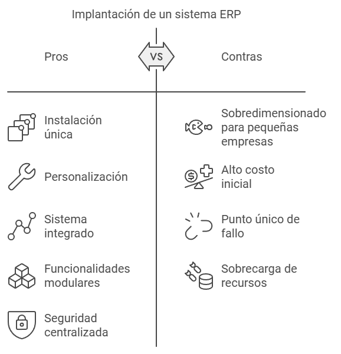

# **1. Guia d’estudi**
   
## Coneixements previs requerits
* Ús bàsic de sistemes operatius.
* Coneixements bàsics del món de l’empresa.

## Objectius

* Conéixer que és un sistema de gestió empresarial (ERP)
* Conéixer alguns conceptes del món de l’empresa.

## Continguts

* Teoria i activitats avaluables, a compartir al fòrum els dubtes.

## Activitats

* És molt important llegir els apunts i dur a terme les tasques avaluables. 

## Bibliografia

Aquest document està basat en els apunts d’aquesta assignatura impartida pels professors:
* Castillo Aliaga, José
* García Barea, Sergi.

# **2. Introducció**
Qualsevol empresa per a una òptima gestió empresarial i funcionar ha de tindre a l’esquena un sistema informàtic. Per posar en marxa aquest tipus de sistemes informàtics, a més d'una infraestructura en l’àmbit de maquinari i comunicacions, cal programari específic per a la gestió empresarial.

Al mercat sempre han existit programes per gestionar de forma separada o integrada elements com ara: comptabilitat, facturació, gestió comercial, gestió de nòmines, relació amb els clients, i un llarg etc. 

Una tendència actual és integrar tot aquest tipus de sistemes en sistemes ERP-CRM.

# **3. Què és un sistema ERP-CRM-BI?**
           
## 3.1. Sistemes ERP
Un sistema ERP ("Enterprise Resource Planning"), es tradueix literalment com "un sistema de planificació de recursos empresarials", encara que a efectes pràctics en el nostre context pot considerar com un programa de gestió empresarial integrada.
Aquest sistema de gestió empresarial integrada sol incloure elements comuns a diferents tipus d'empresa com ara comptabilitat, vendes, compres, recursos humans, clients, i un llarg etc.

## 3.2  Sistemes CRM
Un sistema CRM ("Customer Relationship Management") és un sistema que gestiona les relacions amb els clients. Aquest programari facilita l'automatització de processos com ara gestió de dades de clients, gestió i seguiment de vendes, gestió i seguiment de campanyes, etc.

## 3.3  Sistemes BI
Un sistema BI ("Bussiness Inteligence") és un sistema l'anomenada intel·ligència de negoci. Aquests sistemes proporcionen eines per facilitar l'anàlisi i visualització de dades. Aquests sistemes permeten analitzar el passat de l'empresa (veient què va passar), la situació present i la situació futura, realitzant prediccions i facilitant la presa de decisions.

## 3.4  Sistemes ERP-CRM-BI
Per les seues característiques, els sistemes CRM i BI han estat complements naturals dels sistemes ERP. Actualment la majoria de sistemes ERP integren els sistemes CRM i BI. A més, els sistemes ERP incorporen sistemes de connectors modulars que permeten ampliar-los de formes molt variades.
Per això, la majoria de sistemes de gestió integrats són comunament anomenats simplement "Sistemes ERP" i inclouen tant les parts ERP, CRM com BI.

> ❕ **Atenció:** des d'ara, per simplicitat farem servir habitualment l'expressió *"Sistemes ERP"* com abreujament de *"Sistemes ERP-CRM-BI"*.
{: .prompt-info }
       

# **4. Avantatges i inconvenients de la implantació d'un sistema ERP**

La implantació d'un sistema ERP davant de la implantació de programes de gestió individuals per a cada necessitat té una sèrie d'avantatges i inconvenients.
Els principals avantatges són:
* Realitzar una única instal·lació, configuració i manteniment, enfront de les diverses instal·lacions, configuracions i manteniment d'aplicacions individuals.
* Facilitat de personalitzar la teua empresa enfront d'aplicacions de gestió individuals gairebé sense possibilitat de personalització.
* Sistema integrat, facilitant el treball i evitant desenvolupar programari de comunicació entre diferents aplicacions.
* Instal·lació de noves funcionalitats de manera modular mitjançant sistemes de connectors.
* Aplicació de mesures de seguretat de forma centralitzada (actualitzacions, protecció de sistema, encriptació, etc.)
* La de dades integrades facilita tasques d'anàlisi de dades per a la presa de decisions ("Bussiness inteligence") a l'empresa.

Els principals desavantatges són:
* Per a xicotetes empreses un sistema ERP pot estar sobredimensionat respecte a les necessitats de l'empresa.
* La instal·lació i configuració inicial pot ser més costosa que unes poques aplicacions més senzilles d'instal·lar.
* Si tens un únic sistema, un atac dut a terme amb èxit contra el sistema pot deixar exposada tota la informació utilitzada.
* Disponibilitat de més recursos dels que l'usuari necessita, que poden portar a confusió i dificultar el seu ús. 
      
# **5. Programar el nostre Sistema ERP o personalització de sistema ERP?**
Quan en un entorn empresarial s'ha de prendre la decisió d'implantar un sistema ERP, aquesta no ha de ser presa a la lleugera i ha de tenir darrere una profunda anàlisi.

Programar a mida el nostre sistema ERP pot tenir certs avantatges en tasques de personalització, però és una tasca que requereix un gran esforç, ja que crear un programari que siga robust i amb una àmplia funcionalitat és una tasca complexa.

Per a la majoria d'organitzacions, utilitzar com a solució un sistema ERP existent i de certa entitat, aporta una certa garantia de robustesa, funcionalitat, suport, etc. Sol ser l'opció més recomanable. Aquests sistemes més solen tenir àmplies opcions de personalització tant en l’àmbit funcional (mitjançant sistemes de mòduls/plugins) com visuals (mitjançant l'ús de temes).

# **6. Llicències privatives o lliures per a sistemes ERP?**
Si ens decidim per utilitzar un sistema ERP existent, un altre aspecte a considerar és la llicència de programari que utilitza el sistema ERP. Una llicència tancada ens pot crear excessiva dependència amb el desenvolupador del sistema ERP, amb els seus conseqüents problemes (canvi de tarifes, tanca empresa, traves per migració a un altre sistema ERP, etc.). 

Un sistema ERP amb llicència lliure ens permet tenir una menor dependència d'una empresa concreta (diferents empreses desenvolupen per al mateix ERP, si tanca l'empresa nosaltres i una altra empresa pot seguir desenvolupant i donant suport, etc.).

Generalment, és recomanable implantar sistemes ERP amb una llicència lliure. En el cas d'implantar sistemes ERP amb llicència privativa, s'ha d'estudiar i avaluar a consciència els riscos que suposa dependre d’un programari privatiu vinculat a una empresa concreta.

Més informació sobre els diferents tipus de llicències aquí:
https://es.wikipedia.org/wiki/Licencia_de_software

# **7. Reptes en implantar un sistema ERP**
Tant si s'utilitza un sistema a mida com si es realitza una personalització d'un sistema ERP, sorgeixen reptes comuns a l'hora d'implantar un sistema ERP. Alguns dels principals reptes als quals s'ha d'enfrontar la implantació d'un sistema ERP són:

* Problemes tècnics: problemes en la implantació en l’àmbit de programari, maquinari, infraestructures de xarxa, etc.
* Problemes relacionats amb les dades: ens podem trobar problemes per migrar dades ja existents: dificultats tècniques per a la migració, errors d'organització de dades, dades incompletes o errònies, sistemes de codificació de caràcters heterogenis, sistemes de seguretat (exemple: encriptat de dades), etc.
* Problemes en la mentalitat empresarial: és possible que molts càrrecs no vegen els avantatges i possibilitats que ofereix la implantació d'un sistema ERP.
  - La solució implica intentar que puguen veure quines oportunitats ofereix el sistema ERP per actualitzar tant l'organització empresarial com el propi, i que això es tinga en compte en l'estratègia de futur de l'empresa.
* Resistència d'empleats: és molt freqüent trobar resistència d'empleats al canvi per diferents motius: prefereixen sistemes obsolets, no veuen els avantatges del canvi, no se'ls ha format (o la formació és un extra a la seua jornada laboral), por de perdre un lloc de treball, etc.
  - La solució implica establir canals d'informació i retroalimentació amb els empleats, oferir una formació completa, en horari de treball, on se celebren els èxits dels empleats en formació.

# **8. Exemples de sistemes ERP**
En https://en.wikipedia.org/wiki/List_of_ERP_software_packages hi ha un llistat amb el programari ERP mes popular. En el llistat distingeixen entre programari ERP amb llicències gratuïtes o de codi obert i sistemes ERP amb llicències privatives. Alguns dels més destacats són:
* Llicència privativa
  - JD Edwards d'Oracle
  - Microsoft Dynamics NAV (Navision)
  - SAP
* Llicència lliure o gratuïta
  - AbanQ
  - Odoo
  - OpenBravo

Al llarg d'aquest mòdul treballarem amb Odoo https://www.odoo.com. 

# **9. Glossari: conceptes bàsics del món empresarial**
En aquest apartat, introduirem un glossari amb alguns conceptes bàsics de l'empresa. La fi d'aquest glossari és el de facilitar la comprensió d'alguns termes utilitzats en el món empresarial a l'alumnat que no estiga familiaritzat amb ells.
* Empresa: persona, organització o institució dedicada a activitats amb ànim de lucre per a satisfer les necessitats de béns o serveis de la societat
* Persona física i jurídica:
  - Persona Física: és un individu humà. Aquest posseeix drets i pot contreure obligacions. En cas de deutes, una persona física ha de respondre amb el seu patrimoni. Els autònoms, encara que siguen emprenedors, es consideren persones físiques.
  - Persona Jurídica: és una entitat susceptible tant d'adquirir drets com de contraure obligacions. En cas de deutes, una persona jurídica respon amb els béns de l'entitat. Són persones jurídiques les societats, corporacions, fundacions, etc.

* Clients i proveïdors:
  - Client: persona física o jurídica que adquireix un bé o servei a canvi de diners o altres béns i serveis.
  - Proveïdor: un proveïdor és una persona física o empresa que proveeix de béns i/o serveis a altres persones i/o empreses.
* Empleats: un empleat és una persona que brinda serveis a un ocupador a canvi d'un salari. Els detalls d'aquest vincle es defineixen mitjançant un contracte.
* Impostos i tributs: són una obligació de pagament que és efectuat a l'Estat sense que hi haja una contraprestació directa de béns o serveis.
  - IVA: a Espanya, Impost sobre Valor Afegit. Aquest impost pot canviar segons el tipus de bé i servei o comunitat autònoma.
 * Factures comercials: és un document mercantil que reflecteix tota la informació d'una compra/venda: client, proveïdor, data d'entrega del producte / servei, detall del producte servei (incloent-hi preus unitaris i preu total), moment de la meritació (moment en què neix obligació tributària), impostos (com IVA), etc.
    - Factura completa: factura comercial que conté les dades tant de l'emissor com del receptor d’aquesta, i venen detallats els conceptes amb el seu corresponent IVA desglossat.
    - Factura simplificada (Ticket): és una factura comercial que no conté totes les dades per ser considerada factura completa.

* Factura proforma: és un document que el seu encapçalat ha de contenir de forma ben visible el títol "proforma", per evitar confondre amb factures comercials. Les factures proforma serveixen com una oferta prèvia i no tenen valor comptable. Aquestes factures solen contenir identificador de proveïdor i client, descripció dels productes i serveis, així com el seu preu unitari i total.
* Producció / fabricació, línia de producció i ordre de producció:
    - Producció / fabricació:  procés pel qual s'elabora un producte. Aquest procés sol constar de diferents fases (cadascuna fins i tot amb diferents ubicacions) i alguns elements associats com ara matèries primeres, energia i mà d'obra.
    - Línia de producció: definició del conjunt d'operacions seqüencials i recursos necessaris per a organitzar la fabricació d'un producte.
    - Ordre de producció: és la concreció de la fabricació d'un producte, indicant la quantitat de producte, data de producció i línia de producció utilitzada.
* Logística, emmagatzematge, estoc / inventari, distribució:
    - Logística: són aquells processos de coordinació, gestió i transport dels béns comercials des del lloc de distribució fins al client final.
    - Emmagatzematge: un procés en el qual es guarden tant els materials necessaris per al procés productiu, com l'estoc d'articles per a la seua venda i distribució.
    - Stock/Inventari: és el conjunt d'existències d'articles que posseeix l'empresa tant per comerciar amb ells com per poder produir béns i serveis.
    - Distribució: procés pel qual l'empresa fa arribar béns i serveis des del lloc d'emmagatzematge fins al consumidor final.
          

# **10. Bibliografia**
* Sistemes de Gestió Empresarial IOC: 
https://ioc.xtec.cat/educacio/cfgs-dam

* Wikipedia: https://es.wikipedia.org/wiki/Sistema_de_planificaci% C3% B3n_de_recursos_empresariales
       