# **1. Guia d’estudi**
## Coneixements previs requerits
- Ús bàsic de sistemes operatius.
- Coneixement de comandaments de Linux.
- Utilització de comandaments de Docker i Docker Compose.
- Coneixements per a desplegar Odoo.
      
## Objectius
- Aprendre a implantar Odoo i a instal·lar i configurar mòduls d’Odoo mitjançant un cas pràctic.
      
## Continguts
Aquesta unitat té associada una activitat avaluable.
      
## Activitats
És molt important llegir els apunts i dur a terme les tasques no avaluables, a més de les avaluables.
      
## Bibliografia
Aquest document està basat en els apunts d’aquesta assignatura impartida pels professors:
- García Barea, Sergi.
    
## **2. Introducció**
En aquesta unitat mostrarem com implantar un sistema Odoo 17 en una empresa. Per a això ens valdrem d'un exemple d'implantació d'un sistema ERP en una taverna. Partirem del context en què tenim un sistema Odoo amb la instal·lació bàsica proposada en la unitat 2.

>❕ Atenció:  aquesta unitat no és un exemple "pas a pas" de com realitzar totes les accions, sinó un esbós de quina configuració i mòduls poden utilitzar-se per implantar Odoo 17 Per a alguns detalls haureu de recolzar-vos en la documentació d'usuari.

**<u>Documentació d'usuari d’Odoo 17</u>**:  [https://www.odoo.com/documentation/17.0/]

## 2.1  Context cas pràctic: La taverna de Moe
Moe Szyslak és un conegut taverner que regenta "La taverna de Moe". Habitualment els seus parroquians parlen d'incoherències, canten cançons, discuteixen sobre assumptes diversos, etc.

Tots paguen les seues consumicions religiosament, l'únic dels seus parroquians a què li fia és a Barney Gumble, qui és el seu millor client. Tot i això, Barney té tantes coses apuntades a comptes que una simple llibreta no és suficient per a portar bé el compte de Barney (de fet, en una ocasió Moe va portar el compte de Barney a la NASA per poder calcular quan li hi havia).

Aquest problema el va fer reflexionar a Moe i l'ha impulsat a plantejar modernitzar el seu negoci. Després de plantejar diverses opcions, Moe (que és conegut per la seua gasiveria) ha decidit utilitzar Odoo 17 Community Edition, especialment per ser lliure i gratuït.

# **3. Mòdul “Facturació”**
Els primers elements que Moe vol controlar en el seu negoci és la facturació. Per a això, haurem de buscar "facturació" i instal·lar aquest mòdul, com es veu en aquesta imatge:

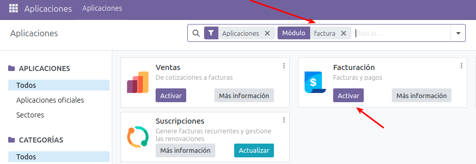

Després de seguir els passos d'instal·lació i tenir una mica de paciència (els mòduls poden trigar a instal·lar-se), tindrem el mòdul instal·lat al nostre sistema. 

Una vegada instal·lat, si tornem a "Aplicacions" (menú "superior esquerra"), i en "Filtres" vam indicar "mòduls instal·lats", podrem observar que mòduls tenim instal·lats.

En aquest cas, a més de facturació, ens ha instal·lat un altre mòdul addicional, "Converses", que necessita al mòdul "Facturació" per a funcionar. Aquesta acció passa habitualment, ja que hi ha molts mòduls amb interdependències.

Aquí un exemple de mòduls instal·lats després d'instal·lar "Facturació".

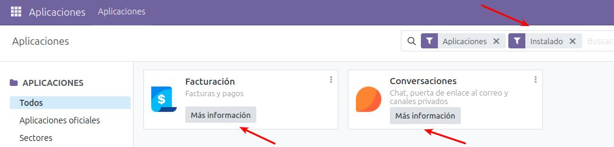

## 3.1  Passos previs a usar el mòdul “Facturació”
Abans d'usar el mòdul de "Facturació", val la pena fer / comprovar alguns xicotets ajustos. Per a això "Configuració" al menú "superior esquerra" i configurem algunes opcions. 

**Dades de l'empresa: (A "Configuració -> Opcions generals")**
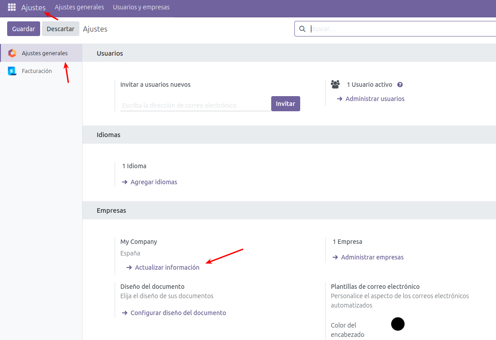

Aquí podreu indicar informació de l'empresa. Entre ells destaca triar el nom de l'empresa o col·locar un logotip com observem en la següent imatge.

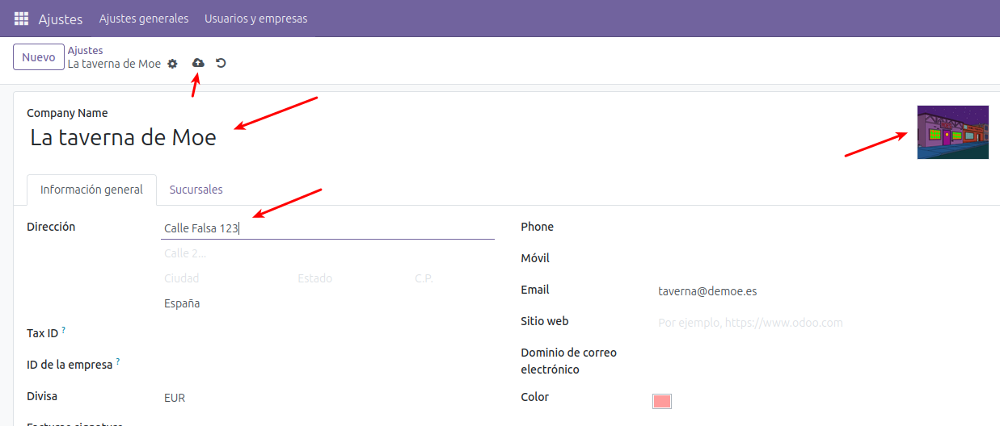

>❕ Atenció: és important recordar que quan feu servir Odoo, encara que en algunes parts hi ha guardat automàtic, és una bona pràctica assegurar-nos de guardar fent clic en la icona de guardar (o en algunes pantalles, en un botó amb el text “Guardar”). Així evitem el risc de perdre dades.

**Localització fiscal: (A "Configuració -> Facturació / Comptabilitat")**:
Aquí podrem comprovar entre altres coses que la "Localització fiscal" i "Impostos per defecte" amb els quals treballarà Odoo són correctes. Per al nostre cas utilitzarem PIMES 2008 i 21% IVA.

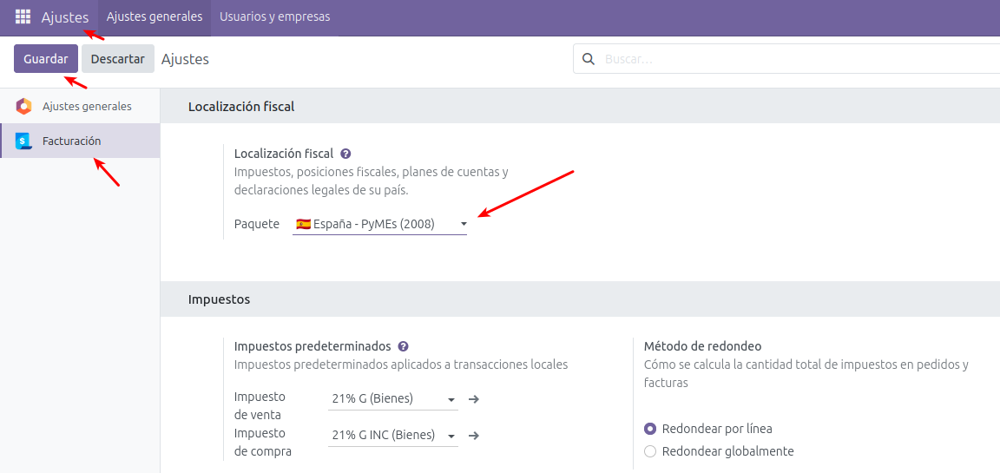

## 3.2  Esbossos d'ús de la lliçó facturació
Per treballar amb el mòdul facturació anirem a menú "superior esquerre" i seleccionarem "Facturació / Comptabilitat". Després d'això, en la part superior esquerra veurem el text "Facturació / Comptabilitat" i a la seua dreta immediata algunes seccions d'aquest mòdul: "Clients" (operacions relacionades amb clients), "Proveïdors" (Operacions relacionades amb proveïdors), "Informes" (generació d'informes) i "Configuració" (per configurar aspectes de la lliçó). A baix d'aquestes, veurem un botó per crear factures.

<div align="center">
  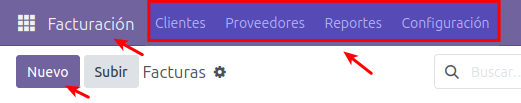
</div>

En general, les operacions que hauria de realitzar Moe per operar en aquest mòdul serien:
- Donar d'alta tant a clients com a proveïdors.
  - Si una persona o entitat és alhora client i proveïdor, deu donar-se d'alta en les dues seccions.
  - Per al cas d'empreses molt conegudes, Odoo té una base de dades que permet autocompletar dades d'aquestes empreses com a client o proveïdor.
- Un cop donades d'alta les entitats, es poden tant emetre factures (a clients) o emmagatzemar factures emeses per part d'un proveïdor.
  - A més de registrar les factures, en el moment del pagament, haurem d’indicar-ho.

Aquí un exemple d'una factura emesa a "Barney Gumble", pendent de pagament.

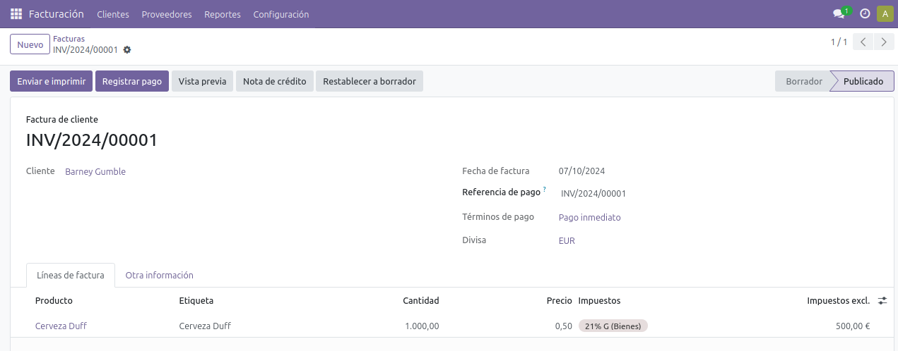

Ací un exemple de factura pagada a un proveïdor:

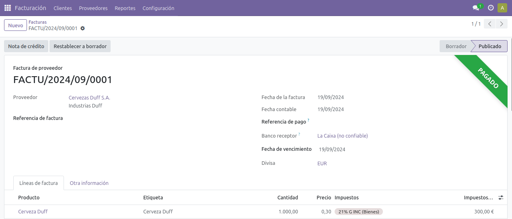


# **4. Mòdul "Empleats"**
Ara que Moe ja té Odoo amb el mòdul de "Facturació", els comptes de Barney Gumble ja no són un problema per a ell. El temps lliure que ha guanyat gràcies a aquests canvis, els ha invertit a netejar i endreçar una mica la taverna. Sorprenentment, això ha fet que acudisca més gent a més dels seus parroquians habituals, per la qual cosa s'ha plantejat contractar gent perquè l'ajude amb el seu negoci.

Per poder gestionar aquests nous empleats, instal·larem el mòdul "Empleats".

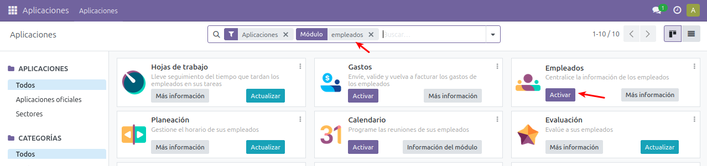

Un cop instal·lat tot correctament, tindrem al menú "superior esquerre" una nova secció "Empleats", amb subseccions com "Empleats", "Directori d'empleats", "Departaments" i "Configuració".

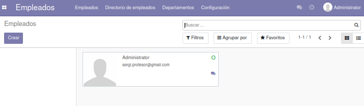

Entre altres opcions, amb aquest mòdul podrem:
- Donar d'alta/baixa a empleats.
- Crear departaments i assignar empleats a aquests mateixos.

A la següent imatge, podem veure un exemple on s'han configurat els departaments "Vendes" i "Administració" en el sistema.

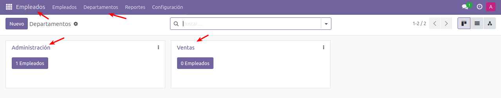

Aquí un exemple on s'ha donat d'alta a "Lurleen Lumpkin" al departament de "Vendes", i a "Waylon Smithers" al departament d'"Administració".

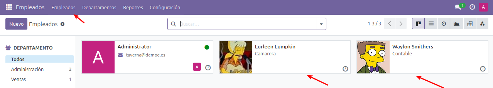

> 📖 Important:  en crear/editar l'empleat, si escau, podem crear-li i assignar un compte Odoo perquè puga accedir al sistema.
       
# **5. Mòdul "Compra"**
Contractar Smithers com a comptable ha estat un encert. Però aquest li ha suggerit a Moe que ha d'implementar un mòdul per a gestionar les compres que es fan.
Per poder gestionar les compres, instal·larem el mòdul "Compra".

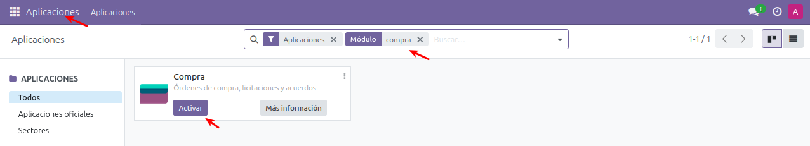

Un cop instal·lat tot correctament, tindrem al menú "superior esquerre" una nova secció "Compra", amb subseccions com "Comandes", "Productes", "Informes" i "Configuració".

<div align="center">
  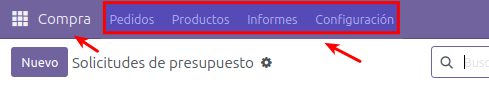
</div>

Si visitem les diferents seccions, comprovarem que aquest mòdul està interconnectat als altres com "Facturació" (elements com ara clients, proveïdors i productes, són comuns). 
Aquest grau d'interconnexió de mòduls facilita que Odoo siga un sistema integral i evita redundància de dades, errors, etc.
Entre altres opcions, amb aquest mòdul podrem:
- Realitzar sol·licituds de pressupostos de compra.
  - Aquests pressupostos es poden enviar per correu electrònic o imprimir-se.
- Realitzar comandes o convertir en comanda un pressupost de compra.
A continuació un pressupost de compra de "Duff 0.0":

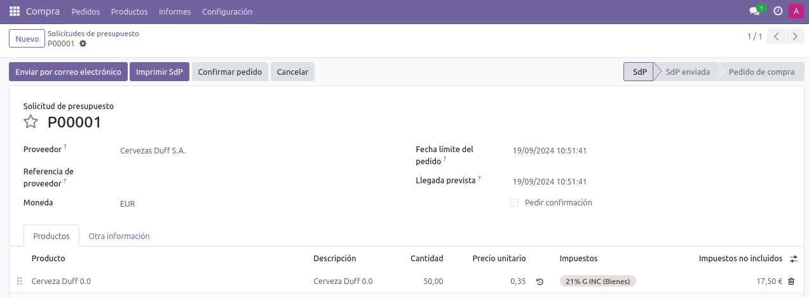

Un cop confirmat aquest pressupost, es converteix en comanda com veiem aquí:

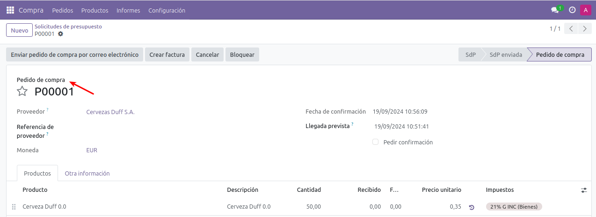

# **6. Mòdul "Vendes"**
Moe, content i extasiat per la comoditat que li ha proporcionat el mòdul "Compra", vol aplicar al que més li importa a ell: les vendes. Instal·larem el mòdul "Vendes".

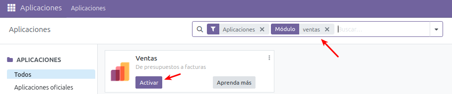

Un cop instal·lat tot correctament, tindrem al menú "superior esquerre" una nova secció "Vendes", amb subseccions com "Comandes", "A facturar", "Productes", "Informes" i "Configuració".

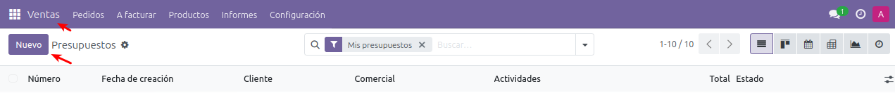

Aquí un exemple on Barney Gumble ha demanat pressupost per pagar diverses rondes de cervesa Duff amb els amics.

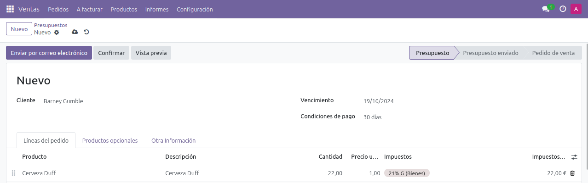

Una vegada confirmat el pressupost es genera la comanda i fins i tot aprofitant la interconnexió amb el mòdul de "Facturació", generar la factura de la comanda.
A continuació, podem veure la factura generada per Barney Gumble:

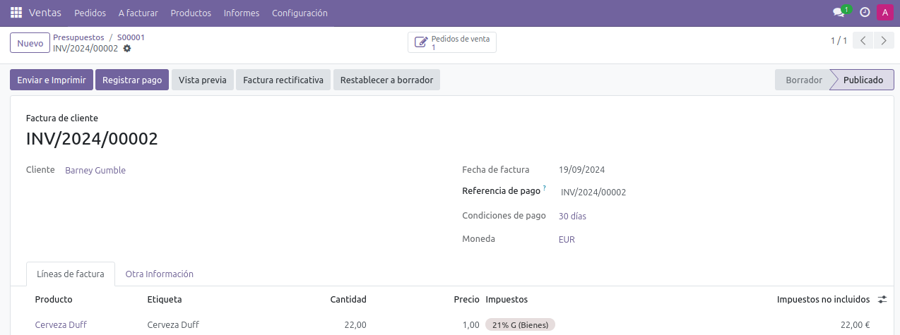
       
# **7. Mòdul "Punt de venda"**
Lurleen Lumpkin treballa molt de valent com a cambrera a la taverna de Moe, però últimament està molt esgotada, ja que compaginar la feina de cambrera amb ser cantant de música country és molt sacrificat. Moe vol ajudar a Lurleen i per facilitar la presa de notes, l'ha dotat d'un dispositiu mòbil amb accés a Odoo i ha instal·lat el mòdul "Punt de venda".

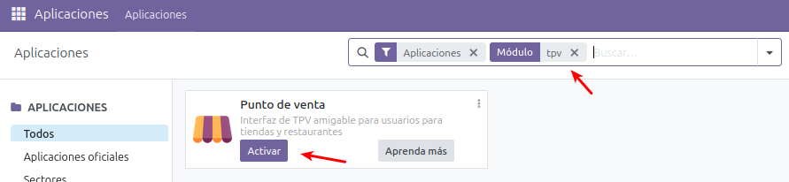

Un cop instal·lat tot correctament, tindrem al menú "superior esquerre" una nova secció "Punt de venda", amb subseccions com "Tauler", "Comandes", "Productes", "Informes" i "Configuració".

>❕ Atenció: els productes utilitzats en el punt de venda, han de ser donats d'alta de nou dins d'aquest mòdul.

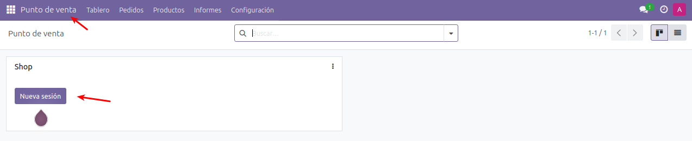

Un cop configurat els productes, tindrem accés per a accedir al nostre punt de venda. Cada vegada que acabem d'utilitzar el punt de venda, és recomanable tancar sessió perquè els canvis siguen efectius.

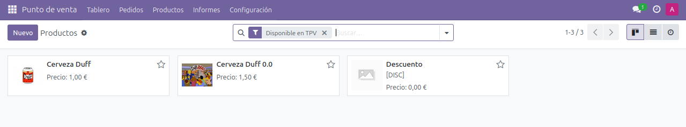

Això ens permetrà des de qualsevol dispositiu prendre una nota ràpida dels productes de forma similar a com es veu a la imatge:

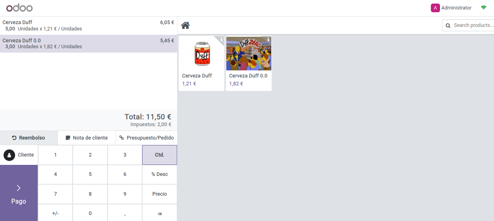

Després d'un pagament registrat, fins i tot ens permet emetre un rebut des del mateix punt de venda:

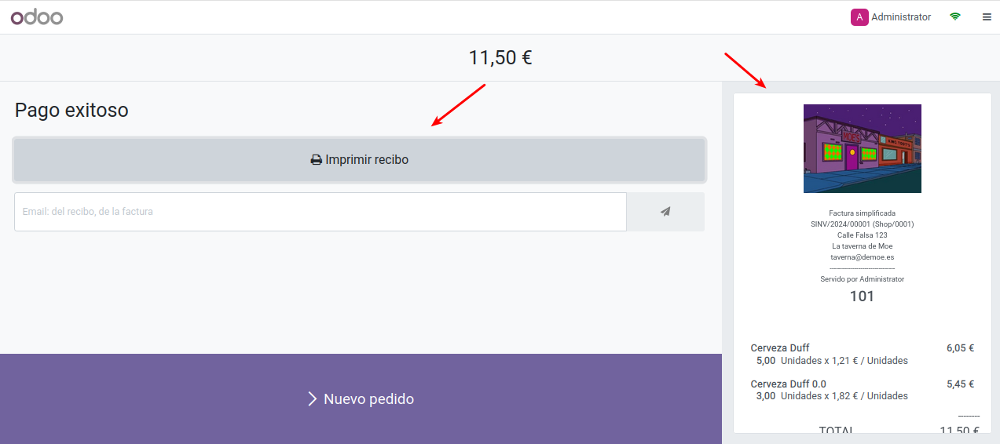
       
# **8. Altres mòduls interessants d’Odoo**
Després d'aquesta experiència, Moe ha quedat meravellat per Odoo i les seues possibilitats. Els mòduls comentats anteriorment han fet un pas més enllà al seu negoci. S'ha posat a pensar en ampliacions futures i ha pres nota d'alguns mòduls d’Odoo que li han semblat interessants per explorar i utilitzar en futures ampliacions:
- Websites i comerç electrònic
  - Comerç electrònic: permet implementar una botiga virtual vinculada a Odoo.
  - Website Builder: permet crear un lloc web des del mateix sistema Odoo.
  - Esdeveniments: permet gestionar esdeveniments i vendre entrades.
  - Mètode de pagament Paypal: introdueix el mètode de pagament per Paypal.
- Relació amb els clients
  - CRM: "Customer Relationship Management", per a seguiment de clients potencials i oportunitats de negoci.
  - Cites: mòdul per programar i gestionar cites amb clients.
  - Màrqueting per email/SMS: aquests són dos mòduls per a la gestió de campanyes de màrqueting per email/SMS.
  - Signar: mòdul per signar documents ràpidament.
- Relació amb els empleats:
  - Calendari: mòdul per programar i gestionar cites amb empleats.
  - Despeses: mòdul per gestionar i validar despeses dels empleats.
  - Planificació: permet gestionar l'horari dels empleats .
  - Projecte: permet gestionar l'organització de projectes de l'negoci.
  - Codi de barres: permetre l'ús de codi de barres per a operacions logístiques.
  - Manteniment: mòdul que permet gestionar necessitats de manteniment del negoci.
    
# **9. Còpia de seguretat en Odoo**
Després dels fets de l'episodi "Strong Arms of The Ma", on intenten convéncer a Marge que deixe els esteroides, la taverna de Moe acaba totalment destrossada. Moe decideix cremar la taverna per poder començar de nou. Quan ja li ha calat foc a la barra, Carl li etziba estranyat: "Però Moe ... No hauries de contractar una assegurança abans?".

Després d'aquest incident, amb la taverna cremada i sense assegurança de cobrar... Moe està trist i desanimat. Just en aquest moment recorda que va seguir una política de seguretat correcta i té còpia de seguretat emmagatzemada fora de la taverna de tot el seu sistema Odoo, per la qual cosa podrà cobrar els deutes a Barney i a la resta de parroquians i amb això començar de nou.

> 💬 Interessant: encara s'escapa una mica del temari d'aquest mòdul, és interessant conéixer principis sobre com dissenyar una política de còpies de seguretat. Més informació a [https://www.incibe.es/sites/default/files/contenidos/guias/guia-copias-de-seguridad.pdf]

## 9.1  Quins elements ha de contenir una còpia de seguretat/migració d’Odoo?
Per poder realitzar una còpia de seguretat o migració d'un sistema Odoo, s'ha de fer còpia dels següents elements:
- Sistema base d’Odoo.
- Contingut de la base de dades PostgreSQL.
- Fitxer configuració d’Odoo, normalment localitzat en "/etc/odoo/odoo.conf".
- Contingut de les carpetes (generalment en "/var/lib/Odoo")
  - "addons" en cas de tenir mòduls extres instal·lats.
  - "Sessions", amb emmagatzematge de les sessions.
  - "Firestore", amb alguns fitxers emmagatzemats per Odoo.

Un cop conegut que hem de copiar, distingim el cas d'una còpia de seguretat i d'una migració de sistema (de servidor, amb la mateixa versió o entre versions):
- Còpia de seguretat: en aquest cas, simplement hauríem d’emmagatzemar aquests elements i restaurar aquells que s'hagen danyat.
- Migració de servidor, mateixa versió d’Odoo: si realitzem una migració mantenint la versió d’Odoo, per exemple, passant el nostre sistema d'un servidor a un altre, simplement haurem de restaurar els elements anteriors i actualitzar el fitxer de configuració Odoo amb els paràmetres del nou servidor.
- Migració entre versions d'Odoo: aquest cas és més complicat, pot ocasionar problemes i fins i tot no sempre és possible. Cal tenir clar que versions d’Odoo són les implicades i investigar sobre el procés de migració entre aquestes.
- Entre altres coses, algunes migracions d’Odoo permeten convertir la base de dades seguint el que indica [https://upgrade.odoo.com/]

## 9.2  Fent còpia de la base del sistema d'Odoo
Per aquest cas, la millor idea és fer còpia de sistema Odoo ja siga descarregant la versió actual d’Odoo en el moment de la instal·lació des de [https://www.odoo.com/es_ES/page/download] o si vols utilitzar l'última versió de la teua branca, pots obtenir-la des de les "Nighty builds" a [https://nightly.odoo.com/].

En el cas d'una instal·lació usant Docker, la millor manera de preservar el sistema base és fent una còpia de seguretat de la imatge d’Odoo utilitzada per llançar el sistema, generalment obtinguda de  [https://hub.docker.com/_/Odoo].

## 9.3  Fent còpia de la base de dades PostgreSQL
Per fer una còpia de seguretat de la base de dades de PostgreSQL, tenim dues vies:

**<u>Interfície d’Odoo</u>**:
Utilitzar la interfície d’Odoo accedint a [http://localhost:8069/web/database/manager] (canviant "localhost:8069" per la direcció del teu host d’Odoo). En aquesta interfície, podràs tant fer còpia de seguretat de la base de dades com restaurar-la. Per a l'accés a aquesta eina, se't demanarà el "password mestre" de la instal·lació d’Odoo.

**<u>Còpia de seguretat tradicional</u>**:
Fer una còpia de seguretat clàssica d'una base de dades PostgreSQL amb les eines que estimem convenients. Un exemple de passos per a aquesta còpia serien:

```
service postgresql stop
#per còpia
pg_dump -U usariobd nombrebd > ficherocopia.sql 
#per restaurar
psql -U usariobd nombrebd < ficherocopia.sql 
service postgresql start
```

Després d'això, tindríem la còpia de seguretat en el fitxer "ficherocopia.sql".

En aquesta segona via, si estem utilitzant Docker Compose amb la configuració proposada en la unitat 03, simplement n'hi hauria prou amb fer còpia de la imatge Docker de la base de dades i de la carpeta que hem configurat perquè tinga persistència (carpeta "/var/lib/postgresql/ data "dins del contenidor, mapejada a "./volumesOdoo/dataPostgreSQL" fora d'ell). Exemple:
1. Exportar la imatge Docker de la base de dades: Suposant que la imatge es diu postgres, pots exportar-la amb:
> docker save -o postgres_backup.tar postgres

2. Fer còpia de la carpeta de persistència: La carpeta mapejada és ./volumesOdoo/dataPostgreSQL, que correspon a /var/lib/postgresql/data dins del contenidor.:
> cp -r ./volumesOdoo/dataPostgreSQL ./backup/dataPostgreSQL_$(date +%Y%m%d)

3. Restauració (si cal): Imatge Docker i Dades persistents
docker load -i postgres_backup.tar
> cp -r ./backup/dataPostgreSQL_YYYYMMDD ./volumesOdoo/dataPostgreSQL


Si, així i tot, volem fer la còpia de seguretat usant "pg_dump", podríem accedir a l'interior del contenidor Docker amb l'ordre:
> docker compose exec db bash

Si a més, volguérem copiar fora del contenidor "ficherocopia.sql" hauríem de realitzar dos passos. En el primer, hem de conéixer el nom del contenidor de la base de dades, usant:
> docker compose ps

Una vegada conegut, des de l’amfitrió podríem fer servir una ordre semblant a:
> docker cp contenidor:/rutacontenedor/ficherocopia.sql /rutaanfitrion

## 9.4  Fent còpia del fitxer de configuració i carpetes necessàries
En aquest cas, simplement és fer una còpia simple tant del fitxer de configuració d’Odoo, com de les carpetes indicades ( "addons", "sessions" i "firestore").
Si estem utilitzant Docker Compose amb la configuració proposada en la unitat 02, les tres carpetes ("addons", "sessions" i "firestore") ja estan mapejades dins de "./volumesOdoo" i simplement haurem de fer còpia de seguretat d'aquestes dades mapejats.
No obstant això, per copiar el fitxer de configuració, hauríem de seguir els següents passos. En el primer, hem de conéixer el nom del contenidor d’ Odoo, usant:
> docker compose ps

Un cop conegut, des de l’amfitrió podríem fer servir una ordre semblant a:
> docker cp contenidor:/etc/odoo/odoo.conf /rutaanfitrion

# **10.  Enlaces de interés**
* Documentación Odoo 17: [https://www.odoo.com/documentation/17.0/es/](https://www.odoo.com/documentation/17.0/es/)
* Documentación de usuario de Odoo: [https://www.odoo.com/documentation/user/14.0/es/](https://www.odoo.com/documentation/user/14.0/es/)

# **11.  Bibliografia**
- Sistemes de Gestió Empresarial IOC: 
[https://ioc.xtec.cat/materials/FP/Materials/2252_DAM/DAM_2252_M10/web/html/index.html]
- Documentació d’Odoo:
[https://www.odoo.com/documentation/17.0/es/]
- Documentació d'usuari de Odoo:
[https://www.odoo.com/documentation/user/14.0/es/]

       