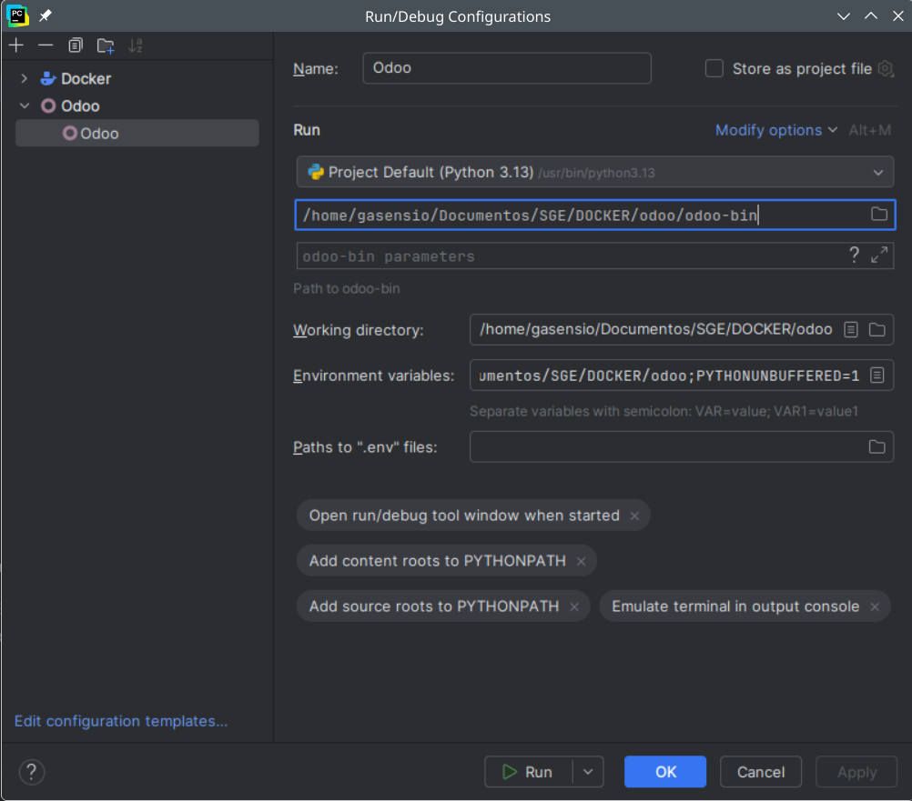
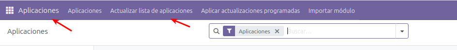
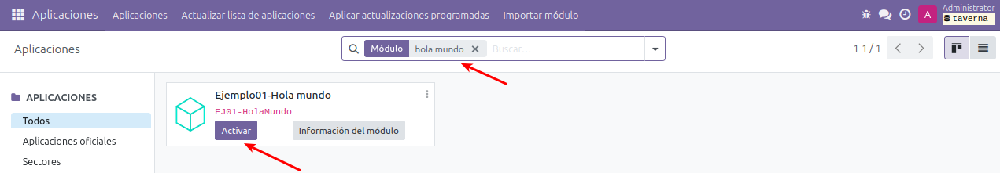
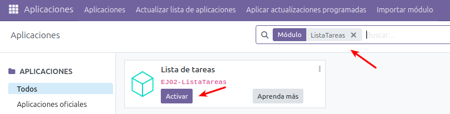
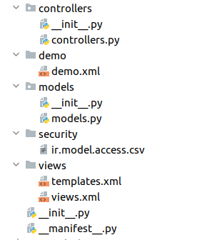
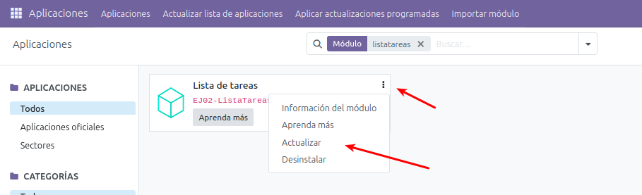
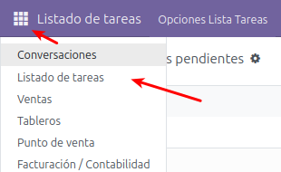
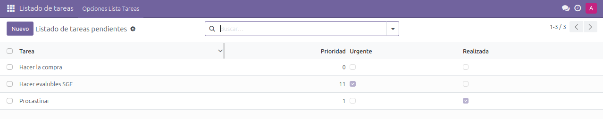

# 1. Guia d'estudi
## Coneixements previs requerits
- Ús bàsic de sistemes operatius.
- Coneixement de comandaments de Linux.
- Coneixements avançats de programació.
- Coneixements de Python.
- Desplegament d’Odoo.
       
## Objectius
- Aprendre a preparar l’entorn per a desenvolupar mòduls en Odoo.
- Fer els primers passos en desenvolupament de mòduls en Odoo.

## Continguts
Teoria i activitats no avaluables, a compartir al fòrum.
       
## Activitats
És molt important llegir els apunts i dur a terme les tasques **<u>AVALUABLES</u>**.
       
## Bibliografia
Aquest document està basat en els apunts d’aquesta assignatura impartida pels professors:
- García Barea, Sergi.

# 2.INTRODUCCIÓ

En la unitat 03 s’explica com instal·lar Odoo, tant amb una configuració pensada per a un entorn de producció com una configuració pensada per a
un entorn de desenvolupament. En aquesta unitat insistirem un poc més en
la configuració de l’entorn de desenvolupament, incloent-hi tant el mateix Odoo, com l’IDE de desenvolupament amb els seus respectius “plugins”. Amb tot això llest, farem els nostres primers mòduls d’Odoo.

## 2.1 Com orientarem aquesta unitat?

En primer lloc, prepararem tot l’entorn de desenvolupament. Amb un sistema ERP Odoo instal·lat, es poden desenvolupar mòduls que amplien la seua funcionalitat sense una gran preparació de l’entorn. Tan sols una terminal i un editor de text són suficients per a poder desenvolupar amb Odoo.

No obstant això, es recomana realitzar una configuració prèvia tant del mateix sistema ERP Odoo com de les eines de desenvolupament associades per fer la feina més fàcil i augmentar la productivitat.

Una vegada configurat l’entorn de desenvolupament, començarem a introduir els primers mòduls d’Odoo. Començarem amb un senzill mòdul “que no fa res”, però que ja es pot instal·lar. Aquest mòdul ens ajudarà
a validar si tenim una configuració correcta del nostre entorn de desenvolupament.

A continuació ampliarem el mòdul base anterior, afegint coses per augmentar la seua funcionalitat. Aquesta serà la metodologia que seguirem en aquesta unitat d’introducció al desenvolupament de mòduls.

El desenvolupament de mòduls d’Odoo pot arribar a ser molt complex i només els programadors experts són capaços d’aprofundir des del principi sense veure com va funcionant. En la següent unitat ja aprofundirem en major detall en la programació de mòduls per Odoo. 

# 3. CREANT UN DIRECTORI PER A MÒDULS

Com ja vam veure en la unitat 03, és important tenir un directori per incloure i desenvolupar mòduls en Odoo. En aquest apartat comentarem com posar en marxa aquest directori tant en una instal·lació manual com
utilitzant Docker. 

**<u>Instal·lació manual</u>**
Si hem fet una instal·lació manual tal com es va explicar en la unitat 03, un script per aconseguir crear aquest directori a la carpeta “/var/lib/Odoo modules” és:

```
# Estant situat en /var/lib/odoo:
# Creem directori “modules”
mkdir modules
# Creem un módul anomenat “prova” amb la utilitat “odoo scaffold”
odoo scaffold prova ./modules
# Modifiquem el path dels “addons”.
odoo --addons-path="/var/lib/odoo/modules,/usr/lib/python3/dist-packages/odoo/addons" --save
# Llancem el servidor Odoo i actualitzem el módul “prova” en la bd “empresa”
odoo -u pruebas -d empresa
```

Amb aquesta acció, el que aconseguim és afegir el nostre directori “modules” al PATH d’Odoo (emmagatzemat a l’arxiu de configuració “.odoorc”, situat al “home” de l’usuari Odoo). Amb l’últim comando hem arrancat Odoo actualitzant aquest mòdul ( “prova”) a la base de dades “empresa”.

Els mòduls han de poder ser almenys llegits per l’usuari “Odoo”, que és el que llança el servei. 
- En un entorn de producció, els permisos dels mòduls solen configurar-se de manera que només l’usuari “Odoo” puga llegir-los i cap altre usuari puga llegir ni escriure. 
- En un entorn de desenvolupament, és recomanable que    criptura per fer els canvis necessaris.

**<u>Instal·lació mitjançant Docker i Docker Compose</u>** 
Si poseu en marxa Odoo en mode desenvolupament amb Docker i Docker Compose, tal com era suggerit a la unitat 03, simplement tindreu el vostre directori de mòduls llest per treballar. Aquest directori és l’anomenat “volumesOdoo/addons”, que tindreu mapejat en la vostra màquina amfitriona.

# 4.  ENTORN DE DESENVOLUPAMENT

Hi ha diversos entorns de desenvolupament que permeten desenvolupar mòduls per Odoo. Els més utilitzats són “Visual Studio Code” i “PyCharm”. A més és important fer servir algunes eines addicionals.
Recomanem en el desenvolupament usar un sistema de control de versions “git” juntament amb plataformes com [https://github.com](https://github.com) o [https://gitlab.com](https://gitlab.com). 

**<u>PyCharm</u>** 
Recomane el ús d'aquest editor en Pycharm [https://www.jetbrains.com/es-es/pycharm/](https://www.jetbrains.com/es-es/pycharm/). 
Per defecte no reconeix els elements del framework Odoo, però sí els del llenguatge Python. Si volem facilitar el desenvolupament podem instal·lar l’extensió d’Odoo Pycharm Templates [https://github.com/mohamedmagdy/odoo-pycharm-templates](https://github.com/mohamedmagdy/odoo-pycharm-templates).

> **IMPORTANT: En cas de problemes per importar la llibreria Odoo (al fer «from» o «import» de la llibreria odoo)**

- Verifica que Odoo esté instalat correctament
  - Odoo no se instala com un paquet estándar de Python amb «pip install odoo». Normalment es clona desde GitHub, es te que clonar desde la arrel de la carpeta del projecte:
``` 
git clone https://www.github.com/odoo/odoo --depth 1 --branch 17.0 
```

  - Agrega la ruta de Odoo al PYTHONPATH: tras  instal·lar l’extensió d’Odoo en pycharm i el paquet estándar de Python, pasarem a configurar la ruta de Odoo, per a poder, gestionar les llibreries. Dins de la configuració es te que configurar al menys:
     - Odoo-bin path
     - Working directory
     - Environment variables: **PYTHONPATH=/home/gasensio/Documentos/SGE/DOCKER/odoo;PYTHONUNBUFFERED=1** 



> NOTA: En el meu cas la carpeta del projecte es /home/gasensio/Documentos/SGE/DOCKER


**<u>Visual Studio Code</u>** 
Un altre editor recomanat es Visual Studio Code. És molt potent i posseeix un gran ecosistema de “plugins” per ampliar la seua funcionalitat [https://code.visualstudio.com/](https://code.visualstudio.com/)

Aquí alguns manuals lliures d’ús de Visual Studio Code en castellà:
- [http://www.mclibre.org/consultar/informatica/lecciones/](http://www.mclibre.org/consultar/informatica/lecciones/)
- [http://www.mclibre.org/consultar/informatica/lecciones/vsc-instalacion.htmlVSC-personalizacion.html](http://www.mclibre.org/consultar/informatica/lecciones/vsc-instalacion.htmlVSC-personalizacion.html)

Per al desenvolupament amb Odoo, recomanem els següents: 
- Python: [https://marketplace.visualstudio.com/items?itemName=ms-python.python](https://marketplace.visualstudio.com/items?itemName=ms-python.python) 
- Odoo-snippets: [https://marketplace.visualstudio.com/items?itemName=jeffery9.odoo-snippets](https://marketplace.visualstudio.com/items?itemName=jeffery9.odoo-snippets)

**<u>Control de versions usant Git + Visual Studio Code</u>** 
Git és un sistema de control de versions. El seu ús en l’entorn professional està molt estés i és utilitzat en tota mena de desenvolupaments. Durant el curs, s’utilitzaran repositoris Git tant per al lliurament de pràctiques com per facilitar disposar d’un repositori amb control de versions.  Per instal·lar Git: 
- Ubuntu: 
  - sudo apt-get update 
  - sudo apt-get install git 
- Windows: [https://git-for-windows.github.io/](https://git-for-windows.github.io/)

Per facilitar la tasca de l’ús de Git és recomanable instal·lar alguna extensió o entorn que us facilite el seu ús. Per fer servir Git en Visual Studio Code recomanem el següent connector: [https://marketplace.visualstudio.com/items?itemName=donjayamanne.git-extension-pack](https://marketplace.visualstudio.com/items?itemName=donjayamanne.git-extension-pack)

Pots trobar més informació de com fer servir Git amb Visual Studio Code a: 
● [https://code.visualstudio.com/docs/editor/versioncontrol](https://code.visualstudio.com/docs/editor/versioncontrol)
● [http://www.mclibre.org/consultar/informatica/lecciones/vsc-git-repositorio.html](http://www.mclibre.org/consultar/informatica/lecciones/vsc-git-repositorio.html)

**<u>Control de versions usant Git + PyCharm</u>**
PyCharm també permet l’ús d’un sistema de control de versions Git des del seu entorn. Podeu trobar informació de com utilitzar Git amb Pycharm a: 
- [https://programmerclick.com/article/169045515/](https://programmerclick.com/article/169045515/) 
- [https://www.jetbrains.com/help/pycharm/set-up-a-git-repository.html](https://www.jetbrains.com/help/pycharm/set-up-a-git-repository.html)

# 5. ACTIVANT EL MODE “DESENVOLUPADOR” EN ODOO 17
En aquest URL de la guia de Odoo 17 s’expliquen les diferents vies existents per activar el mode desenvolupador. Aquesta manera ens permet depurar els nostres mòduls Odoo gràficament.
- [https://www.odoo.com/documentation/17.0/es/applications/general/developer_mode.html](https://www.odoo.com/documentation/17.0/es/applications/general/developer_mode.html)

Qualsevol de les explicades (interfície Odoo, url, extensió navegador) és igualment vàlida per a aquest fi, encara que si feu un desenvolupament exhaustiu és possible que la més còmoda siga l’activació mitjançant una extensió de navegador.

Podeu trobar l’extensió per: 
- Firefox: [https://addons.mozilla.org/es/firefox/addon/odoo-debug/](https://addons.mozilla.org/es/firefox/addon/odoo-debug/) 
- Chrome: [https://chrome.google.com/webstore/detail/odoo-debug/hmdmhilocobgohohpdpolmibjklfgkbi?hl=es_PR](https://chrome.google.com/webstore/detail/odoo-debug/hmdmhilocobgohohpdpolmibjklfgkbi?hl=es_PR)

>❕Atenció: per activar el mode desenvolupador des de la interfície Odoo, s'ha d'haver instal·lat almenys un mòdul (per exemple, Vendes).

# 6.  EL NOSTRE PRIMER MÒDUL: “HOLA MÓN”

Un mòdul d’Odoo serveix per a ampliar les funcionalitats d’aquest sistema ERP i pot tenir molts propòsits diferents.

Per a aquest exemple, crearem el mòdul més senzill que permet Odoo 17. Un mòdul que no fa absolutament res, excepte aparéixer a la llista de mòduls. La creació d’aquest mòdul té una fi completament didàctica i ens
ajudarà a comprovar que el nostre sistema està configurat correctament per poder detectar i utilitzar els mòduls que desenvolupem.

Per a aquest primer “Hola món”, crearem una carpeta
“Ejemplo01-HolaMundo” dins del directori que hàgem configurat per col·locar els nostres mòduls. Aquesta carpeta contindrà dos fitxers: 
- Fitxer “__init__.py”: Aquest fitxer ha d’estar buit. 
- Fitxer “__manifest__.py”: Aquest fitxer contindrà el següent codi: 
```python
# -*-coding: utf-8 -*- 
{‘name’: ‘Ejemplo01-Hola mundo’}
```

Una vegada creada l’estructura, amb el “Mode desenvolupador” activat, podreu anar a la llista de mòduls i” Actualitzar la llista d’aplicacions “tal com s’observa en la imatge.



Després d’això, eliminant els filtres de cerca per defecte i buscant “hola mundo”, podrem trobar el nostre mòdul. Si tot ha funcionat correctament, veurem alguna cosa similar a:



>❕Atenció: fixeu-vos que ha de llevar-se el filtre “aplicacions” de la cerca.

Ara podrem instal·lar el nostre mòdul per provar-ho (tot i que aquest exemple no fa res).

# 7.  CREANT MÒDULS EN ODOO

• Creant mòduls amb “Odoo Scaffold” Quan vam crear un mòdul, diguem que es converteix en una “aplicació” dins “d’una altra aplicació més gran” que és Odoo sent aquesta aplicació pràcticament independent de la resta d’Odoo.

Els mòduls d’Odoo poden tenir moltes funcionalitats diferents. Començarem realitzant un tipus de mòdul fàcil d’entendre: un mòdul que cree nous models de dades (fitxers mestres) i permeta que s’observen aquests models a través d’un nou menú.

> 💬 Interessant: una altra possibilitat més d'afegir models nous, és modificar models/vistes existents per afegir funcionalitats a les quals ja ofereix Odoo. Aquest tipus de mòduls serà tractat en la següent unitat didàctica mitjançant ús d'herència.

Un cop comprovat en punts anteriors que tenim a punt tot el necessari per a treballar amb Odoo, explicarem com desenvolupar el nostre primer mòdul amb funcionalitat utilitzant la comanda “Odoo Scaffold” i basant-nos en l’exemple i la informació descrita en [https://www.odoo.com/documentation/17.0/es/administration/odoo_sh/getting_started/first_module.html](https://www.odoo.com/documentation/17.0/es/administration/odoo_sh/getting_started/first_module.html) 

> 📖 Important: si heu desplegat Odoo amb Docker, per
a usar “Odoo scaffold” haureu d’usar- lo dins del contenidor. Podeu fer-ho amb una ordre semblant a”docker exec -it IDCONTENEDOR /bin/bash”. Si ho heu fet amb Docker Compose, el comandament equivalent podria ser “docker-compose exec web /bin/bash”.

Un cop tot llest, creem el nostre mòdul amb una estructura base per treballar fent servir “Odoo scaffold” amb una ordre semblant a: 
```
Odoo scaffold lista_tareas /mnt/extra-addons/
```

>❕Atenció: el nom de la lliçó no ha de començar per nombre ni posseir el caràcter "-".

Si tot ha anat bé, dins de la carpeta “/mnt/extra-addons”(o on l’hàgeu muntat si és un contenidor Docker), s’haurà creat una carpeta “lista_tareas”. Si esteu dins d’un contenidor Docker, és recomanable donar-li permisos complets per poder editar fàcilment fora del contenidor. Podeu fer-ho des de dins del contenidor amb: 
```
chmod 777 -R /mnt/extra-addons/lista_tareas
```

Si actualitzem el llistat de mòduls, traiem filtres i busquem “listatareas”, podrem accedir-hi de forma similar a aquesta imatge:



Si volem utilitzar l’estructura de fitxers que ens creurà “Odoo scaffold” sense utilitzar aquesta comanda, la podem descarregar des de la següent adreça: [https://www.odoo.com/documentation/17.0/\_downloads/b7f3a4243ae7f3166cd5c4d23a256739/my_module.zip](https://www.odoo.com/documentation/17.0/\_downloads/b7f3a4243ae7f3166cd5c4d23a256739/my_module.zip). 

El mòdul creat conté un codi d’exemple, però per defecte tot aquest codi està comentat. Si volem habilitar-lo, hem de descomentar el contingut de tots els fitxers creats.

**<u>Estructura d’un mòdul Odoo</u>**
Com en qualsevol framework, els directoris on es programen mòduls tenen uns fitxers amb uns noms i extensions determinats. En el cas d’Odoo, tot comença amb un fitxer Python anomenat ”__manifest__.py” que conté la informació necessària per a interpretar tots els fitxers que conté el directori. Aquesta informació
està emmagatzemada usant una estructura diccionari de Python. 

A més, com en qualsevol paquet de Python, el directori conté un fitxer”__init__.py”. Aquest té el nom dels fitxers Python o directoris que contenen la lògica de la lliçó. Els subdirectoris amb fitxers Python de l’estructura creada amb “Odoo scaffold” també tindran el seu propi fitxer”__init__.py”.

Internament, la carpeta creada amb “Odoo scaffold” té el següent contingut:



Anem a fer una breu explicació de cada un dels fitxers generats: 
- **“models/models.py”**: defineix un exemple del model de dades i els seus camps. 
- **“Views/views.xml”**: descriu les vistes del nostre mòdul (formulari, arbre, menús, etc.). 
- **“Demo/demo.xml”**: inclou dades “demo” per l’exemple proposat de model. 
- **“Controllers/controllers.py”**: conté un exemple de controlador de rutes, implementant algunes rutes. 
- **“Views/templates.xml”**: conté dos exemples de vistes “qweb” usat pel controlador de rutes. 
- **“__Manifest__.py”**: és el manifest de la lliçó. Inclou informació com el títol, descripció, així com fitxers a carregar. En l’exemple s’ha de des-comentar la línia que conté la llista de control d’accés al fitxer *‘security/ir.model.access.csv’*.

**<u>Mòduls en producció</u>** 
En aquest apartat comentem com funcionen els mòduls quan estem treballant en producció. Quan instal·lem o actualitzem un mòdul de Odoo, el manifest indica a l’actualitzador on són els fitxers de dades i altres paràmetres per actualitzar la base de dades.

Odoo té una manera de funcionar “data-driven” (dirigit per dades) i quan instal·lem un mòdul, les vistes, dades, etc. (els .xml) s’emmagatzemen a la base de dades. L’actualització de la base de dades amb dades, vistes, etc. només es fa en instal·lar o actualitzar el mòdul. Així que encara que canviem una vista en un fitxer XML, no es veurà el canvi si no actualitzem el mòdul Odoo (ni tan sols reiniciant el servei Odoo).

Els fitxers Python d’un mòdul són carregats de nou cada vegada que s’inicia el servei Odoo. Pel que si canviem alguna cosa en ells, tenim dues opcions per observar els canvis: recarregar el mòdul o reiniciar el
servei Odoo (si necessitat d’actualitzar el mòdul).

>❕Atenció: si esteu utilitzant "Docker" podeu reiniciar el servei simplement reiniciant el contenidor "docker restart IDCONTENEDOR". En el nostre exemple de "Docker Compose" seria "docker-compose restart web".

Aquí una imatge on es veu com actualitzar un mòdul ja instal·lat



**<u>Mòduls en desenvolupament</u>** 
Si estem treballant en mode desenvolupament (opció “–dev=all” en llançar Odoo), el servidor Odoo llegirà cada vegada les vistes, dades i codi Python directament dels fitxers. Per tant, podrem observar canvis de vistes, dades o codi sense reiniciar el servei ni actualitzar el mòdul.

>❕Atenció: aquesta pràctica és molt còmoda per desenvolupar, però no s'usa en entorns de producció per motius tant de seguretat com de rendiment.

# 8.  EXEMPLE DE MÒDUL “LLISTA DE TASQUES”

Per posar en marxa el nostre primer mòdul funcional, utilitzarem un exemple comentat on crearem una senzilla “Llista de tasques”. 



Aquest mòdul tindrà una estructura similar a aquesta:



I ens permetrà crear tasques amb una prioritat associada. També podrem marcar si la tasca està realitzada o no. El camp “urgent” serà un camp calculat (és a dir, no es podrà editar a mà) que estarà marcat si la prioritat és més gran que 10.

A continuació, desglossem el codi comentat d’aquesta aplicació:

**Fitxer “__manifest__.py”**:
```python 
# -*- coding: utf-8 -*- 
{ 
     ‘name’: “Lista de tareas”,
     'summary': """
     Sencilla Lista de tareas""",

     'description': """
     Sencilla lista de tareas utilizadas para crear un nuevo módulo con un nuevo modelo de datos
     """,

     'author': "Sergi García",
     'website': "https://apuntesfpinformatica.es",
     #Indicamos que es una aplicación
     'application': True,

     # En la siguiente URL se indica qué categorías pueden usarse
     # https://github.com/odoo/odoo/blob/14.0/odoo/addons/base/data/ir_module_category_data.xml
     # Vamos a utilizar la categoría Productivity
     'category': 'Productivity',
     'version': '0.1',

     # Indicamos lista de módulos necesarios para que este funcione correctamente
     # En este ejemplo solo depende del módulo "base"
     'depends': ['base'],

     # Esto siempre se carga
     'data': [
     #Este primero indica la politica de acceso del módulo
     'security/ir.model.access.csv',
     #Cargamos las vistas y las plantillas
     'views/views.xml',
     ]
}
``` 

**Fitxer “models.py”**: 
```python
# -*- coding: utf-8 -*-

from odoo import models, fields, api

#Definimos el modelo de datos 
class lista_tareas(models.Model):
     #Nombre y descripcion del modelo de datos 
     _name =‘lista_tareas.lista_tareas’ 
     _description = ‘lista_tareas.lista_tareas’

     #Elementos de cada fila del modelo de datos
     #Los tipos de datos a usar en el ORM son
     # https://www.odoo.com/documentation/14.0/developer/reference/addons/orm.html#fields

     tarea = fields.Char()
     prioridad = fields.Integer()
     urgente = fields.Boolean(compute="_value_urgente", store=True)
     realizada = fields.Boolean()


     #Este computo depende de la variable prioridad
     @api.depends('prioridad')
     #Funcion para calcular el valor de urgente
     def _value_urgente(self):
     #Para cada registro
     for record in self:
     #Si la prioridad es mayor que 10, se considera urgente, en otro caso no lo es
     if record.prioridad>10:
     record.urgente = True
     else:
     record.urgente = False
```

Fitxer “views.xml”: 
```xml
<odoo> 
     <data> 
          <!-- explicit list view definition -->
          <!-- Definimos cómo es la vista explícita de la listas-->
          <record model="ir.ui.view" id="lista_tareas.list">
          <field name="name">lista_tareas list</field>
          <field name="model">lista_tareas.lista_tareas</field>
          <field name="arch" type="xml"> <tree> <field name="tarea"/>
          <field name="prioridad"/> <field name="urgente"/>
          <field name="realizada"/> 
          </tree> 
          </field> 
          </record>
          <!-- actions opening views on models -->
          <!-- Acciones al abrir las vistas en los modelos https://www.odoo.com/documentation/14.0/developer/reference/addons/actions.html
          -->
          <record model="ir.actions.act_window" id="lista_tareas.action_window">
          <field name="name">Listado de tareas pendientes</field>
          <field name="res_model">lista_tareas.lista_tareas</field>
          <field name="view_mode">tree,form</field> </record>

          <!-- Top menu item -->
          <menuitem name="Listado de tareas" id="lista_tareas.menu_root"/>

          <!-- menu categories -->
          <menuitem name="Opciones Lista Tareas" id="lista_tareas.menu_1"

          parent=“lista_tareas.menu_root”/\>

          <!-- actions -->
          <menuitem name="Mostrar lista" id="lista_tareas.menu_1_list" parent="lista_tareas.menu_1"
          action="lista_tareas.action_window"/>

     </data> 
</odoo>
```

# 9. BIBLIOGRAFIA

- Sistemes de Gestió Empresarial IOC: 
  [https://ioc.xtec.cat/materials/FP/Materials/2252_DAM/DAM_2252_M10/web/html/index.html](https://ioc.xtec.cat/materials/FP/Materials/2252_DAM/DAM_2252_M10/web/html/index.html) 
- Wikipedia: 
  [https://es.wikipedia.org/wiki/Sistema_de_planificaci%C3%B3n_de_recursos_empresariales](https://es.wikipedia.org/wiki/Sistema_de_planificaci%C3%B3n_de_recursos_empresariales)(
- Documentació de Odoo:
  [https://www.odoo.com/documentation/master/reference/http.html](https://www.odoo.com/documentation/master/reference/http.html)
