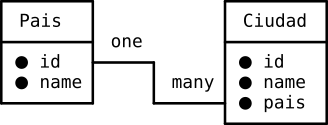
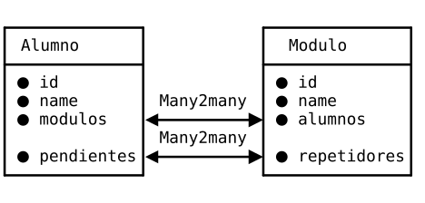

# **1. Guia d'estudi**
## Coneixements previs requerits
- Ús bàsic de sistemes operatius.
- Coneixement de comandaments de Linux.
- Coneixements avançats de programació.
- Coneixements de Python.
- Desplegament d’Odoo.
       
## Objectius
- Aprendre a preparar l’entorn per a desenvolupar mòduls en Odoo.
- Fer els primers passos en desenvolupament de mòduls en Odoo.

## Continguts
Teoria i activitats no avaluables, a compartir al fòrum.
       
## Activitats
És molt important llegir els apunts i dur a terme les tasques **<u>AVALUABLES</u>**.
       
## Bibliografia
Aquest document està basat en els apunts d’aquesta assignatura impartida pels professors:
- García Barea, Sergi.

# **2.INTRODUCCIÓ**

Odoo és un ERP-CRM de codi obert que es distribueix sota dos tipus de desplegament:
- On-premise en GNU/Linux o Windows amb dues versions (Community, gratuïta i Enterprise, de pagament).
- SaaS (Programari As A Service): l’empresa que desenvolupa Odoo també proporciona el seu servei en el núvol. 

D'aquesta manera, una empresa pot tenir el seu propi Odoo en un servidor local, en un núvol propi o en un núvol de tercers. També pot tenir accés a Odoo pel SaaS d'Odoo o d'altres terceres empreses que proporcionen Odoo com SaaS.

La llicència d'Odoo ha anat canviant al llarg del temps. La llicència actual, de la versió 17 'Community' és LGPLv3.

Odoo té una arquitectura “client-servidor” de 3 capes:
- La base de dades en un servidor PostgreSQL.
- El servidor Odoo, que engloba la lògica de negoci i el servidor web.
- La capa de client que és un SPA (Single Page Application). La capa client està dividida en almenys 3 interfícies molt diferenciades:
  - El “Backend” on s'administra la base de dades per part dels administradors i empleats de l'empresa.
  - El “Frontend” o pàgina web, on poden accedir els clients i empleats. Pot incloure una botiga i altres aplicacions.
  - El “TPV” per als terminals punt de venda que poden ser tàctils.

> 💬 Atenció: a més d'usar el seu propi client, Odoo admet que altres aplicacions interactuen amb el seu servidor usant XML-RPC. També es poden desenvolupar “web controllers” per a crear una API per a aplicacions web o mòbils, per exemple.
 
A part de l'arquitectura de 3 capes, Odoo és un sistema modular. Això vol dir que es pot ampliar amb mòduls de tercers (oficials o no) i mòduls desenvolupats per nosaltres mateixos.
De fet, en Odoo hi ha un mòdul “base” que conté el funcionament bàsic del servidor i a partir d'ací es carreguen tots els altres mòduls.

Quan instal·lem Odoo, abans d'instal·lar cap mòdul, tenim accés al “backend” on gestionar poc més que les opcions i usuaris. És necessari instal·lar els mòduls necessaris per a un funcionament mínim. Per exemple, el més típic és instal·lar almenys els mòduls de vendes, compres, CRM i comptabilitat.

Per a ampliar les funcionalitats o adaptar Odoo a les necessitats d'una empresa, no cal modificar el codi font d'Odoo. Tan sols necessitem crear un mòdul.


Els mòduls d'Odoo poden modificar el comportament del programa, l'estructura de la base de dades i/o la interfície d'usuari. En principi, un mòdul es pot instal·lar i desinstal·lar i els canvis que implicava el mòdul es reverteixen completament.

Odoo facilita el desenvolupament de mòduls perquè, a més d'un ERP, és un framework de programació. Odoo té el seu propi framework tipus RAD (Rapid Application Development). Això significa que amb poc esforç es poden aconseguir aplicacions amb altes prestacions i segures.

>❕Atenció: el poc esforç és relatiu. Per a desenvolupar correctament en Odoo són necessaris amplis coneixements de Python, XML, HTML, Javascript i altres tecnologies associades com QWeb, JQuery, XML-RPC, etc. La corba d'aprenentatge és alta i la documentació és escassa. A més, els errors són més difícils d'interpretar perquè no sabem tot el que està passant per davall. La frustració inicial es veurà compensada amb una major agilitat i menys errors.

Aquest framework es basa en alguns dels principis generals dels RAD moderns:
- La capa ORM (Object Relational Mapping) entre els objectes i la base de dades.
  - La combinació Classe Python ↔ ORM ↔ Tabla PostgreSQL es coneix com a Model.
  - El programador no efectua el disseny de la base de dades, només de les classes i les seues relacions.
  - Tampoc és necessari fer consultes SQL, quasi tot es pot fer amb els mètodes d'ORM d'Odoo.
- L’arquitectura MVC (Modelo-Vista-Controlador). 
  - El model es programa declarant classes de Python que hereten de “models.Model”. Aquesta herència provoca que actue l'ORM i és mapejen en la base de dades.
  - Les vistes es defineixen normalment en arxius XML i són llestes, formularis, calendaris, gràfics, menús, etc. Aquest XML serà enviat al client web on el framework Javascript d'Odoo ho transforma en HTML.
  - El controlador també es defineix en fitxers Python, normalment al costat del model. El controlador són els mètodes que proporcionen la lògica de negoci.
- Odoo té una arquitectura de Tinença Múltiple. De manera que un únic servidor pot proporcionar servei a molts clients de bases de dades diferents.
- Odoo proporciona un dissenyador d'informes.
- El framework facilita la traducció de l'aplicació a molts idiomes.

> 📖 Important: ja que Odoo facilita la traducció, és una bona pràctica programar tot en anglés, tant el nom de les variables com els textos que vam mostrar als usuaris. Posteriorment, podem afegir les traduccions necessàries.

# **3. La base de dades d'Odoo**
Gràcies a l'ORM, no hi ha un disseny definit de la base de dades. La base de dades d'una empresa pot tenir algunes taules molt diferents d’altres en funció del mapatge que l'ORM haja fet amb les classes actives en aquesta empresa. Per tant, és difícil trobar un disseny “entitat-relació” o una cosa similar en la documentació d'Odoo.
Cal afegir que Odoo té alguns models ja creats i ben documentats com:
- “res.partner” (clients, proveïdors, etc.).
  - [https://www.technaureus.com/odoo-partner-res-partner-concept/](https://www.technaureus.com/odoo-partner-res-partner-concept/)
- “sale.order” (Ordre de venda).

Aquests models existeixen de base pel fet que estan en quasi totes les empreses i versions d'Odoo.

Però ni tan sols aquests tenen en la base de dades les mateixes columnes o relacions que en altres empreses. Moltes vegades necessitem saber el nom del model, del camp o de la taula en la base de dades. Per a això, Odoo proporciona en el seu “backend” el “mode desenvolupador” per a saber el model i camp posant el ratolí damunt d'un camp dels formularis.

> 📖 Important: el nom de les classes de Python sempre ha de ser en minúscula i amb el punt per a separar per jerarquia. El nom d'un model, per tant, serà sempre: “modul.model”. Si el model té un nom compost, se separa per “_”.
En la base de dades, el punt se substitueix per una barra baixa.

> 💬  Interessant: aconsellem dedicar uns minuts a conéixer la base de dades usant el “mode desenvolupador” i el client de terminal de PostgreSQL. Per a això, podem repassar les consultes SQL traient, per exemple, el nom dels clients que no han fet cap comanda.
    
# **4. Composició d'un mòdul**
Odoo és un programa modular. Tant el servidor com el client es componen de mòduls que estenen al mòdul “base”. Qualsevol cosa que es vulga modificar en Odoo s'ha de fer creant un mòdul.

> 📖 Important: ja que Odoo és de codi obert i tot el codi està en Python, que no és un llenguatge compilat, podem alterar els fitxers Python o XML dels mòduls oficials, canviant el que ens interesse.
> **Això pot funcionar, però és una mala pràctica, ja que**:
> - Qualsevol actualització dels mòduls oficials esborraria els nostres canvis.
> - Si no actualitzem, perdrem accés a nova funcionalitats i estarem exposats a problemes de seguretat.
> - Revertir canvis és més difícil i la solució sol passar per tornar a la versió oficial.

Podem crear mòduls per a modificar, eliminar o ampliar parts d'altres mòduls. També podem crear mòduls per a afegir funcionalitats completament noves a Odoo sense interferir amb la resta del programa. En qualsevol cas, el sistema modular està dissenyat perquè es puguen instal·lar i desinstal·lar mòduls sense afectar la resta del programa.

**Exemple**: pot ser que una empresa no necessite totes les dades que demana Odoo en registrar un producte. Com a solució, podem fer un mòdul que elimine de la vista els camps innecessaris. Si després es comprova que aquells camps eren necessaris, només cal desinstal·lar el mòdul i tornen a aparéixer.

Aquest sistema modular funciona perquè, cada vegada que es reinicia el servidor o s'actualitza un mòdul, s'interpreten els fitxers Python que defineixen els models i l'ORM mapeja les novetats en la base de dades. A més, es carreguen les dades dels fitxers XML en la base de dades i s'actualitzen les dades que han canviat.

## 4.1  Composició d'un mòdul
Els mòduls modifiquen parts de Model-Vista-Controlador. D'aquesta manera, un mòdul es compon de fitxers Python, XML, CSS o Javascript entre altres. Tots aquests arxius han d'estar en una carpeta amb el nom del mòdul.

Hi ha una estructura de subcarpetes i de noms d'arxius que quasi tots els mòduls respecten. Però tot depén del que pose en el fitxer “__manifest__.py”. Aquest fitxer conté un diccionari de Python amb informació del mòdul i la ubicació dels altres fitxers. A més, l'arxiu “__init__.py” indica quins fitxers Python s'han d'importar.

Dins d'un mòdul podem trobar:
- Fitxers Python que defineixen els models i els controladors.
- Fitxers XML que defineixen dades que han d'anar a la base de dades. Dins d'aquestes dades, podem trobar:
  - Definició de les vistes i les accions.
  - Dades de demo.
  - Dades estàtiques que necessita el mòdul.
- Fitxers estàtics com a imatges, CSS, Javascript, etc. que han de ser carregats per la interfície web.
- Controladors web per a gestionar les peticions web.

Els mòduls es guarden en un directori indicat en l'opció “--addons-path” en llançar el servidor o en el fitxer de configuració “odoo.conf”. Els mòduls poden estar en més d'un directori i depenen de la mena d'instal·lació o la distribució o versió que s'instal·le.

Per a crear un mòdul es pot fer manualment creat la carpeta, el manifest, els directoris i fitxers o utilitzant una eina de línia de comandos anomenada “odoo scaffold”.

```odoo scaffold nombremodul /rutadononcolocarlo```

Una vegada executat aquest comando, tenim en la ruta indicada, l'estructura bàsica de directoris i fitxers amb una mica de codi d'exemple.

>❕Atenció: encara que usar “scaffold” ens proporciona una base, durant la unitat pot ser bona idea basar-se en exemples proporcionats a classe.
    
# **5. Models**
## 5.1  Introducció als models en Odoo
Els models són una abstracció pròpia de molts frameworks i relacionada amb l'ORM. Un model es defineix com una classe Python que hereta de la classe “models.Model”. En heretar d'aquesta classe, adquireix unes propietats de manera transparent per al programador. A partir d'aquest moment, les classes del llenguatge de programació queden per davall d'un nivell més d'abstracció.

Una classe heretada de “models.Model” es comporta de la següent manera:
- Pot ser accedida com a model, com “recordset” (conjunt de registres) o com “singleton” (un unic registre). Si és accedida com a model, té mètodes de model per a crear “recordsets”, per exemple. Si és accedida com “recordset”, es pot accedir a les dades que guarda.
- Pot tenir atributs interns de la classe, ja que continua sent Python. Però els atributs que es guarden en la base de dades s'han de definir com “fields”. Un “field” és una instància de la classe “fields.Field”, i té els seus propis atributs i funcions.
  - Odoo analitzarà el model, cercarà els atributs tipus “field” i les seues propietats i mapeará automàticament tot això en l'ORM.
- Els mètodes definits per als “recordset” reben un argument anomenat “self” que pot ser un “recordset” amb una col·lecció de registres. Per tant, han d'iterar en el self per a fer la seua funció en cadascun dels registres.
- Un model representa a la taula sencera en la base de dades. Un “recordset” representa a una col·lecció de registres d'aqueixa taula i també al model. Un “singleton” és un “recordset” d'un sol element.
- Els models tenen les seues pròpies funcions per a no haver d'accedir a la base de dades per a modificar o crear registres. A més, incorporen restriccions d'integritat.

Aquest és l'exemple d'un model amb solament un “field”:

```python
class AModel(models.Model):
    _name = 'a.model'
    _description = 'descripción opcional'
    name = fields.Char(
        string="Name",                   # El nombre en el label (Opcional)
        compute="_compute_name_custom",  # En caso de ser computado, el nombre de la función
        store=True,                      # En caso de ser computado, si se guarda o no 
        select=True,                     # Forzar que esté indexado
        default='Nombre',                # Valor por defecto, puede ser una función
        readonly=True,                   # El usuario no puede escribir directamente
        inverse="_write_name"            # En caso de ser computada y se modifique
        required=True,                   # Field obligatorio
        translate=True,                  # Si se puede traducir
        help='blabla',                   # Ayuda al usuario
        company_dependent=True,          # Transforma columna a ir.property
        search='_search_function',       # En caso de ser computado, cómo buscar en él.
        copy =True                       # Si se puede copiar con copy() 
    )
```

Sobre el codi anterior, vegem detalladament tot el que passa:
- Es defineix una classe de Python que hereta de “models.Model”
- Es defineixen dos atributs “_name” i “_description”. El “_name” és obligatori en els models i és el nom del model. Ací s'observa l'abstracció, ja no s'accedirà a la classe “Amodel”, sinó al model “a.model”.
- Després està la definició d'un altre atribut tipus “field” que serà mapatge per l'ORM en la base de dades. Com es pot observar, crida al constructor de la classe “fields.Char” amb uns arguments. Tots els arguments són opcionals en el cas de “Char”. Hi ha constructors per a tots els tipus de dades.

> 💬 Interessant: és molt probable que a hores d'ara no entengues el perquè de la majoria del codi anterior. Els frameworks requereixen entendre moltes coses abans de poder començar. No obstant això, amb aqueix fragment de codi ja tenim solucionat l'emmagatzematge en la base de dades, la integritat de les dades i part de la interacció amb l'usuari.

> 💬 Interessant: Odoo està pensat perquè siga fàcilment modificable per la web. Sense necessitat d'entrar al codi. Això és molt útil per a prototipar les vistes, per exemple.
Una de les funcionalitats és la manera desenvolupador, que permet, entre moltes altres coses, explorar els models que té en aquest moment el servidor. 

Els models tenen alguns atributs del model, com “_name” o “_description”. Un altre atribut de model important és “_rec_name” que indica que atribut pren nom el registre i que per defecte apunta a l'atribut “name” (no confondre amb “_name”).
- En les vistes (que veurem més endavant), en alguns camps es basa en l'atribut marcat per “_rec_name”, que per defecte és “name”. Si no tenim un atribut “name” o volem que siga un altre atribut el que de nom, podem modificar-ho amb “_rec_name=’nomatribut’”.

## 5.2  Atributs tipus “field” simples
Els models tenen altres atributs tipus “field”, que es mapejen en la base de dades i als quals l'usuari té accés i mètodes que conformen el controlador. A continuació detallarem tots els tipus de “field” que hi ha i les seues possibilitats:

En primer lloc, definim els “fields” de dades més habituals:
- Integer
- Char
- Text
- Date
- Datetime
- Float
- Boolean
- Html
- Binary: arxius binaris que guarda en format base64. Poden guardar-se imatges o altres elements. Abans d'Odoo 13 en aquesta mena de “fields” es guardaven les imatges.

Dins dels “fields” de dades, hi ha alguns una mica més complexos:
- Image: a partir de la versió 13 d'Odoo es poden guardar imatges en aquest “field”. Cal definir el “max_width” o “max_height” i es redimensionarà en guardar. 
- Selection: guarda una dada, però cal dir-li amb una llista de tuples les opcions que té.
Ací un exemple de “Selection”:

```python
type = fields.Selection([('1','Basic'),('2','Intermediate'),('3','Completed')])
aselection = fields.Selection(selection='a_function_name') # se puede definir su contenido en una función.
```

Tots els “fields” esmentats tenen un constructor que funciona de la mateixa manera que en l'exemple anterior. Poden tenir un nom, un valor per defecte, o fins i tot pot definir-se el seu contingut mitjançant una funció.
Al llarg d'aquest text es veuran exemples de com s'han definit “fields” segons les necessitats.

## 5.3  Atributs “fields” relacionals
A continuació, observarem els “fields” relacionals. Atés que l'ORM evita que hàgem de crear les taules i les seues relacions en la base de dades, quan existeixen relacions entre models es necessiten uns camps que definisquen aquelles relacions.

**Exemple**: una comanda de venda té un client i un client pot fer moltes comandes de venda. Al seu torn, aquesta comanda té moltes línies de comanda, que són només d’aquesta comanda i tenen un producte, que pot estar en moltes línies de venda.

En situacions com la de l'exemple, aquestes relacions acaben estant en la base de dades amb claus alienes. Però amb els frameworks que implementen ORM, tot això és molt més senzill.

Per a això utilitzarem els “fields” relacionals d'Odoo:
- Many2one: és el més simple. Indica que el model en el qual està té una relació molts a un amb un altre model. Això significa que un registre té relació amb un únic registre de l'altre model, mentre que l'altre registre pot tenir relació amb molts registres del model que té el “Many2one”. En la taula de la base de dades, això es traduirà en una clau aliena a l'altra taula.
  - Exemple on es pretén que cada ciutat emmagatzeme el seu país.
    
  

```python
pais_id = fields.Many2one('modulo.pais') # La forma más común, en el Modelo Ciudad
pais_id = fields.Many2one(comodel_name='modulo.pais') # Otra forma, con argumento
```

>❕ Atenció: al principi pot semblar contra intuïtiu el nom de “Many2one” amb la mena de relació. Reflexiona sobre aquest diagrama i feix altres proves per a acostumar-te a aquesta mena de relació.

- One2many: la inversa del “Many2one”. De fet, necessita que existisca un “Many2one” en l'altre model relacionat. Aquest “field” no suposa cap canvi en la base de dades, ja que és l'equivalent a fer un 'SELECT' sobre les claus alienes de l'altra taula. El “One2many” es comporta com un camp calculat cada vegada que es veurà.
  - Exemple on es pretén que cada país puga accedir a les seues ciutats.

  

```python
pais_id = fields.Many2one('modulo.pais') # Esto en el modelo Ciudad, indica un many2one
ciudades_ids = field.One2many('modulo.ciudad', 'pais_id') # En el modelo Pais.
#El nombre del modelo y el field que tiene el Many2one necesario para que funcione.
```

- Many2many: es tracta d'una relació molts a molts. Això s'acaba mapejant com una taula intermèdia amb claus alienes a les dues taules. Fer els “Many2many” simplifica molt la gestió d'aquestes taules intermèdies i evita redundàncies o errors. La majoria dels “Many2many” són molt fàcils de gestionar, però alguns necessiten conéixer realment que ha passat en l'ORM.
  - Exemple que indica que un alumne pot tenir molts mòduls i un mòdul pot tenir molts alumnes.

  

```python
modulos_ids = fields.Many2many('modulo.modulo') # Esto en el modelo Alumno
alumnos_ids = field.Many2many('modulo.alumno') # Esto en el modelo Modulo. 
```

En l'exemple anterior, Odoo interpretarà que aquests dos “Many2many” corresponen a la mateixa relació i crearà una taula intermèdia amb un nom generat a partir del nom dels dos models. No obstant això, no tenim control sobre la taula intermèdia.

Pot ser que en altres contextos, necessitem tenir dues relacions “Many2many” independents sobre dos mateixos models. Observem aquest diagrama:

  

Existeixen dues relacions “Many2many”:
- Les de “alumnes amb mòduls”, descrita en l'exemple anterior.
- Una nova relació, on es relacionen alumnes repetidors amb mòduls pendents.

No han de coincidir, però si no s'especifica una taula intermèdia diferent, **<u>Odoo considerarà que és la mateixa relació</u>**. En aquests casos cal especificar la taula intermèdia amb la sintaxi completa per a evitar errors:

```python
alumnos_ids = fields.Many2many(comodel_name='modulo.alumno',
   relation='modulos_alumnos', # El nombre de la tabla intermedia
   column1='modulo_id', # El nombre en la tabla intermedia de la clave a este modelo
   column2='alumno_id')  # El nombre de la clave al otro modelo.
repetidores_ids = fields.Many2many(comodel_name='modulo.alumno',
   relation='modulos_alumnos_repetidores', # El nombre de la tabla intermedia
   column1='modulo_id', # El nombre en la tabla intermedia de la clave a este modelo
   column2='alumno_id')  # El nombre de la clave al otro modelo.
modulos_ids = field.Many2many(comodel_name='modulo.modulo',
   relation='modulos_alumnos', # El nombre de la tabla intermedia
   column1='alumno_id', # El nombre en la tabla intermedia de la clave a este modelo
   column2='modulo_id')  # El nombre de la clave al otro modelo.
pendientes_ids = field.Many2many(comodel_name='modulo.modulo',
   relation='modulos_alumnos_repetidores', # El nombre de la tabla intermedia
   column1='alumno_id', # El nombre en la tabla intermedia de la clave a este modelo
   column2='modulo_id')  # El nombre de la clave al otro modelo.
```

Les relacions “Many2one”, “One2many” i “Many2many” suposen la majoria de les relacions necessàries en qualsevol programa. Hi ha un altre tipus de “fields” relacionals especials que faciliten la programació:
- related: en realitat no és un tipus de “field”, sinó una possible propietat de qualsevol dels tipus. El que fa un “field related” és mostrar una dada que està en un registre d'un altre model amb el qual es té una relació “Many2one”.

Si prenem com a exemple l'anterior de les ciutats i països, imaginem que volem mostrar la bandera del país en el qual està la ciutat. La bandera serà un camp “Image” que estarà en el model país, però el volem mostrar també en el model ciutat. Per a això tenim dues possibles solucions:
- La solució dolenta seria guardar la bandera en cada ciutat.
- La bona solució és usar un “field related” per a accedir a la bandera.

```python
pais_id = fields.Many2one('modulo.pais') # Esto en el modelo Ciudad
bandera = fields.Image(related='pais_id.bandera') # Suponiendo que existe el field bandera y es de tipo Image.
```

> 📖 Important: el “field related” pot tenir 'store=True' si volem que ho guarde en la base de dades. En la majoria de casos és redundant i no serveix. Però pot ser que per raons de rendiment, o per a poder cercar, s'haja de guardar. Això no respecta la tercera forma normal. En aqueix cas, Odoo s'encarrega de mantenir la coherència de les dades. 

> 📖 Important: un altre ús possible dels “field related” pot ser fer referència a “fields” del propi model per a tenir les dades repetides. Això és molt útil en les imatges, per exemple, per a emmagatzemar versions amb diferents resolucions. També pot ser útil per a mostrar els mateixos “fields” amb diversos “widgets”.

- Reference: és una referència a un camp arbitrari d'un model. En realitat no provoca una relació en la base de dades. El que guarda és el nom del model i del camp en un “field char”.
- Many2oneReference: és un “Many2one” però en el qual també cal indicar el model al qual fa referència. No són molt utilitzats.

> 💬 Interessant: en algunes ocasions, influïts pel pensament de les bases de dades relacionals, podem decidir que necessitem una relació “One2one”. Odoo va deixar d'usar-les per motius de rendiment i recomana en el seu lloc unir els dos models en un. No obstant això, es pot imitar amb dos “Many2many” computats o un “One2many” limitat a un sol registre. En els dos casos, serà tasca del programador garantir el bon funcionament d'aqueixa relació.

Una vegada estudiat el concepte de model i dels 'fields', detinguem-nos un moment a analitzar aquest codi que defineix 2 models:

```python
# -*- coding: utf-8 -*-
from odoo import models, fields, api
from openerp.exceptions import ValidationError
####
class net(models.Model):
 	_name = 'networks.net'
 	_description = 'Networks Model'
 	name = fields.Char()
 	net_ip = fields.Char()
 	mask = fields.Integer()
 	net_map = fields.image()
 	net_class = fields.Selection([('a','A'),('b','B'),('c','C')])
 	pcs = fields.One2many('networks.pc','net')
 	servers = fields.Many2many('networks.pc',relation='net_servers')     	 

class pc(models.Model):
 	_name = 'networks.pc'
 	_description = 'PCs Model'
 	name = fields.Char(default="PC")
 	number = fields.Integer()
 	ip = fields.Char()
 	ping = fields.Float()
 	registered = fields.Date()
 	uptime = fields.Datetime()
 	net = fields.Many2one('networks.net')
 	user = fields.Many2one('res.partner')
 	servers = fields.Many2many('networks.net',relation='net_servers')
```

Com es pot veure, estan quasi tots els tipus bàsics de field. També podem veure fields relacionals. Parem atenció al “Many2one” anomentat “net” dels “PC” que permet que funcione l'”One2many” anomenat “pcs” del model “networks.net”. També són interessants els “Many2many” en els quals declarem el nom de la relació per a controlar el nom de la taula intermèdia.

Una vegada repassats els tipus de fields i vist un exemple, ja podríem fer un mòdul amb dades estàtiques i relacions entre els models. Ens faltaria la vista per a poder veure aquests models en el client web. Pots passar directament a l'apartat de la vista si vols tenir un mòdul funcional mínim. Però en el model queden algunes coses que explicar.

## 5.4  Atributs “fields” computats (“computed”)
Fins ara, els “fields” que hem vist emmagatzemaven alguna cosa en la base de dades. No obstant això, pot ser que no vulguem que algunes dades esten guardats en la base de dades, sinó que es recalculen cada vegada que els veurem. En aqueix cas, cal utilitzar camps computats.
Un “field computed” es defineix igual que un normal, però entre els seus arguments cal indicar el nom de la funció que el computa:

```python
taken_seats = fields.Float(string="Taken seats", compute='_taken_seats')
@api.depends('seats', 'attendee_ids')  # El decorador @api.depends() indica que se llama a  
    # la función cada vez que cambie el valor de los fields
    # seats i attendee_ids.

def _taken_seats(self):
    for r in self:  # El for recorre self, que es un recordset con los registros activos      	

if not r.seats: # r es un singleton y se puede acceder a los atributos como un objeto
  r.taken_seats = 0.0 # esta asignación ya hace que se vea el resultado.
else:
  r.taken_seats = 100.0 * len(r.attendee_ids) / r.seats
```

Els “field computed” no es guarden en la base de dades, però en algunes ocasions pot ser que necessitem que es guarde (per exemple, per a cercar sobre ells). En aquest cas podem usar “store=True”. **Això és perillós, ja que pot ser que no recalcule més aqueix camp. El decorador “@api.depends()” soluciona aqueix problema si el “computed” depén d'un altre “field”**. 

En cas de no voler guardar en la base de dades, però si voler cercar en el camp, Odoo proporciona la funció “search”. Aquesta funció s'executa quan s'intenta cercar per aqueix camp. Aquesta funció retornarà un domini de cerca (això s'explicarà més endavant). El problema és que tampoc pot ser un domini molt complex i limita la cerca.

> 💬 Interessant: hi ha un truc per a poder tenir “fields computed” amb “store=False” i alhora poder cercar o ordenar. El que es pot fer és un altre “field” del mateix tipus que no siga “computed”, però que se sobreescriga quan s'executa el mètode del qual sí que és “computed”. D'aquesta manera, es guarda en la base de dades, encara que es recalcula cada vegada. El problema és que han d'estar els dos “fields” en la vista. Això se soluciona posant “invisible=’1’” en el “field computed”. L'usuari no l'observa, no obstant això Odoo el recalcula.

En poques ocasions necessitem escriure directament en un “field computed”. Si és “computed” serà perquè el seu valor depén d'altres factors. Si es permetera escriure en un “field computed”, no seria coherent amb els “fields” dels quals depén. No obstant això, sí que podem permetre que s'escriga directament si fem la funció “inverse”, la qual ha de sobreescriure els “fields” dels quals depén el “computed” perquè el càlcul siga el que introdueix l'usuari. 

## 5.5  Valors per defecte
En moltes ocasions, per a facilitar el treball als usuaris, alguns “fields” poden tenir un valor per defecte. Aquest valor per defecte pot ser sempre el mateix o ser computat en el moment en què s'inicia el formulari. A diferència dels “fields computed”, es permet per defecte que l'usuari el modifique i no depén del que l'usuari va introduint en altres “fields”.
Perquè un “field” tinga el valor per defecte, cal posar en el seu constructor l'argument “default=”. En cas de ser un valor estàtic, només cal posar el valor. En cas de ser un valor per defecte calculat, es pot posar la funció que el calcula.

```python
name = fields.Char(default="Unknown")
user_id = fields.Many2one('res.users', default=lambda self: self.env.user)
start_date = fields.Date(default=lambda self: fields.Date.today())
active = fields.Boolean(default=True)
def compute_default_value(self):
	return self.get_value()
a_field = fields.Char(default=compute_default_value)
```

A continuació expliquem l’exemple anterior:
- En la primera línia es veu la manera més fàcil d'assignar un valor per defecte, una simple cadena de caràcters per al “field Char”.
- En la segona línia s'usa una funció “lambda” que obté l'usuari.
- En la tercera una que obté la data.
- En la quarta va un “default” simple que assigna un valor booleà.
- Finalment, tenim una funció que després és referenciada en el “default” de l'últim “field”.

Recordem que les funcions “lambda” són funcions anònimes definides en el lloc on s'invocaran. No poden tenir més d'una línia.

> 📖 Atenció: no és funció d'aquestes anotacions explicar com es programa en Python. Si no les coneixies, és molt recomanable que cerques per internet i amplies informació sobre les funcions “lambda”. Al llarg d'aquestes anotacions les tornarem a fer servir i podràs veure més exemples.

La segona cosa que hi ha és la definició de la funció abans de ser invocada. Python és un llenguatge interpretat i no pot invocar funcions que no s'han definit prèviament de ser invocades. En el cas dels “fields computed”, això no té importància perquè s'invoquen quan l'usuari necessita veure el “field”. Però els “defaults” s'executen quan es reinicia el servidor Odoo i interpreta tots els fitxers Python.

Aquest efecte es pot veure de manera clara en la funció lambda que calcula l'hora. Si en comptes del que hi ha en l'exemple, posàrem directament la funció “fields.Date.today()”, posaria la data de reinici del servidor i no la data de creació del registre. En canvi, en referenciar a una funció “lambda”, aquesta s'executa cada vegada que el programa entra en aqueixa referència. Igual que en referenciar a una funció normal amb nom.

> 💬 Interessant: no hi ha millor manera d'aprendre que provar les coses. Recomanem crear un model nou amb valors per defecte i provar de posar la data només amb la funció de data i després dins de la funció lambda i comprovar el que passa.

## 5.6  Restriccions (constraints)
No en tots els “fields” els usuaris poden posar de tot. Per exemple, podem necessitar limitar el preu d'un producte en funció d'uns límits preestablits. Si l'usuari crea un nou producte i es passa en posar el preu, no ha de deixar-li guardar. Les restriccions s'aconsegueixen amb un decorador anomenat “@api.constraint()” el qual executarà una funció que revisarà si l'usuari ha introduït correctament les dades. Vegem un exemple:

```python
from odoo.exceptions import ValidationError
...
@api.constrains('age')
def _check_age(self): 
    for record in self:
        if record.age > 20:
             raise ValidationError("Your record is too old: %s" % record.age)
```

Es suposa que hi ha un “field” anomenat “age”. Quan és modificat i s'intenta guardar es diu a la funció que té el decorador. Aquesta recorre el “recordset” (recordem que és important posar sempre el “for record in self”). Per a cada “singleton” compara l'edat i si alguna és major de 20, llança un error de validació. Aquest llançament impedeix que es guarde en la base de dades i avisa a l'usuari del seu error.

A vegades és més còmode posar una restricció SQL que fer l'algorisme que el comprova. A més de més eficient en termes de computació. Per a això podem usar una 

```python
“_sql_constraints”:
_sql_constraints = [
('name_uniq', 'unique(name)', 'Custom Warning Message'),
('contact_uniq', 'unique(contact)', 'Custom Warning Message')
]
```

Les “SQL contraints” són una llista de tuples en les quals està el nom de la restricció, la restricció SQL i el missatge en cas d’errada.

# **6. Vista**


L'esquema Model-Vista-Controlador que segueix Odoo, la vista s'encarrega de tot el que té a veure amb la interacció amb l'usuari. En Odoo, la vista és un programa complet de client en Javascript que es comunica amb el servidor amb missatges breus. La vista té tres parts molt diferents: El “backend”, la web i el TPV. Nosaltres ens centrarem en la vista del “backend”. 

En la primera connexió amb el navegador web, el servidor Odoo li proporciona un HTML mínim, una SPA (Single Page Application) en Javascript i un CSS. Això és un client web del servidor, és el que es considera la vista. Però tampoc carrega la vista completa, ja que podria ser immensa. Cada vegada que els menús o botons de la vista requereixen carregar la visualització d'unes dades, demanen al servidor un XML que definisca com es veuran aqueixes dades i un JSON amb les dades. Llavors la vista renderitza les dades segons l'esquema de l’XML i els estils definits en el client. Aquesta visualització es fa amb uns elements anomenats Ginys, que són combinacions de CSS, HTML i Javascript que defineixen l'aspecte i comportament d'una mena de dades en una vista en concret. Tot això és el que veurem amb detall en aquest apartat.


Els XML que defineixen els elements de la vista es guarden en la base de dades i són consultats com qualsevol altre model. D'aquesta manera se simplifica la comunicació entre el client web i el servidor i el treball del controlador. Com que quan creguem un mòdul, volem definir les seues vistes, hem de crear arxius XML per a guardar coses en la base de dades. Aquests seran referenciats en el “__manifest__.py” en l'apartat de data.

> 💬 Interessant: observeu el que ha passat quan es crea un mòdul amb “scaffold”. En el “__manifest__.py” hi ha una referència a un XML en el directori “views”. Aquest XML té un exemple comentat dels principals elements de les vistes, que veurem a continuació.

La vista té diversos elements necessaris per a funcionar:
- Defincions de vistes: són els més evidents. Són les mateixes definicions de les vistes, guardades en el model “ir.ui.view”. Aquests elements tenen almenys els “fields” que es mostraran i poden tenir informació sobre la disposició, el comportament o l'aspecte dels “fields”.
- Menus: són altres elements fonamentals. Estan distribuïts de manera jeràrquica i es guarden en el model “ir.ui.menu”. 
- Actions: les accions o “actions” enllacen una acció de l'usuari (com prémer en un menú) amb una anomenada al servidor des del client per a demanar alguna cosa (com carregar una nova vista). Les “action”’ estan guardades en diversos models depenent del tipus.
Ací un exemple complet:

```python
<odoo>
  <data>
	<!-- explicit list view definition -->
	<record model="ir.ui.view" id="prueba.student_list">
  	   <field name="name">Student list</field>
  	   <field name="model">prueba.student</field>
  	   <field name="arch" type="xml">
    	    <tree>
      	     <field name="name"/>
      	     <field name="topics"/>
    	    </tree>
  	   </field>
	</record>
	<!-- actions opening views on models -->
	<record model="ir.actions.act_window" id="prueba.student_action_window">
  	   <field name="name">student window</field>
  	   <field name="res_model">prueba.student</field>
  	   <field name="view_mode">tree,form</field>
	</record>
	<!-- Top menu item --> 
	<menuitem name="prueba" id="prueba.menu_root"/>
	<!-- menu categories -->
	<menuitem name="Administration" id="prueba.menu_1" parent="prueba.menu_root"/>
       <!-- actions -->
	<menuitem name="Students" id="prueba.menu_1_student_list" parent="prueba.menu_1"
       action="prueba.student_action_window"/>
  </data>
</odoo>
```

En aquest exemple es veuen “records” en XML que indiquen que es guardarà en la base de dades. Aquests “records” diuen el model on es guardarà i la llista de “fields” que volem guardar.

El primer “record” defineix una vista de tipus “tree” que és una llista d'estudiants on es veuran els camps “name” i “topics”. El segon “rècord” és la definició d'un “action” tipus “window”, és a dir, que obri una finestra per a mostrar unes vistes de tipus “tree” i “form” (formulari). Els altres defineixen tres nivells de menú: el superior, l'intermedi i el menú desplegable que conté el “action”. Quan l'usuari navegue pels dos menús superiors i pressione el tercer element de menú s'executarà aquest “action” que carregarà la vista “tree” definida i una vista “form” inventada per Odoo.

> 💬 Interessant: per a poder observar un model en el client web d'Odoo no necessitem més que un menú que accione un “action” tipus “window” sobre aqueix model. Odoo és capaç d'inventar les vistes bàsiques que ens permeten observar-ho. No obstant això solen ser menys atractives i útils que les que definim nosaltres. 

Quedem-nos de moment amb la definició bàsica d'un “action window” i dels menús. Ens centrarem abans en les vistes.

## 6.1  Vista Tree
La vista “tree” mostra una llista de “records” sobre un model. Vegem un exemple bàsic:

```python
<record model="ir.ui.view" id="prueba.student_list">
  	   <field name="name">Student list</field>
  	   <field name="model">prueba.student</field>
  	   <field name="arch" type="xml">
    	    <tree>
      	     <field name="name"/>
      	     <field name="topics"/>
    	    </tree>
  	   </field>
</record>
```

Com es pot observar, aquesta vista es guardarà en el model “ir.ui.view” amb un external ID anomenat “prueba.student_list”. Té més possibles “fields”, però els mínims necessaris són “name”, “model” i “arch”. El “field arch” guarda l’XML que serà enviat al client perquè renderitze la vista.
Dins del “field arch” està l'etiqueta “<tree>” que indica que és una llista i dins d'aquesta etiqueta tenim més “fields” que són els “fields” del model “prova.student” que volem que es vegen.

Aquesta vista “tree” es pot millorar de moltes formes. Vegem algunes d'elles:

### 6.1.1  Colors en les línies
Odoo no dona llibertat absoluta al desenvolupador en aquest aspecte i permet un nombre limitat d'estils per a donar a les línies en funció d'alguna condició. Aquests estils són com els de Bootstrap:
- decoration-bf: líneas en BOLD 
- decoration-it: líneas en ITALICS 
- decoration-danger: color LIGHT RED 
- decoration-info: color LIGHT BLUE 
- decoration-muted: color LIGHT GRAY 
- decoration-primary: color LIGHT PURPLE 
- decoration-success: color LIGHT GREEN 
- decoration-warning: color LIGHT BROWN

```python
<tree  decoration-info="state=='draft'" decoration-danger="state=='trashed'">
```

En aquest exemple es veu com s'assigna un estil en funció del valor del “field state”.

> 💬 Interessant: es pot comparar un “field date” amb una variable de “QWeb” anomenada “current_date”: 

```python
<tree  decoration-info="start_date==current_date">
```

### 6.1.2  Línies editables
Si no necessitem un formulari per a modificar alguns “fields”, podem fer el “tree” editable.

>❕ Atenció: si ho fem editable no s'obrirà un formulari quan l'usuari faça clic en un element de la llista.

Per a fer-ho editable cal posar l'atribut “editable=’[top | bottom]’". A més, poden tenir un atribut “on_write” que indica què fer quan s'edita.

### 6.1.3  Camps invisibles
Alguns camps només han d'estar per a definir el color de la línia, servir com a llançador d'un “field computed” o ser cercats, però l'usuari no necessita veure'ls. Per a això es pot posar l'atribut “invisible=’1’” en el “field” que necessitem.

### 6.1.4  Càlculs de totals
En els “fields” numèrics, si volem mostrar la suma total, podem usar l'atribut “sum”.

Exemple de com quedaria una vista “tree” amb tot el que hem explicat:

```python
<record model="ir.ui.view" id="prova.student_list">
  	<field name="name">Student list</field>
  	<field name="model">prova.student</field>
  	<field name="arch" type="xml">
    	  <tree decoration-info="qualification&lt;5" editable="top">
      	   <field name="name"/>
      	   <field name="topics" invisible="true"/>
          <field name="qualification" sum="Total Qualifications"/>
    	  </tree>
  	</field>
</record>
```

## 6.2  Vista Form
Aquesta vista permet editar o crear un nou registre en el model que represente. Mostra un formulari que té versió editable i versió “només vista”. En tenir dues versions i necessitar més complexitat, la vista “form” té moltes més opcions.

>❕ Atenció: en aquesta vista cal tenir en compte que al final es traduirà en elements HTML i CSS i que els selectors CSS són estrictes amb l'ordre i jerarquia de les etiquetes. Per tant, no totes les combinacions funcionen sempre.

El formulari deixa certa llibertat al desenvolupador per a controlar la disposició dels “fields” i l'estètica. No obstant això, hi ha un esquema que convé seguir.
Un formulari pot ser l'etiqueta “<form>” amb etiquetes de “fields” dins, igual que el “tree”. Però aconseguir un bon resultat serà més complicat i cal introduir elements HTML. Odoo proposa uns contenidors amb uns estils predefinits que funcionen bé i estandarditzen els formularis de tota l'aplicació.

Perquè un formulari quede bé i no ocupe tota la pantalla es pot usar l'etiqueta “<sheet>” que englobe a la resta d'etiquetes. Si la utilitzem, els “fields” perdran el “label”, per la qual cosa hem de fer servir l'etiqueta“<group string=”nom del grup”>” abans de les dels “fields”. També es pot posar en cada “field” l'etiqueta “<label for="nom del field">”.
Si fem diversos “groups” o “groups dins de groups”, el CSS d'Odoo ja alinea els “fields” en columnes o els separa correctament. No obstant això, si volem separar manualment alguns “fields”, podem fer servir l'etiqueta “<separator string="nom  del separador"/>”.
Un altre element de separació i organització és “<notebook> <page string="titol">”, que crea unes pestanyes que amaguen parts del formulari i permeten que càpia en la pantalla.

>❕ Atenció: les combinacions de “group”, “label”, “separator”, “notebook” i “page” són moltes. Es recomana veure com han fet els formularis en algunes parts d'Odoo. Els formularis oficials tenen moltes coses més complexes. Algunes d'elles les observarem a continuació.

Una vegada esmentats els elements d'estructura del formulari, veurem com modificar l'aparença dels “fields”.

### 6.2.1  Definir una vista “tree” específica als “X2many”
Els “One2many” i “Many2many” es mostren, per defecte, dins d'un formulari com una sub-vista “tree”. Odoo agafa la vista “tree” amb més prioritat del model al qual fa referència el “X2many” i la incrusta dins del formulari. Això provoca dos problemes:
- Si canvies aqueixa vista també canvien els formularis.
- Les vistes “tree” quan són independents solen mostrar més “fields” dels quals necessites dins d'un formulari que les referencia.
Per això es pot definir un “tree” dins del “field”:

```python
<field name="subscriptions" colspan="4">
   <tree>...</tree>
</field>
```

### 6.2.2  Widgets
Un “widget” és un component del client web que serveix per a representar una dada d'una forma determinada. Un “widget” té una plantilla HTML, un estil amb CSS i un comportament definit amb Javascript. Si volem, per exemple, mostrar i editar dates, Odoo té un “widget” per als “Datetime” que mostra la data amb format de data i mostra un calendari quan estem en manera edició.
Alguns “fields” poden mostrar-se amb diferents “widgets” en funció del que vulguem. Per exemple, les imatges per defecte estan en un “widget” que permet descarregar-les, però no veure-les en la web. Si li posem “widget=’image’” les mostrarà. 
És possible fer els nostres propis “widgets”, no obstant això, requereix saber modificar el client web, la qual cosa no està contemplat en aquesta unitat didàctica.
Ací tenim alguns “widgets” disponibles per a “fields” numèrics:
- integer: el número sense comes. Si està buit, mostra un 0.
- char: el caràcter, encara que mostra el camp més ample. Si està buit mostra un buit.
- id: no es pot editar.
- float: el número amb decimals
- percentpie:  un gràfic circular amb el percentatge. 
- progressbar: una barra de progrés: 
- monetary: amb dues decimals.
- field_float_rating: estreles en funció d'un float.

Per als “fields” de text tenim alguns que amb el seu nom s'expliquen a soles pel seu nom: char, text, email, url, date, html.
Per als booleans, a partir d'Odoo 13 es pot mostrar una cinta al costat del formulari amb el “widget” anomenat “web_ribbon”.

Els “fields” relacionals es mostren per defecte com un “selection” o un “tree”, però poden ser:
-  many2onebutton: indica només si està seleccionat. 
- many2many_tags: que mostres les dades com etiquetes. 

>❕ Atenció: la llista de “widgets” és molt llarga i van entrant i eixint en les diferents versions d'Odoo. Recomanem explorar els mòduls oficials i veure com s'utilitzen per a copiar el codi en el nostre mòdul. Hi ha molts més, alguns sols estan si has instal·lat un determinat mòdul, perquè es van fer a propòsit per a aqueix mòdul, encara que els pots aprofitar si el poses com a dependència.

### 6.2.3  Valors per defecte en els One2many
Quan tenim un “One2many” en una vista “form”, ens dona l'opció de crear nous registres. Recordem que un “One2many” no és més que una representació del “Many2one” que hi ha en l'altre model. Per tant, si creem nous registres, necessitem que el “Many2one” del model a crear referencie al registre que estem modificant del model que té el formulari. 

Per a aconseguir que el formulari que ix en la finestra emergent tinga aquest valor per defecte, el que farem serà passar per context una dada amb un nom especial que serà interpretat: context="{'default_<nom del field many2one>':active_id}". 

Això es pot fer també en un “action”. De fet, en pressionar un element del “tree” s'executa un “action” també:

```python
<field name="context">{"default_doctor": active_id}</field>
```

>❕ Atenció: el concepte de context en Odoo no està explicat encara. De moment pensem que és un calaix de sastre on posar les variables que volem passar de la vista al controlador i viceversa.

La paraula reservada “active_id” és una variable que apunta al “id” del registre que està actiu en aquest formulari. Per saber més de com utilitzar “context” podeu consultar [https://www.cybrosys.com/blog/how-to-use-context-and-domain-in-odoo-13 i https://odootricks.tips/about/building-blocks/context/](https://www.cybrosys.com/blog/how-to-use-context-and-domain-in-odoo-13 i https://odootricks.tips/about/building-blocks/context/).

### 6.2.4  Domains als Many2one
Encara que es poden definir en el model, pot ser que en una vista determinada necessitem un “domain” més específic. Així es defineixen:

```python
<field name="hotel" domain="[('ishotel', '=', True)]"/>
```

### 6.2.5  Formularis dinàmics
El client web d'Odoo és una web reactiva. Això vol dir que reacciona a les accions de l'usuari o a esdeveniments de manera automàtica. Part d'aquesta reactivitat es pot definir en la vista “form” fent que es modifique en funció de diversos factors. Això s'aconsegueix amb l'atribut “attrs” entre altres dels “fields”.
**Es pot ocultar condicionalment un “field”**:
```python
<field name="boyfriend_name" attrs="{'invisible':[('married', '!=', False)]}" />
<field name="boyfriend_name" attrs="{'invisible':[('married', '!=', 'selection_key')]}" />
```

**Es pot mostrar en manera edició o lectura**:
```python
<field name="partido" class="oe_edit_only"/>
<field name="equipo" class="oe_read_only"/>
```

Molts formularis tenen estats i es comporten com un assistent. En funció de cada estat es poden mostrar o ocultar “fields”. Hi ha una drecera a l'exemple anterior si tenim un “field” que específicament es diu “state”. Amb l'atribut “states” es pot mostrar o ocultar elements de la venda:

```python
<group states="i,c,d">                 	
    <field name="name"/>
</group>
```

També existeix l'opció d'ocultar una columna d'un “tree” d'un “X2many”:
<field name="lot_id" attrs="{'column_invisible': [('parent.state', 'not in', ['sale', 'done'])] }"/>

> 💬 Interessant: fixa't en l'exemple anterior que diu “parent.state”. Això fa referència al “field state” del model pare d'aqueix “tree”. Cal tenir en compte que aqueix “tree” es mostra amb el model al qual fa referència el “X2many”, però està dins d'un formulari d'un altre model.

Dins dels formularis dinàmics, es pot editar condicionalment un “field”. Això vol dir que permetrà a l'usuari modificar un “field” en funció d'una condició:

```python
<field name="name2" attrs="{'readonly': [('condition', '=', False)]}"/>
```

Vegem ara un exemple amb tots els “attrs”:
```python
<field name="name" attrs="{'invisible': [('condition1', '=', False)], 
                           'required': [('condition2', '=', True)], 
                           'readonly': [('condition3','=',True)]}" />
```

### 6.2.6  Assistents
Els formularis d'Odoo poden ser assistents amb les tècniques que acabem d'estudiar. A partir d'Odoo 11 s'usa el “field status”, l'atribut “states” i un “widget” anomenat “statusbar” que mostra aquest “field” en la part superior del formulari com unes fletxes. 
```python
<field name="state" widget="statusbar" statusbar_visible="draft,sent,progress,invoiced,done" />
```

## 6.3  Vista Kanban
La vista “tree” i la vista “form” són les que funcionen per defecte en qualsevol “action”. La resta de vistes, com la “Kanban”, necessiten una definició en XML per a funcionar.
A més, donada la gran quantitat d'opcions que tenim en fer un “Kanban”, no disposem d'etiquetes com en el “form” que després es traduïsquen en HTML o CSS i donen un format estàndard i confortable. Quan estem definint una vista “Kanban” entrem en el terreny del llenguatge “QWeb” i de l'HTML o CSS explícit.

> 💬 Interessant: aprendre els detalls de QWeb, HTML i CSS necessaris per a dominar el disseny dels “Kanban” suposa molt espai que no podem dedicar en aquest capítol. De moment, la millor manera de fer-los és entendre com funcionen els exemples i mirar, copiar i pegar el codi dels “Kanban” que ja estan fets.

Vegem un exemple mínim de “Kanban” on descriurem posteriorment per a què serveixen les etiquetes i atributs.

```python
<record model="ir.ui.view" id="terraform.planet_kanban_view">
        	<field name="name">Student kanban</field>
        	<field name="model">school.student</field>
        	<field name="arch" type="xml">
            	<kanban>
            	<!-- Estos fields se cargan inicialmente y pueden ser utilizados
            	por la lógica del Kanban -->
                	<field name="name" />
                	<field name="id" /> <!-- Es importante añadir el id para el
                	record.id.value posterior -->
                	<field name="image" />
                	<templates>
                    	<t t-name="kanban-box">
                        	<div class="oe_product_vignette"> 
                           <!-- Aprovechando un CSS de products -->
                            	<a type="open">
                                	
                            	</a>
                    <!-- Para obtener la imagen necesitamos una función javascript 
                         que proporciona Odoo Llamada kanban-image y esta necesita 
                         el nombre del modelo, el field y el id para encontrarla -->
                   <!-- record es una variable que tiene QWeb para acceder a las 
                        propiedades del registro que estamos mostrando. Las propiedades
                        accesibles son las que hemos puesto en los fields de arriba. -->
                            	<div class="oe_product_desc">
                                	<h4>
                                    <a type="edit"> <!-- Abre un formulario de edición -->
                                        	  <field name="id"></field>
                                        	  <field name="name"></field>
                                    </a>
                                	</h4>
                            	</div>
                        	</div>
                    	</t>
                	</templates>
            	</kanban>
        	</field>
    	</record>
```

## 6.4  Vista Calendar
Aquesta vista mostra un calendari si les dades dels registres del model tenen almenys un “field” que indica una data i un altre que indique una data final o una duració. 
La sintaxi és molt simple, vegem un exemple:

```python
<record model="ir.ui.view" id="school.travel_calendar">
        	<field name="name">travel calendar</field>
        	<field name="model">school.travel</field>
        	<field name="arch" type="xml">
            	<calendar string="Travel Calendar" date_start="launch_time"
               date_delay="distance" <!-- Puede ser delay (en horas) o date_stop -->
               color="origin_school"> <!-- El color indica el field que lo modifica
						No un color literalmente -->
                	<field name="name"/>
            	</calendar>
        	</field>
</record>
```

Per defecte el “delay” ho divideix en dies segons la duració de la jornada laboral. Aquesta es pot modificar amb l'atribut “day length”.

## 6.5  Vista Graph
La vista “graph” permet mostrar una gràfica a partir d'alguns “fields” numèrics que tinga el model. Aquesta vista pot ser de tipus “pie” (pastís en anglés), “bar” o “line” i es comporta agregant els valors que ha de mostrar.

En aquest exemple es veu un gràfic en el qual es mostrarà l'evolució de les notes en el temps de cada estudiant. Per això el temps es posa com “row”, l'estudiant com a “col” i les dades a mostrar que són les qualificacions com “measure”. En cas d'oblidar posar a l’estudiant com a “col” ens mostraria l'evolució en el temps de la suma de les notes de tots els estudiants.

```python
<record model="ir.ui.view" id="school.qualifications_graph">
  	<field name="name">Qualifications graph</field>
  	<field name="model">school qualifications</field>
  	<field name="arch" type="xml">
    	   <graph string="Qualifications History" type="line">
      	      <field name="time"  type="row"/>
             <field name="student"  type="col"/>
      	      <field name="qualification" type="measure"/>
    	   </graph>
  	</field>
</record>
```

## 6.6  Vista Search
Aquesta no és una vista com les que hem vist fins ara. Entra dins de la mateixa categoria i es guarda en el mateix model, però no es mostra ocupant la finestra, sinó la part superior on se situa el formulari de cerca. El que permet és definir els criteris de cerca, filtrat o agrupament dels registres que es mostren en el client web.

Vegem un exemple complet de vista “search”:

```python
<search>
 <field name="name"/>
 <field name="inventor_id"/>
 <field name="description" string="Name and description" filter_domain="['|', ('name', 'ilike', self), ('description', 'ilike', self)]"/>
 <field name="boxes" string="Boxes or @" filter_domain=   "['|',('boxes','=',self),('kg','=',self)]"/>
 <filter name="my_ideas" string="My Ideas" domain="[('inventor_id', '=', uid)]"/>
 <filter name="more_100" string="More than 100 boxes" domain="[('boxes','>',100)]"/>
 <filter name="Today" string="Today" domain="[('date', '&gt;=', datetime.datetime.now().strftime('%Y-%m-%d 00:00:00')),('date', '&lt;=', datetime.datetime.now().strftime('%Y-%m-%d 23:23:59'))]"/>
 <filter name="group_by_inventor" string="Inventor" context="{'group_by': 'inventor_id'}"/>
 <filter name="group_by_exit_day" string="Exit" context="{'group_by': 'exit_day:day'}"/>
</search>
```

L'etiqueta “field” dins d'un “search” permet indicar per què “fields” cercarà. Es pot posar l'atribut “filter_domain” si volem incorporar una cerca més avançada fins i tot amb diversos “fields”. S'usarà la sintaxi dels dominis que ja hem usat en Odoo en altres ocasions.

L'etiqueta “filter” estableix un filtre predefinit que s'aplicarà prement en el menú. Necessita l'atribut “domain” perquè faça la cerca.

L'etiqueta “filter” també pot servir per a agrupar en funció d'un criteri. Per a això, cal posar en el “context” la clau “group_by”, de manera que farà una cerca i agruparà pel criteri que li diguem. Hi ha un tipus especial d'agrupació per data (últim exemple) en la qual podem especificar si volem agrupar per dia, mes o uns altres.

# **7. Seguretat en models Odoo**
Odoo necessita conéixer que permisos tenen els usuaris/rols del sistema per a cada model particular del nostre mòdul. En el fitxer “__manifest__.py” s'indica un la ruta a un fitxer on es detallen aquests permisos, d'una forma similar a:

```python
'data': ['security/ir.model.access.csv',]
```

El contingut del fitxer és una capçalera, indicant que és cada camp (d'una manera molt descriptiva), seguit d'un conjunt de línies, cadascuna definint una ACL (Access Control List).

Vegem un exemple:

```python
id,name,model_id:id,group_id:id,perm_read,perm_write,perm_create,perm_unlink
acl_lista_tareas,lista_tareas.lista_default,model_lista_tareas_lista,base.group_user,1,1,1,1
```

En aqueix exemple es defineix:
- Una ACL amb “id” anomenada “acl_lista_tareas”.
- Un nom que indique que afecta al model “lista_tareas.lista” (i s'indica amb “lista_tareas.lista_default_model”).
- El model “lista_tareas.lista”, indicat pel seu “External ID” com “model_lista_tareas_lista”.
- El grup al qual s'aplica aquesta ACL. Indicant “base.group_user” s’aplica a tots els usuaris.
- Una llista de permisos (lectura, escriptura, creació i esborrat) on “1” indica “permís concedit” i “0” indica “permís denegat”.

Si volem definir grups propis perq l’ACL, a banda dels que puga poseir Odoo, podem fer-ho indicant en “__manifest__.py” un fitxer de definició de grups de forma similar a aquesta:

```python
'data': ['security/groups.xml','security/ir.model.access.csv',]
```

Vegem un exemple de definició de grup:
```python
<?xml version="1.0" encoding="utf-8"?>
<odoo>
	<record id="grupo_bibliotecario" model="res.groups">
    	<field name="name">Bibliotecario</field>
    	<field name="users" eval="[(4, ref('base.user_admin'))]" />
	</record>
</odoo>
```

Amb aquest exemple, hem creat el “grupo_bibliotecario” i ho hem poblat afegint els usuaris que pertanguen al grup d'administradors (“base.user_admin”). Per a usar-ho al fitxer “csv” amb les ACL, simplement haurem d'indicar en el camp grup “grupo_bibliotecario”. 

Més informació en www.odoo.yenthevg.com/creating-security-groups-odoo/ i en [https://www.odoo.com/documentation/17.0/es/developer/tutorials/server_framework_101/04_securityintro.html](https://www.odoo.com/documentation/17.0/es/developer/tutorials/server_framework_101/04_securityintro.html)

# **8. Mòduls d'exemple amb comentaris**
Es poden trobar exemples de mòduls d'Odoo comentats amb els conceptes tractats durant la unitat en [https://github.com/sergarb1/OdooModulosEjemplos](https://github.com/sergarb1/OdooModulosEjemplos)

# **9. Bibliografia**
- [https://www.odoo.com/documentation/master/](https://www.odoo.com/documentation/master/)
- [https://ioc.xtec.cat/materials/FP/Materials/2252_DAM/DAM_2252_M10/web/html/index.html](https://ioc.xtec.cat/materials/FP/Materials/2252_DAM/DAM_2252_M10/web/html/index.html)
- [https://castilloinformatica.es/wiki/index.php?title=Odoo](https://castilloinformatica.es/wiki/index.php?title=Odoo)
